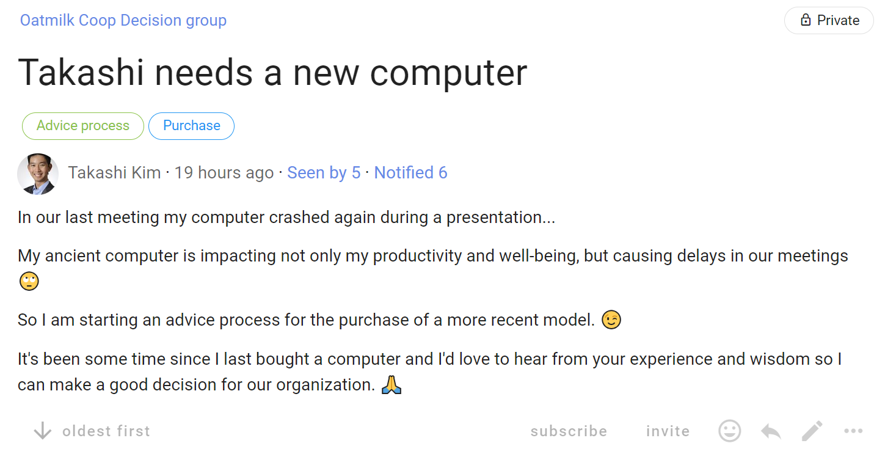
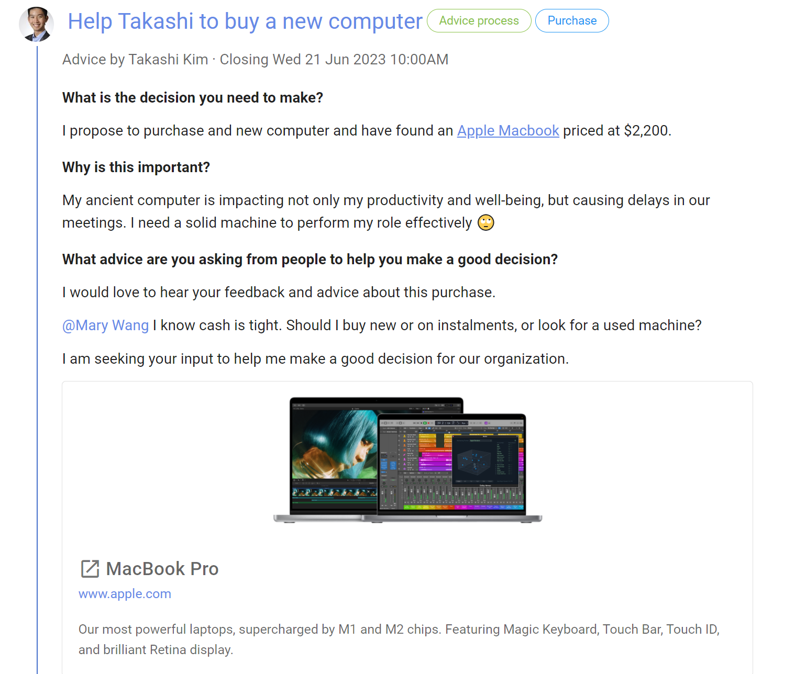
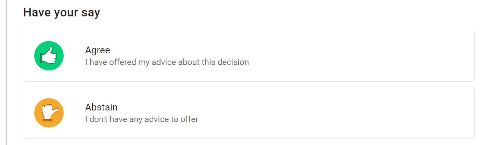
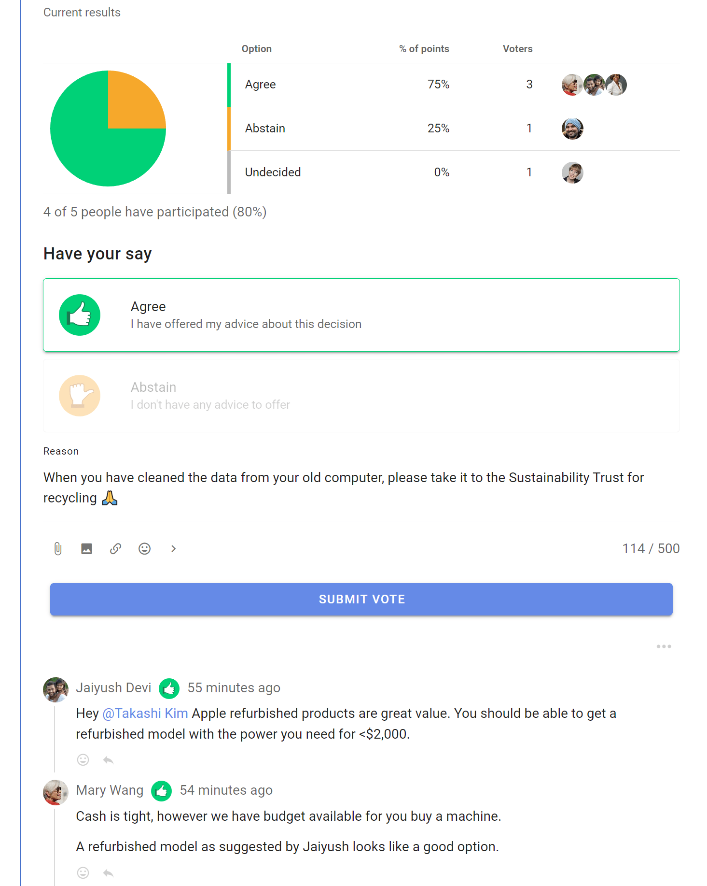
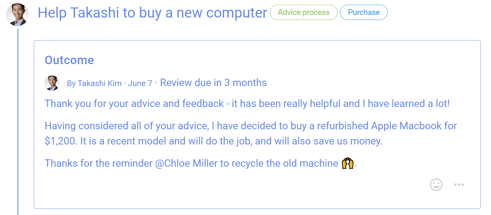

# Advice process

Seek advice on a decision you need to make, with the advice of people impacted or who have expertise, so you can make a better decision for your organization.

*“With the advice process, any person can make any decision but must seek advice from affected parties and people with expertise.” Frederick Laloux, Reinventing Organizations.*

Key points:
- freedom to make a decision
- invite people to offer their advice
- take into account other people’s voices

The Advice proposal is a key step in the Advice process:
1. You notice a problem or opportunity and take the initiative.
2. Seek input to sound out perspectives before proposing action - start a Loomio **thread**.
3. Make a proposal and seek advice - run an **Advice proposal**.
4. Taking advice received into account, you make a decision and inform the people who have given advice - state an **outcome**.

Benefits:
- Advice helps you make a better decision for your organization. 
- Foster relationships, learning opportunities and diverse input.  
- Stimulate initiative and creativity, and more enjoyable work.

| **Advice process** | **On Loomio** |
|---|---|
| You notice a problem or opportunity and take the initiative. |  |
| Seek input to sound out perspectives before  proposing action. | Start a Loomio **thread**.   Name the issue or opportunity in the thread title, and open a discussion to seek input and perspectives from people. |
| Make a proposal and seek advice from those affected by, or with expertise of, the proposal. | Run an **Advice proposal** and invite people to respond within a set time frame.  *In the title:* Name the decision you want to make.   *In the proposal context:* Clearly state the decision you want to make, and say why. Include any background information you feel necessary.    Invite people to comment, offer advice or ask clarifying questions, and to do so before the Advice proposal closes.   @mention particular people you would like to hear from.   Reply to advice and feedback received, and acknowledge contributions with reactions. |
| Taking advice received into account, you make a decision and inform the people who have given advice. | Close the proposal and state an **outcome**.    State the decision made and thank people for their advice and feedback.   Say what will happen next and notify people about the outcome.   The outcome statement is an important record of the decision for future reference. |        

## Advice process example on Loomio

### Step 1 - You notice a problem or opportunity and take the initiative.

Is the problem or opportunity is worth pursuing?  Takashi is experiencing problems with his old computer, and it crashed during a recent presentation.

Is there a decision to be made?  It's time to replace the computer.

Does it impact other people and your organization?  Takashi's colleagues want him to perform his role effectively, not waste time in meetings, and so appreciate he needs a working computer.  Purchase of a piece of equipment also impacts on the organization budget, purchasing policies and may need to be aligned with other team members.

### Step 2. Seek input to sound out perspectives before proposing action

Takashi starts a Loomio thread with a clear statement of the decision he needs to make.  He provides some context to open a discussion, that he is starting an advice process.

### Step 3. Make a proposal and seek advice

Following a short discussion, Takashi runs an **Advice proposal** clearly stating the decision he needs to make.  

Takashi says why this decision is important now and asks for advice; asking Mary a specific question about budget. 

The Advice proposal template offers two voting options; 
- **Agree** - I have offered my advice about this decision
- **Abstain** - I don't have any advice to offer

People invited to the Advice proposal can see the comments and advice from others, then select Agree and write their advice in the space below.

As people offer advice and comments, the proposal results are updated showing progress and who has offered advice.

### Step 4. Make a decision with advice and inform people

When everyone has offered advice, or the proposal closes, Takashi makes a decision and states the **outcome**.

The outcome is a clear statement of the decision made, what will happen next, and becomes an important record for the organization.

