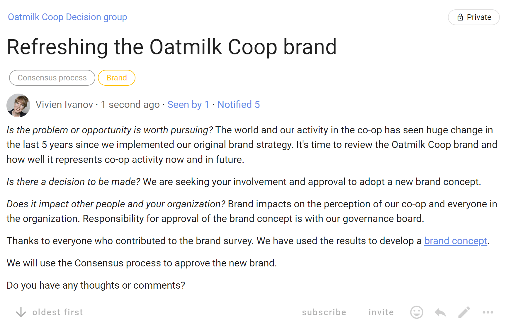
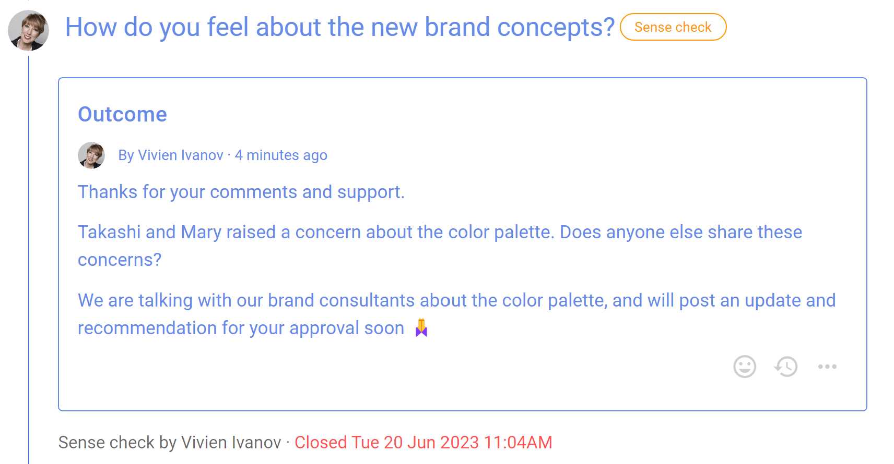
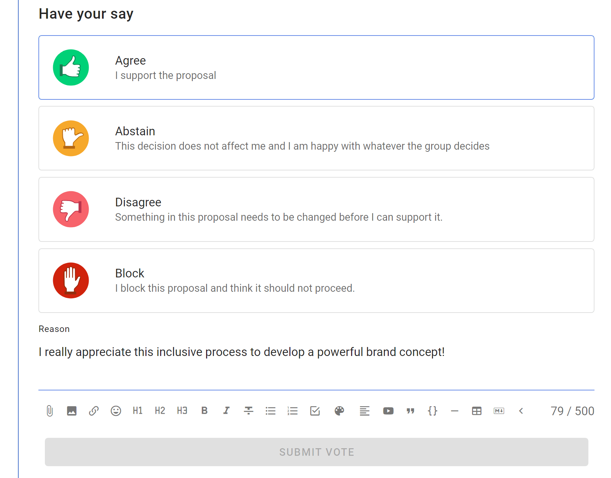
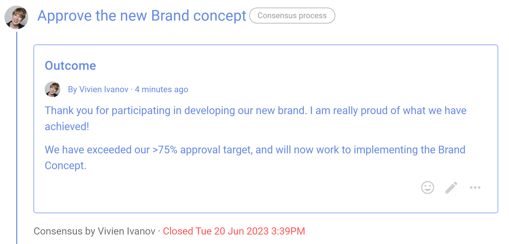

# Consensus process

Reach collective agreement with everyone involved.

Build consensus for a decision you need to make together, to reach an agreement that satisfies the needs and concerns of all participants.

> *“Consensus is the process – a participatory process by which a group thinks and feels together, en route to their decision.” - Sam Kaner, Community at Work*

### Key points
- Discuss and develop a proposal together
- Include and respect everyone involved
- Seek agreement from most people

**Consensus is typically used in:**
- Working teams building shared understanding of an issue or opportunity, collaborating on a proposal and deciding course of action. 
- Governance board decisions where the board shows it is acting jointly, such as decisions on vision, policy, strategic planning and budget.
- AGMs and General Assemblies where members and stakeholders seek general agreement for major decisions, such as revisions to statutes, major transactions and the elections of directors or council members.

### Consensus process steps
1. You notice a problem or opportunity and take the initiative.
2. State the problem or issue to be decided - start a Loomio **thread**.
3. Prepare and present a proposal to test for consensus - start a **Sense check proposal**.
4. Discuss, clarify and amend the proposal  - facilitate discussion in the thread.
5. Test for agreement - start a **Consensus proposal**.
6. Outcome - state the decision **outcome**.

### Benefits
- Grow shared understanding.
- Decisions for the collective will of the group.
- Encourage people to value the group over their personal preferences.

## Applying the Consensus process on Loomio

| **Consensus process** | **On Loomio** |
|---|---|
| You notice a problem or opportunity and take the initiative. |  |
| **State the issue to be decided**    Provide background information and open a broad ranging discussion to build shared understanding. Look for emerging proposals. | Start a Loomio thread   Name the topic of discussion in the thread title, and what you hope to achieve.   Attach or link to background information. Invite people to ask questions, contribute information and write comments. |
| **Present a proposal**   Test for consensus. | Run a **Sense check proposal**.   *In the title:* Name the proposal.   *In the proposal details:* Clearly frame the proposal and say why it is important.  Include any background information necessary and a link to the proposal.    Invite everyone to respond, and to do so before the proposal closes.  |
| **Amendment**   Discuss, clarify and amend the proposal  | Facilitate discussion in the thread to address concerns and modify the proposal. |
| **Agreement**   Do you have an agreement?  Check for:   Agreement: I support the proposal.   Abstain: This decision does not affect me and I am happy with whatever the group decides.   Disagreement: Something in the proposal needs to be changed before I can support it.   Block: I have a fundamental disagreement with the proposal that cannot be resolved. | Run a **Consensus proposal** with the current proposal version.   *In the title:* Name the decision to be made.   *In the proposal details:* Present the proposal and invite people to vote.   Include a clear statement of what agreement means, say 'for this proposal to pass, we need everyone to vote agree' or 'for this proposal to pass, we need 75% of members to agree'.    Ask participants to leave a vote 'Reason' - and if they do not agree to say why, and what needs to change for them to agree.   Some organizations also use the Block (or veto) voting option.   As voting progresses, respond to comments, post updates, close early, or let the proposal run to conclusion.   Participants can *“change vote”* up to proposal close time, say in response to new information that arrives during voting. |
| **Outcome**   State if agreement was reached and the decision that has been made.   Implement the decision and plan actions to be taken. | Consider voting results and state the decision made.   Summarize results of the process and say what will happen next.   If results are inconclusive, you may choose to re-open the discussion and run a new proposal.   The outcome statement is an important record of the decision for future reference. |

## Example of a Consensus process on Loomio

### Step 1. You notice a problem or opportunity and take the initiative

*Is the problem or opportunity is worth pursuing?* Vivien noticed it's time to review the Oatmilk Coop brand.

*Is there a decision to be made?* The governance board has responsibility to approve a new brand concept.

*Does it impact other people and your organization?* Brand impacts on the perception of the co-op and impacts everyone in the organization. 

### Step 2. State the problem or issue

Vivien starts a Loomio thread outlining the need to review the organization's brand, inviting participation to develop a new brand concept, and that the approval decision is to be made by the governance board using the consensus process.

### Step 3. Present a proposal 

Vivien runs a Sense check proposal to survey opinions to see how people feel about key elements of the brand concept, and test for consensus.   The Sense check proposal lets people know a proposal is forming and encourages them to engage.  It's a good way to surface concerns.

### Step 4. Amendment

When the Sense check proposal closes, Vivien states an outcome and notifies everyone about the results and what will happen next.
Vivien facilitates a discussion to address concerns and modify the Brand Concept document.

### Step 5. Agreement

Having completed the latest version of the Brand Concept document, Vivien is now ready to seek approval from the governance board by running a Consensus proposal.

Governance board members are invited to vote and approve the Brand Concept.  The board has previously agreed that proposals like this require >75% of members to vote Agree for it to pass. 

The standard Consensus proposal includes the 'Block' voting option, however this can be removed if not appropriate.   

### Step 6. Outcome

When the Consensus proposal closes, Vivien states an outcome and notifies everyone that agreement has been reached, and that work to implement the new brand will commence. 

