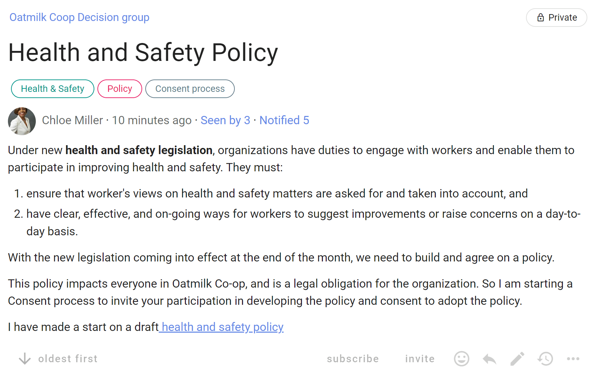

# Consent process

Make a decision that is ‘safe to try’, without objections.

Seek consent on a decision you need to make, where there are no meaningful objections to your proposal, so you can make a fast decision that is 'safe to try' now.

> *“Consent turns the question around: instead of asking for what we want, we ask whether there are reasons not to go ahead.” - Ted Rau, Sociocracy For All*

### Key points
- Aim for a ‘good enough’ decision.
- Involve many voices to develop a workable proposal.
- Ask if anyone has a valid objection.
- Amend the proposal to resolve objections.

### Consent process steps
1. You notice a problem or opportunity and take the initiative.
2. Present a proposal - start a Loomio **thread**.
3. Facilitate a clarifying questions round - start a **Questions round**.
4. Facilitate a round of reactions and comments inviting people to improve the proposal - run a **Sense check proposal**.
5. Amend the proposal with suggestions and comments.
6. Ask if anyone has a meaningful objection to the amended proposal - run a **Consent proposal**.
7. Integrate valid objections to create an amended version of the proposal that everyone consents is ‘safe to try’ - state the decision **outcome**.

### Benefits
- Faster, efficient, clear and more adaptable decisions.
- Diverse perspectives and empowered engagement builds trust.
- A more agile, transparent and inclusive culture.

## Applying the Consent process on Loomio

| **Consent process** | **On Loomio** |
|---|---|
| You notice a problem or opportunity and take the initiative. |  |
| **Present a proposal**   Write a clear and concise proposal and share it with people impacted. Describe it in a way so that others will understand what you are proposing. | Start a Loomio **thread**.   Name the proposal in the thread title, and describe it in the context. |
| **Questions**   Invite clarifying questions to help people understand the proposal.   *“A clarifying question round helps make sure everyone understands the proposal before they say what they think about it.”* | Run a **[Question round](https://help.loomio.com/en/user_manual/polls/proposals/index.html#question-round)**.   Ask “what do you need to know so you understand the proposal?” |
| **Reactions**   Invite people to offer reactions and comments to improve the proposal.   This is a sensing and responding round - *to actively sense and interpret information from the group and then respond or adapt accordingly.* | Run a **[Sense check](https://help.loomio.com/en/user_manual/polls/proposals/index.html#sense-check)** proposal.   *In the title:* Name the proposal and say this is an opportunity to react and comment.   *In the proposal details:* Clearly frame the proposal and say why it is important.  Include any background information necessary and a link to the current proposal version.    Invite everyone to respond, and to do so before the proposal closes.  |
| **Amendment**   Consider comments and suggestions from people and amend the proposal as appropriate for the good of your organization.   Consider any amendments you want to make for the new proposal version. | Reply to comments and suggestions raised in the Sense check proposal.   State an **outcome** to summarize the results of the proposal.    Note any concerns or new information discovered, and outline how the proposal will be amended.   Say what will happen next and notify people about the outcome. |
| **Objections**   Present the amended proposal version and invite people to state valid objections - objections that might cause harm.   Respond to and integrate each objection by amending the proposal. | Run a **[Consent proposal](https://help.loomio.com/en/user_manual/polls/proposals/index.html#consent-proposal)** with the amended proposal.   *In the title:* Name the decision to be made.   *In the proposal details:* Present the proposal and invite people to vote consent or to state a valid objection - an objection that might cause harm.  Remember we are seeking consent that the proposal is 'safe to try'.   Respond to and integrate each objection, creating an amended version of the proposal.   Notify everyone that there has been a further amendment, and invite them to reconsider their Consent and “change your vote”.   Or run successive Consent proposals as necessary until objections are resolved. |
| **Outcome**   When there are no remaining objections and everyone has consented, the result of the decision is announced. | State an **outcome**.   Close the proposal. State an outcome and notify everyone involved.   State the decision made and thank people for participation in the process.   Summarize results of the process and say what will happen next.   If no valid objections remain, state that there is consent the proposal is 'safe to try'.   The outcome statement is an important record of the decision for future reference. |

## Example of a Consent process on Loomio

### Step 1. You notice a problem or opportunity and take the initiative

*Is the problem or opportunity is worth pursuing?* Chloe noticed that new Health and Safety legislation is coming into effect soon, and has taken the lead to draft a policy for her organization.

*Is there a decision to be made?* The Health and Safety policy document will need to be approved as a formal policy.

*Does it impact other people and your organization?* The policy impacts everyone in the organization.  Staff will need to comply with the policy, and it will become a legal obligation of the organization.

### Step 2. Present a proposal

Chloe starts a Loomio thread outlining the need to develop a Health and Safety policy, proposing to lead this work with a first draft, inviting contributions to develop the policy and that she is starting a Consent process to adopt the policy.

### Step 3. Facilitate a clarifying question round

Chloe runs a Question proposal to open a question round, inviting people to ask clarifying questions about the Health and Safety policy within a set period.  Some further background information along with the draft document is provided for context.

The aim at this stage is to help people understand the policy before they say what they think about it.

People ask questions in the proposal 'Reason' text field and click 'Submit vote'.  Chloe replies to questions.

### Step 4. Facilitate a reactions round 

Chloe now opens a Reactions round by running a Sense check proposal.  People are invited to offer reactions and comments to improve the policy.  

This round is an opportunity to actively sense and interpret information from the group and then respond or adapt accordingly.

### Step 5. Amend the proposal

When the Sense check proposal closes, Chloe notifies everyone and works to amend the policy appropriately.

### Step 6. Seek consent to adopt the policy

The Health and Safety policy is looking good.  People have had the opportunity to ask questions and to offer suggestions to improve the policy.

Now Chloe seeks consent to adopt the policy by running a Consent proposal.

### Step 7. Integrate valid objections to create an amended version of the proposal that everyone consents is ‘safe to try’

Once all objections are integrated, consent has been reached and Chloe states the decision outcome :-)

