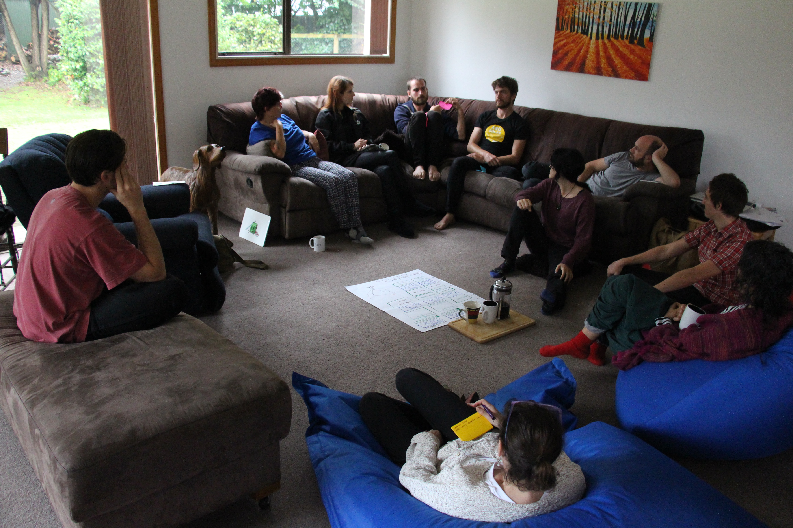

# Consent process - New

Make a decision that is ‘safe to try’, without objections.

Seek consent on a decision you need to make, where there are no meaningful objections to your proposal, so you can make a fast decision that is 'safe to try' now.

> “Consent turns the question around: instead of asking for what we want, we ask whether there are reasons not to go ahead.” Ted Rau, Sociocracy For All

### Key points
- Aim for a ‘good enough’ decision.
- Involve many voices to develop a workable proposal.
- Ask if anyone has a valid objection.
- Amend the proposal to resolve objections.

### Consent process steps
1. You notice a problem or opportunity and take the initiative.
2. Present a proposal - start a Loomio thread.
3. Facilitate a clarifying questions round - start a Questions round
4. Facilitate a round of reactions and comments inviting people to improve the proposal - run a Sense check proposal.
5. Amend the proposal with suggestions and comments.
6. Ask if anyone has a meaningful objection to the amended proposal - run a  Consent proposal.
7. Integrate valid objections to create an amended version of the proposal that everyone consents is ‘safe to try’ - state the decision outcome.

### Benefits
- Faster, efficient, clear and more adaptable decisions.
- Diverse perspectives and empowered engagement builds trust.
- A more agile, transparent and inclusive culture.
