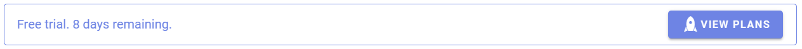
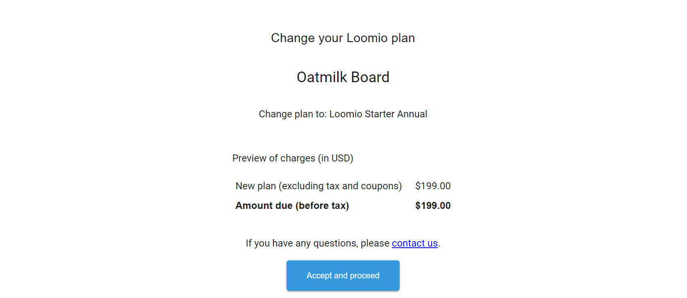
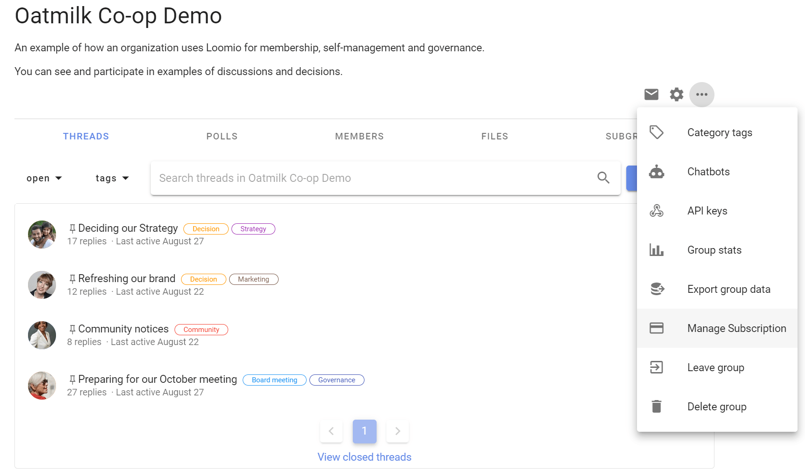

# Subscription management
_How to upgrade, manage or cancel your Loomio subscription._

On this page
- [Upgrading your group](#upgrading-your-group)
- [Billing problems](#billing-problems)
- [Alternate payment options](#alternate-payment-options)
- [Change your plan](#change-your-plan)
- [Manage billing and account details](#manage-billing-and-account-details)
- [Cancel your plan](#cancel-your-plan)
- [Refunds](#refunds)

Loomio uses Maxio billing and subscription management service to manage subscription records, initiate payments, process upgrades and cancellations.

Prices are based on debit/credit card payment via an automated billing portal.

## Upgrading your group
To continue to use Loomio beyond your free trial, you can upgrade your group to a paid subscription plan.

You may upgrade your group at any time by clicking the __VIEW PLANS__ button.

Choose the right plan for your organization's needs and click the __BUY NOW__ button.

In the billing portal complete the required fields to set up your subscription with your credit or debit card, including:
- Customer Information (name and email address)
- Billing Information (credit or debit card details)
- Billing Address (to insure sales taxes are applied correctly)
- Confirm details and click the __Place My Order__ button.

The subscription is activated immediately and the group automatically upgraded. 

A tax invoice/statement confirming successful payment will be sent to your email address.

You will also receive an email a secure link to the billing portal for your subscription, where you can manage your account, update credit card and contact details, and download current or past statements.

The link is only valid for 30 days, so please follow it as soon as you get a chance.

### Automatic payment and statement generation
Your credit or debit card details are held securely by Maxio, our subscription management service provider, for future recurring payments.  [Maxio](https://www.chargify.com/security/) is PCI DSS Level 1 Compliant.

Monthly or annual payments via Maxio are automatic, and an invoice/statement is issued on successful payment.

## Billing problems
Maxio may be unable to process a payment to your card when due.

If a payment is unsuccessful, an email notification will be sent to the email address we have on file, along with a link to the billing portal where you can update card details. The billing system will continue to retry the payment once a week, and if payment is not successful after four (4) attempts, the subscription plan will be cancelled (day 28).

Card payment problems are often caused by:
- Insufficient funds
- Expired card
- Bank restrictions on new cards or changes to existing cards. 
 
Please make sure your credit or debit card is authorized for “international payments” and “internet transactions” (“Prch” and “Auth”).

The billing system will issue an alert via email when your credit card is nearing expiry.

## Alternate payment options
Alternate payment options are only available for annual plan subscriptions.

### Payment via invoice and bank transfer
Contact us to set up payment via invoice and bank transfer.

### Payment via bank transfer must be made within 20 days of invoice.
Bank and international transfer fees must be added to the payment so that the full subscription fee due is paid.

There is an administration charge for manual invoice and purchase order processing of $US 25.00.

### Other currencies
Invoices raised in currencies other than in USD are converted at the daily Telegraphic Transfer rate plus 5%.

## Change your plan

[Click here to change your plan.](https://www.loomio.com/upgrade/)

You will see a list of all the groups you belong to.

Find the group you wish to change and click the **Change plan** link.

Choose your new plan and click on the **PREVIEW CHANGE** button.

Any remaining credit on your previous plan will be carried to your new plan.

Check the details of plan, price and payment frequency in the Plan Summary table are correct. 

## Manage billing and account details
You can access statements, and update card and billing contact details at any time by visiting **Manage Subscription** in your group drop down menu - the 3 dots (**...**) menu to the right of the page.

You can also access the billing portal from the secure **Account Management** link at the bottom of your statement.

Here, you will see your current plan status.

Click on the link to the billing portal in the message:

*Visit the **billing portal** to change billing details*

You may need to enter your email address to receive a secure link to the portal. 

You can also access the billing portal with the **Account Management** link at the bottom of your statement.

## Cancel your plan
Before cancelling your plan, we recommend that you [export your group data](https://help.loomio.com/en/user_manual/groups/data_export/index.html). 

You can cancel your plan via the billing portal.

Go to your Loomio group page and click on the 3 dots (**...**) menu to the right of the page. 

Here, you will see your current plan status.

Click on the link to the billing portal in the message:

*Visit the **billing portal** to cancel your plan or change billing details*

You may need to enter your email address to receive a secure link to the portal. 

You can also access the billing portal with the **Account Management** link at the bottom of your statement.

In the billing portal:

1. Find **Plan Details**, click **Cancel** (on the right).
2. Tell us why you are canceling the plan.
3. Choose **Cancel Now** or **Cancel At End of Period** if you want to continue using Loomio for any remaining billing period.

In general we do not refund subscription fees for any remaining unused billing period.  See [Refunds](#refunds) below.

If you’re having trouble finding your billing portal link or need help to cancel, or manage any details of your plan, please [contact us](https://www.loomio.com/contact).

### What happens when a subscription is cancelled?
Initially when you cancel, your group data will remain available, however you will no longer be able to start new threads or invite members to the group. 

If you have not already done so, we recommend that you [export your group data](https://help.loomio.com/en/user_manual/groups/data_export/index.html). 

After 30 days from cancellation, your group and all content will be deleted from our active systems and you will no longer be able to access the data. 

## Refunds
When it comes to refunds, we treat our customers how we ourselves would like to be treated, and assess requests fairly.

To process a refund, we must receive a request within 30 days of the date payment was made.

[Contact us](https://www.loomio.com/contact) if you would like a refund. 
