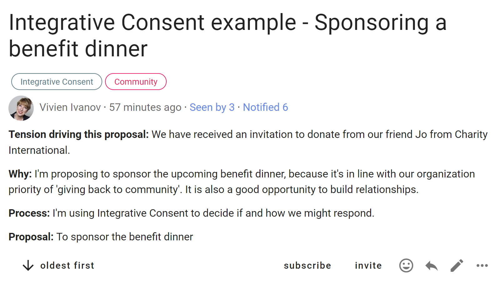
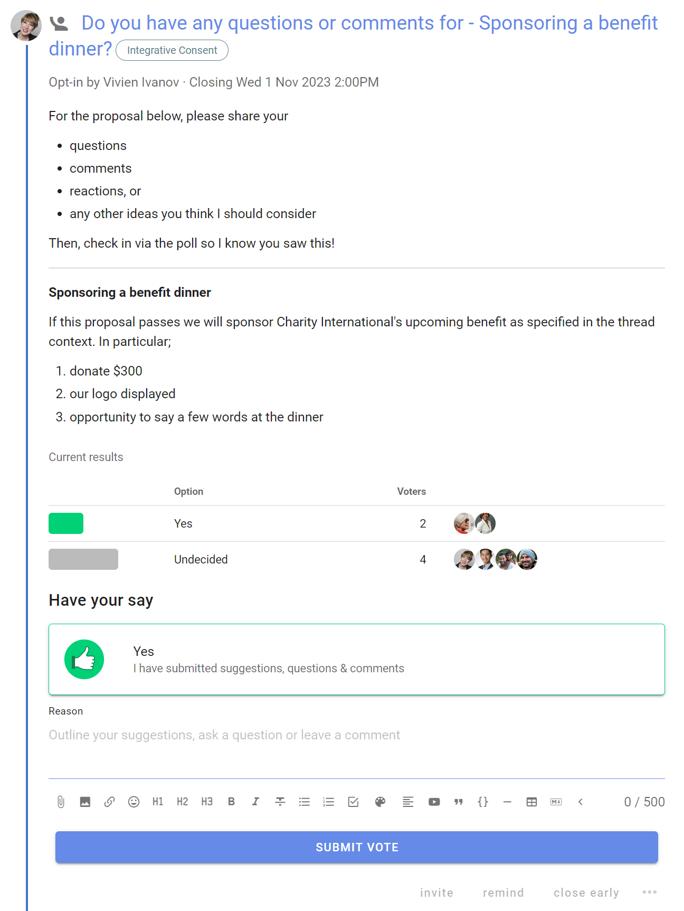
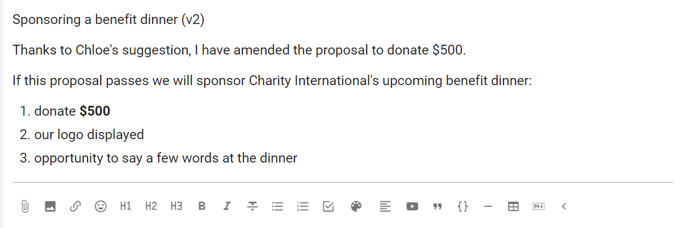
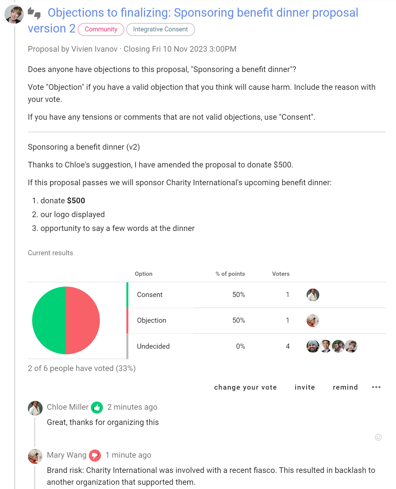
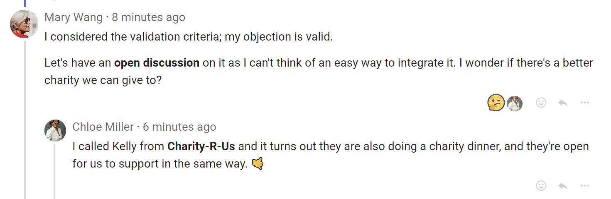
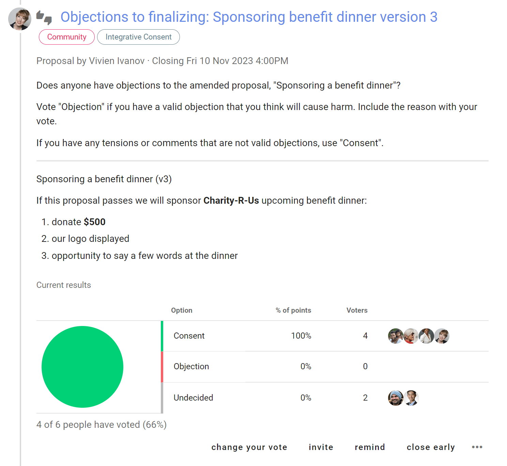
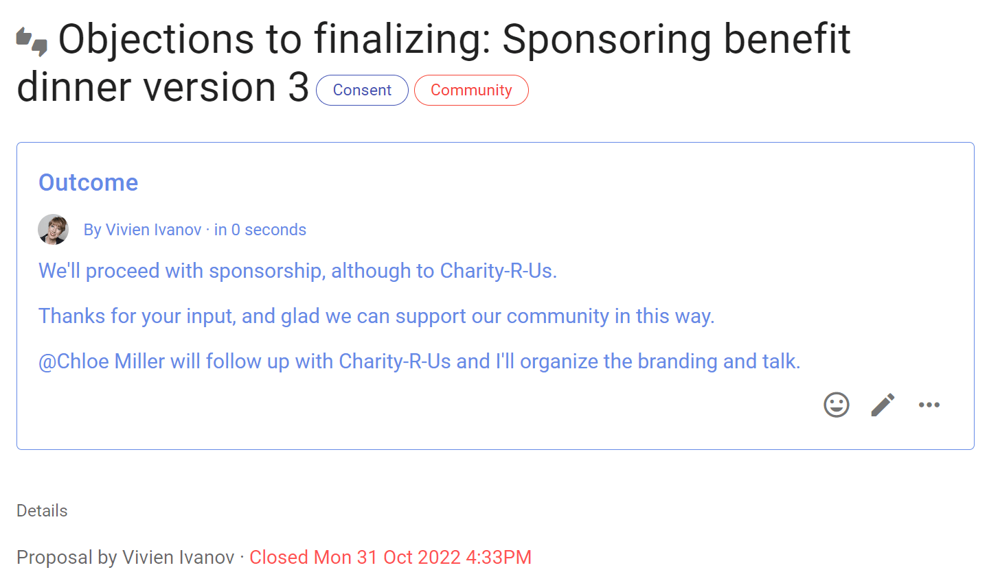
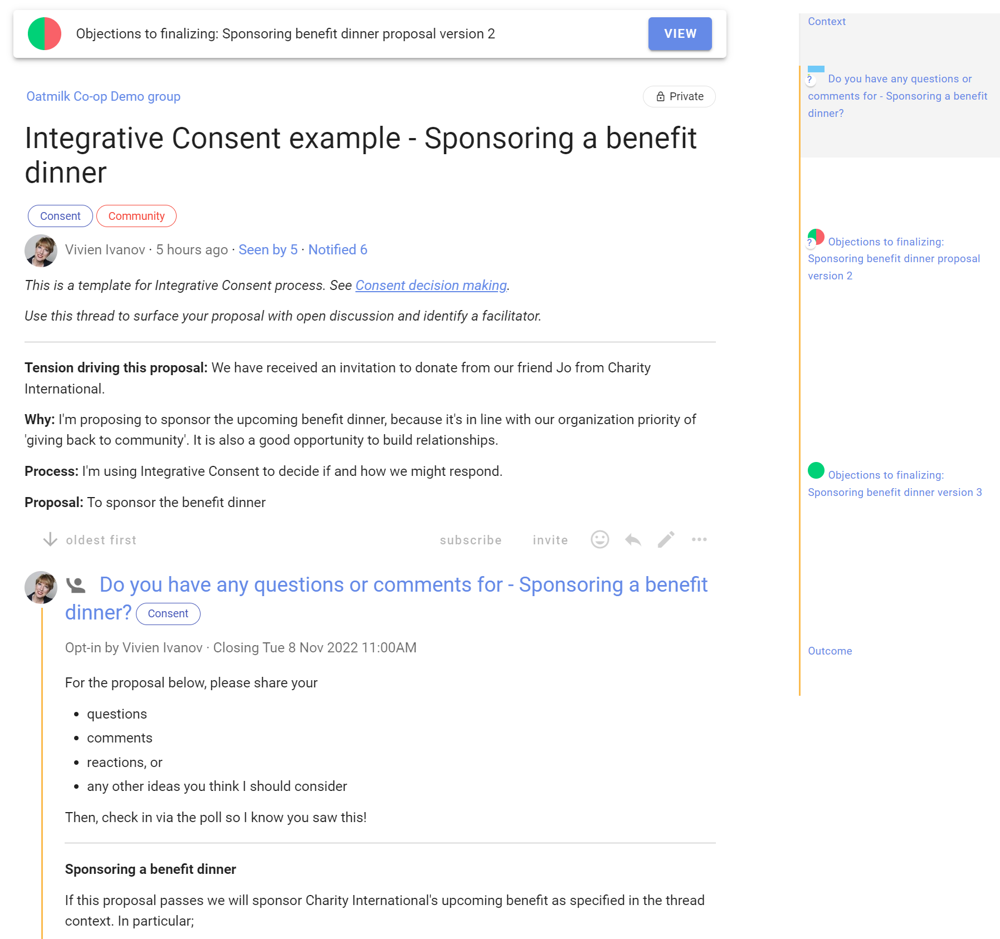

# Consent process

*Seek consent to make a decision. A decision can be made as long as no team member has a valid objection.*

The Consent decision process invites people into decision making towards a solution that is ***"safe to try"***. Focus is on progress over perfection, and consent is reached when there are no valid objections.

Use Consent when you need an inclusive, transparent, collaborative and faster decision.

This guide outlines how you can use the consent process within Loomio to involve your group in decisions.

There are a number of variations in the practice of the consent process. For deeper reading, see the article [Integrative Consent decision making](https://help.loomio.com/en/guides/consent_process/index.html) co-authored with Round Sky Solutions.  The example in the guide below follows the Integrative Consent process.

## Integrative Consent

There are four steps, or rounds:
1. [Proposal](#step-1-proposal)
2. [Questions and Comments](#step-2-questions-and-comments)
3. [Amendment](#step-3-amendment)
4. [Integration](#step-4-integration-objections)

In this process there are a few named roles:
- **Proposer** - the person who has an idea, puts it in writing and starts the process.
- **Facilitator** - someone who can help the proposer through the process.  

## Step 1: Proposal

The first step is for the **proposer** to raise open a discussion by starting a Loomio thread. 

In the thread title, say what you are proposing.  

Use the thread context to frame the discussion with relevant details.

You don't need to notify anyone at this stage, as you will do so in the next step.  Once started, the thread will be visible to any member of your group. Group members will also be alerted in the "Yesterday on Loomio" daily summary if enabled.

## Step 2: Questions and Comments

Using a Loomio Opt-in poll, invite people to ask questions, share information or comment.

In the poll context, include the details of the proposal, so everyone knows what is intended if the proposal passes.

As we are only asking for people to indicate when they have asked questions or commented, you can edit the standard Opt-in options to be a single "Yes" option. 

Copy the Integrative Consent thread example from the [Loomio Examples & Templates group](https://www.loomio.com/templates) to save as a template for use in your group so that this poll is ready to use.

Set the poll closing date and time to give people time to participate, and to end this round.  

Remember Loomio will alert people who have not participated 24 hours before the poll closes, so choose a time when people are likely to be able to respond.  

Invite people to the poll by group or individually.

Participants click the "Yes" vote and ask questions or leave comments in the vote "Reason" or as comments in the thread.

As well as responding to the questions, the proposer listens carefully for anything that they would like to change about their proposal.

## Step 3: Amendment

Having considered the questions and feedback from participants, the proposer may amend their proposal.

## Step 4: Integration (Objections)

When ready, the proposer raises a proposal asking if anyone has **Objections** to the amended proposal.

As before, use a descriptive title for the poll, and add the version number.  This helps people keep track as subsequent versions develop.

Similarly in the poll details field, state the amended proposal.

As we are running a Consent process, edit the poll options for **Consent** and **Objection**. You can further edit the "Meaning" and "Reason prompt" text if you wish to guide participants.

Options example:

**Consent**
- Icon: Thumbs up
- Meaning: This proposal is safe to try
- Reason prompt: Is there anything further you'd like to add?

**Objection**
- Icon: Thumbs down
- Meaning: You are concerned the proposal might cause harm to the team or organization
- Reason prompt: How will the proposal cause harm? Be explicit, impersonal, evidenced and not 'safe to fail'.

Copy the Integrative Consent thread example from the [Loomio Examples & Templates group](https://www.loomio.com/templates) to save as a template for use in your group so that this poll is ready to use.

### Integrate Objection

In the above example, an objection to the proposal has been raised.

Mary adds a comment in the thread inviting an open discussion, and Chloe responds with a suggestion to resolve the objection.

Now, to integrate the objection raise a new proposal poll as before, with the amended proposal labelled with the current version and invite your team for a further round.

In most cases one round of integration after objections are raised is sufficient, however you can continue discussion and use polls in the same way until all objections are integrated.

### Outcome

Once voting is complete and there are no further objections the proposal can be closed.

State an outcome to let everyone know the result of the decision and what will happen next.

## Decision record

As our Consent decision has progressed, you will notice a timeline forming on the right hand side of the app.

Loomio automatically documents questions raised, information added and objections raised, at each stage of the process.

This record is valuable to refer to, for people new to your organization to see how decisions are made, and as an archive for audit purposes.  

Loomio is building a history of decisions made for your organization, the discussion and process used.

