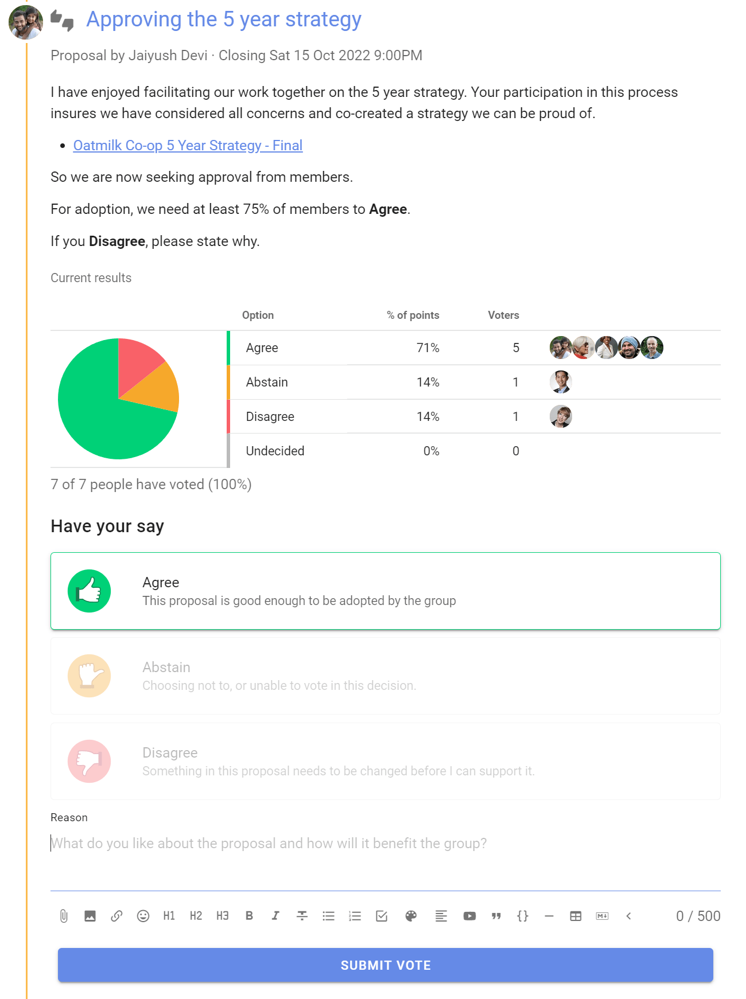

# Making collaborative decisions

Making decisions collaboratively involves people, shares power and responsibility, reduces risk and increases the prospect that it will be a good decision.

Practices for making good collaborative decisions have evolved and there are now a number of decision-making processes you can employ.  Many collaborative organizations use one or more processes, depending on the type of decision, governing policy and culture.  Consensus, advice and consent processes are common.

Making decisions with other people often happens when everyone involved is present in one room. The topic and need for decision is introduced, clarifying questions asked, and a discussion takes place to help everyone understand the context for the decision.  The decision to be made is proposed and people are invited to vote. 

Straight-forward decisions are often resolved quickly, although more complex or challenging decisions may require further deliberation.  A facilitator can help uncover tensions and disagreement. There is also the potential for new information to be introduced that may change people's minds.

When voting is complete and the decision is made, the decision proposer or facilitator announces the outcome of the decision and what will happen next.

However for many organizations today, getting everyone together in one room at the right time is nigh on impossible.  People work remotely and communicate at different times.  Email and online chat tools are not equipped to support collaborative decision making.

## Collaborative decision making in Loomio

Loomio is designed for collaborative decision making, enabling you to replicate in-person decision making practices online -  inclusive, transparent, participative and facilitated.

This guide will help you get started with Loomio to make online collaborative decisions in your organization.    

**[Simple decision process](https://help.loomio.com/en/user_manual/polls/decisions/index.html)** - A simple process to introduce and discuss the decision to be made, listen and sense how people think about it, propose and decide. Start here if you are new to collaborative decision making.

**[Advice process](https://help.loomio.com/en/guides/advice_process/index.html)** - Seek the feedback and advice to help you make a better decision. Anyone can make a decision as long as they listen to input from people impacted or with relevant expertise.

**[Consent process](https://help.loomio.com/en/guides/consent_process/index.html)** - Seek consent to make a decision. A decision can be made as long as no team member has a valid objection.

## Loomio proposal

Loomio is built around the proposal.

A proposal helps convert a discussion into a clear, practical outcome. For example someone suggests a course of action and invites people to respond by voting agree, abstain or disagree. Proposal voting options are available for common decision-making processes and you can create voting options to suit your organization.

As people vote, they can give a reason why they have voted this way. You can all see where everyone else stands on the matter, and why. And then, if the proposal is still open, you can change your response.

In this way you can use proposals to prompt people for a response, uncover new information, and build shared understanding - to help your group make a better, more informed decision.

A proposal and associated discussion, creates its own record of how the decision came about.

