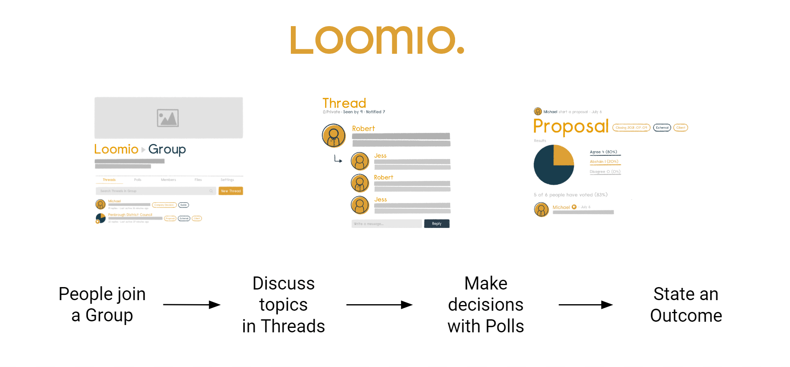

# Orientation tour

If you are new to Loomio, let's take an orientation tour to help you quickly understand how to participate in discussions and decisions in your group.

_On this page_
- [How Loomio works](#how-loomio-works)
- [Group page](#group-page)
- [Side bar](#side-bar)
- [Notifications](#notifications)
- [Finding information quickly](#finding-information-quickly)
- [Threads](#threads)
- [Polls](#poll-tab)

The best way to learn about Loomio is to have a go. Use your own group or:
- see the [demo](https://www.loomio.com/demo)
- start a [free trial](https://www.loomio.com/g/new)

## How Loomio works

Loomio is designed to help your group come together, discuss in threads and use polls to make decisions.  It has a simple structure of three main elements; Group, Threads and Polls. 

### Group

A Loomio group is a safe place for your organization to meet, discuss and make decisions about work.

**Group home**

Your group home page is the first place you see when you arrive. It contains a title, an image to represent the group, and some text to introduce the group: its purpose, the work you will do, and any other information to help group members participate.

### Threads

Threads are where you share information, discuss, and make decisions.

Threads are used for many purposes; to prepare for a meeting, discuss matters, share reports, ask questions, vote on proposals, approve actions, and so on. It's also where your group can develop a shared understanding of important issues.

Threads keep everything about a topic in one place. Over time you’ll create a useful archive of your organization’s discussions and decisions.

### Polls

Loomio includes a wide range of poll tools to help you progress a discussion to an outcome. Each poll type has a slightly different purpose. The most common one is a proposal. 

A **proposal** is for converting a discussion into a clear, practical outcome. Someone suggests a course of action and invites everyone to respond. For example, you might ask members of your group to either:
- agree
- abstain or 
- disagree. 

Importantly, as well as selecting a response, everyone can give a reason why they have voted this way. You can all see where everyone else stands on the matter, and why. And then, if you want, you can change your response. 

A proposal, and associated discussion, helps your group build shared understanding and creates its own record of how the decision came about.

### Putting it all together

The best way to learn what to use when is to have a go. Use your own group or:
- see the [demo](https://www.loomio.com/demo)
- start a [free trial](https://www.loomio.com/g/new)

## Group page

Your group home page is the first place people see when they arrive. It contains a description of why the group exists, what you will use it for, and any other information that may help you participate.

Administrators can edit the description, add an image and logo that represents your organization, set and change group privacy and member permissions.

### Tabs

Under the group description you will see tabs. Clicking on each tab displays information about:

**Threads** - A list of discussion threads showing the author, the thread title, category tag, along with some other useful information about recent activity in the thread. 

**Polls** - A list of polls active in your group.

**Members** - Where you can see a list of the people who are members of the group.

**Files** - Files and documents that have been attached to threads in your group.

**Subgroups** - A list of subgroups that you are a member of. A subgroup is the collaborative space for a working team, project or event, a governance board, a subcommittee or stakeholders group.

Below the tabs there is a search bar where you can type in any key word to find a particular thread. To the left are drop down menus where you can filter thread view to see open or closed threads, or view threads by category tag.

If the threads tab is selected, the thread list shows the title of the thread, author, number of replies, and when last active.

## Side bar

The sidebar menu is accessible from the (☰) menu icon at screen top left, where you can see:

* **Dashboard** - Open polls and recently active threads.
* **Unread threads** - A list of threads you have yet to read.
* **Invite-only threads** - Private threads that do not belong to a group.
* **Start a new thread** - Where you can start a new thread. 
* **Tasks** - A list of tasks assigned to you, with due date.
* **Your Loomio groups** - Where you can easily find your Loomio groups and subgroups.
* **New group** - To start a new Loomio group on free trial.
* **Demo group** - See and explore your private demo group at any time.
* **Help & guides** - A link to the Loomio User Manual.
* **Contact support** - [Contact us via web form](https://www.loomio.com/contact).

### User settings

Click the down arrow ( ∨ ) to open your user settings.

* **Pin sidebar** - The sidebar remains open.
* **Edit profile** - Where you can edit name, email address, upload your photo, introduce yourself, add your location.
* **Notification settings** - Set what emails you want to receive from Loomio.
* **Enable dark mode** - Set your visual interface preference.
* **Sign out** - Sign out from your Loomio user account.  

## Notifications

### In app notifications

The bell icon in the top-right is where notifications are accessed within Loomio.

### Email notifications

Loomio sends emails to keep you updated on the activity in your groups. 

Emails Loomio may send you include:

* **Mention and Replies** - When someone @mentions you in a comment or replies to you, you will receive a notification email.
* **Subscribe on participation** - If selected, when you participate in a thread you will receive emails for all further activity. This is off by default because in a busy group it can generate a lot of emails.
* **Catch-up summary email** - The 'Yesterday on Loomio' email includes activity from all your groups and threads that you have not read yet, and is a useful way to stay in touch with what's happening without having to visit Loomio every day.
* **Invitations to threads and polls** - You may receive an email when invited to a new thread or poll.
* **Reminders and Outcomes** - If you have not voted in a poll, you may receive a reminder 24 hours before close. You may also receive an email stating the outcome of a poll.

These emails are to help you participate effectively with your group. The default settings are to help you stay up to date with activity on Loomio but should not overload your email inbox.

If you are receiving too many emails from Loomio, you can change the default email settings. Talk to your group administrator to get the balance right for you.

When you receive an email from Loomio, you can reply directly from your email inbox and your reply will be posted into the Loomio thread. This works for everything except the Catch-up summary email.

## Finding information quickly

There are several tools included within Loomio to help you find the information you are looking for quickly.

### Search

You can use the Search bar at the top of almost every page to search for content relevant to that page.

For example, on the threads page typing 'strategy' in the search bar brings up threads with the word 'strategy'.

### Category Tags

Category Tags make it easy to find threads of a certain type or topic. 

Tags can be applied when starting or editing a thread or poll.

## Threads

Under the **Threads** tab on your group page, click on one of the threads in the list to open the thread.

The thread title is prominent, and you can see thread content and comments from other members. 

The thread page includes everything you need to know about the thread;
* the group name, and subgroup name, that the thread belongs to
* category tags applied to the thread
* author and thread privacy
* **Seen by** to see who has seen the thread
* **Notified** to see who has been notified
* comments, replies, reactions and any polls
* timeline of key events in the thread, such as polls

### Thread context

The thread context is used to introduce the topic. It will often include background information to help you participate in the discussion, such as attached files or links to online documents. The context always stays at the top of the thread.

### Thread activity

**Seen by** shows who has read the thread, and when.

**Notified** shows who has been notified about the thread, and if read or email opened.

### Comments

As you scroll down the thread page, you will see comments and replies from other group members.

### Timeline

The thread timeline builds with key activity in the threads.  Use timeline to quickly go to decisions or important comments pinned to the timeline.

## Polls tab

From your group page, select the **Polls** tab to see your list of polls. Alongside the poll name, there is an active icon that changes as the poll progresses, and indicates your vote.

