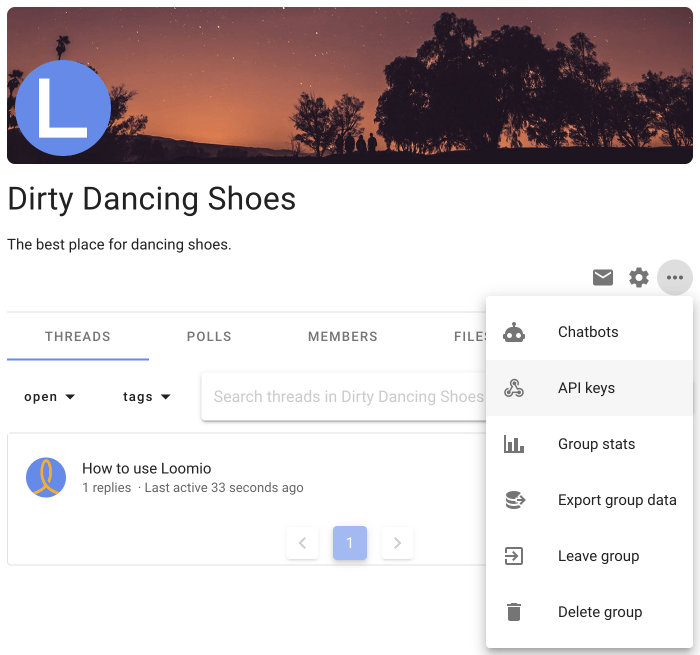

# Loomio integrations API

We have a simple API. With each API Key, there is a documentation page that includes working examples of how to use your API key.

To view the documentation for your API key follow these steps to create an API Key for your group:

## Create an API Key

As a group admin, on your Loomio group page, click the settings dropdown menu and then click API Keys

Add a new integration

Give your integration a name, and select what it will be permitted to do within your group.

After you save it, you can view the documentation for your API Key

It will look something like this:

## See the documentation without an API key

Here a link to the documentation, with a bogus API key. We recommend you follow the steps above to get working examples.

[http://www.loomio.org/help/api?api_key=examplekey](http://www.loomio.org/help/api?api_key=examplekey)