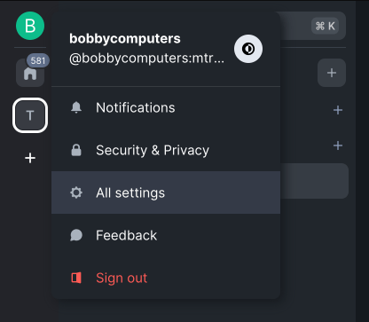
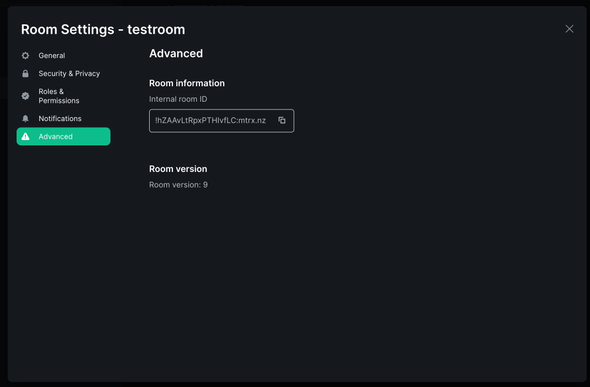

# Matrix integration

Loomio can send notifications into your Matrix channels when new discussions, proposals, comments, votes, and outcomes occur. 

Matrix is nice because it allows some HTML in the chatroom, and Loomio takes advantage of this.

Our Matrix integration is a little different to our other chat integrations - it does not use a webhook - we've built a custom bot client for this one.

You will need to create a matrix user for the bot to login as.

Once you've created a user for the bot, sign in at that user to obtain the following information.

We're using Element for this guide.

---

From your loomio group, add a Matrix Chatbot

Here's the form to complete

Here's where you start to find your access token

Here's the settings page

Here's the access token itself

Now you need the room id..

Here it is.

