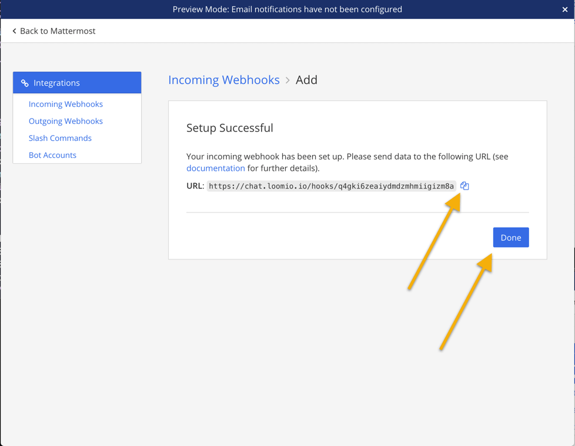

# Mattermost integration
_Connecting your Loomio group notifications to your Mattermost team chat._

Loomio can send notifications into your Mattermost channels when new discussions, proposals, comments, votes, and outcomes occur. 

---

Start from your Mattermost team in your browser. Then open the Integrations settings page.

Click "Incoming Webhooks"

Then click  "Add Incoming Webhook"

Give it a simple name, select the channel for notifications to appear within, and click Save

Copy the Webhook URL to your clipboard, you're going to need it the next step.

Make sure you have your Webhook URL in your clipboard and follow the link below.

[Adding a chatbot in Loomio](../chatbots/#how-to-setup-a-chatbot)
