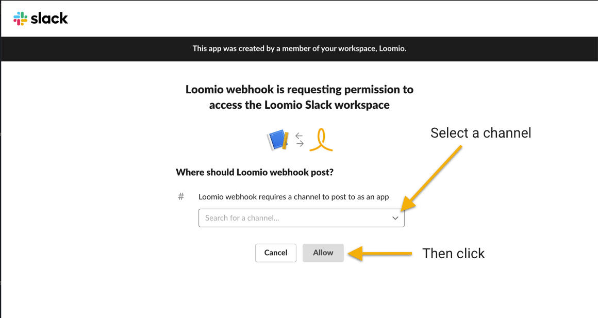

# Slack integration
_Connect your Loomio group notifications to Slack._

Loomio can send notifications into your Slack channels when new discussions, proposals, comments, votes, and outcomes occur. Get key updates, at the right time, on important discussions and decisions.

---

Start by visiting [https://api.slack.com](https://api.slack.com), signing in if you are not already, then clicking Create New App

Give your Slack app a name

Add incoming webhooks support

Then enable the function

Then add a new webhook

Select a channel

Copy the webhook URL to your clipboard

Now that you have a Webhook URL, continue setting up your chatbot over here:

[Adding a chatbot in Loomio](../chatbots/#how-to-setup-a-chatbot)

_Loomio is not created by, affiliated with, or supported by Slack._
