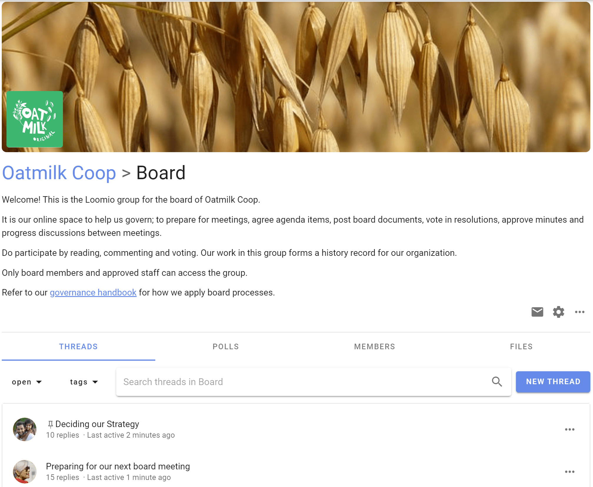

# Intro to Groups

A Loomio group is a safe place for people to meet, have discussions and make decisions. 

It’s a container where group members can find and share information, participate in important discussions and decisions that affect their work.  

A Loomio group looks like this.  At the top of the page you will see an image and logo that you can tailor to represent your organization.  This allows people arriving into your group to see they have joined a place they recognize and feel welcome - a safe space where people feel at home, amongst friends and can participate effectively.

Choose a representative name for your group and use the group description to outline;
- **what** this group is used for,
- **why** this is important,
- **who** is involved, and
- **how** members can participate.

You may also include information like a code of conduct, terms of reference or other governing documents for the group.

## Administration, Facilitation and Moderation - Code of Conduct

Loomio is built to foster inclusive participation, diversity and trust - helping groups make better decisions together. 

Some topics bring tension in a group.  So it's important to allow a robust discussion to take place, while ensuring it is also a safe place, particularly for vulnerable people in your group. 

We recommend establishing a code of conduct for your group, to help everyone be aware of their responsibility for appropriate behaviour and encourage self-regulation.  

Ask people to accept a code of conduct, or make it a condition of group membership.  

Most people behave well in online groups, and an open dialogue encourages more active participation in discussion.  

Here are some suggestions:
- Add a code of conduct to the Loomio group description (link or attach a document)
- Use a Loomio poll and invite people to read and accept the code.  (This could be a light 'Opt-in' poll or a more formal 'Proposal' poll to agree.)

See the [Facilitator's Guide](https://help.loomio.com/en/guides/facilitators_guide/commencing/index.html#culture-protocol-expectations) to further explore the value of a code of conduct.

> *"People often want to leave things to “common sense” and avoid agreeing a code of conduct or explicit protocols. However, this can disproportionately affect the most vulnerable members of the group, since they will feel the negative impacts of bad behavior or culture first and strongest, and are least empowered to counteract it themselves. It's the responsibility of the more privileged or influential members of the group to think through these questions carefully.*
*Like a legal contract, you hope you never have to enforce a code of conduct, but if you need it you’re very glad it’s there. You want to agree before it becomes necessary. In order for a facilitator or any member of the group to effectively stand up and say, “that’s not OK here”, you need to have already invested in culture-building and expectation-setting."*

### Administration

When you set up a Loomio group, you have full admin permissions for your group.

Admins perform administrative tasks for your group including the ability to add and remove members, make and remove admin permissions, change group privacy and member permission settings, upgrade and manage subscription plans, administer threads and polls.

### Facilitation

Admins are often also facilitators - encouraging people to participate, progressing discussions and nurturing decisions, while maintaining a safe environment.

Many features available to admins in Loomio are to help you facilitate.

### Moderation

Admins can edit and delete member's comments, so take on a further role of group moderation. 

Loomio does not support the ability for admins to approve member's comments before they are posted to the group.  We recommend a more open moderation policy to encourage group participation and made safe with a code of conduct.
