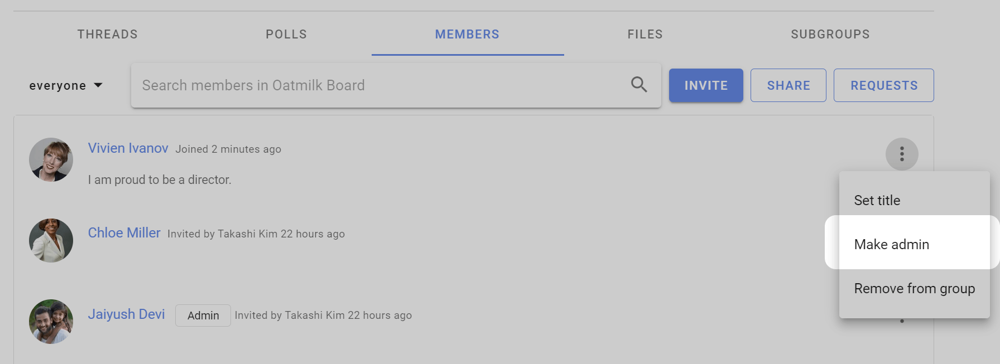

# Member management

*On this page*
- [Administering your group](#administering-your-group)
- [Managing subgroups](#managing-subgroups)
- [Removing members](#removing-members)
- [Leaving group](#leaving-group)
- [Set title](#set-title)
- [Member email addresses](#member-email-addresses)

Manage members from the **Members** tab on your group page. 

Click on the three dots (**⋮**) to the right of the group member you wish to **Set title**, **Make admin** or **Demote admin**, or **Remove from group**.

## Administering your group
There are only two user types in a Loomio group; **member** and **admin**. 

Admins perform administrative tasks for your group including; add and remove members, make and remove admin permissions, change group privacy and member permission settings, upgrade and manage subscription plans. Admins are also able to see the email address of invited members and to export group data. 

The person creating a new Loomio group is made admin by default. We recommend to make at least one other person in your group admin, to insure someone can always administer your group. 

Admins are people you trust to administer your group. You can have as many admins in your group as you wish.

To make a member **admin**, go to the Members tab, find the member and click on the three dots (**⋮**) next to their name. Choose **Make admin**. An `Admin` tag will appear beside their name.

## Managing subgroups
If you are the admin of a parent group, or organization, you have additional permissions with regards to any __closed__ subgroups.

You will be able to join any closed subgroup by clicking the "Join Group" button on the left of the Subgroup page in question (just under the tabs).

Once you have joined the subgroup, you will also be able to make yourself the admin of that subgroup, just as you would promote anyone to admin ([see above](#admin)).

***Note:*** *these permissions do not extend to* ***secret*** *subgroups.*

## Removing members
When you click **Remove from group** you'll be asked to confirm the removal. Upon removal, this user will no longer have access to the group's pages, threads, polls, or proposals. They will receive no further emails or notifications of group activity. However, any comments and votes written by the user will remain untouched.

After you have removed someone from the group, you can add them back to the group later if you wish.

## Leaving group
To leave a group go to the group page, open the 3 dot menu and click **Leave group**.

## Set title
Within the Members tab, you can also name your role within the group, or identify an organization you represent using **title**. You or a group admin can change title with **Set title** from the 3 dot menu near your name.

You can have different titles in different subgroups.

## Member email addresses

Only admins can see group member email addresses.  This is sometimes necessary to audit the members in a group.

To see member email addresses: Use [Export group data](https://help.loomio.com/en/user_manual/groups/data_export/index.html) to download a CSV file, and open the file in Excel or Google sheets.

The export group data file shows every person and their email address in every subgroup.

You can also search for members by email address in the members tab. So if you see someone you want to remove, you can search by email to remove them.
