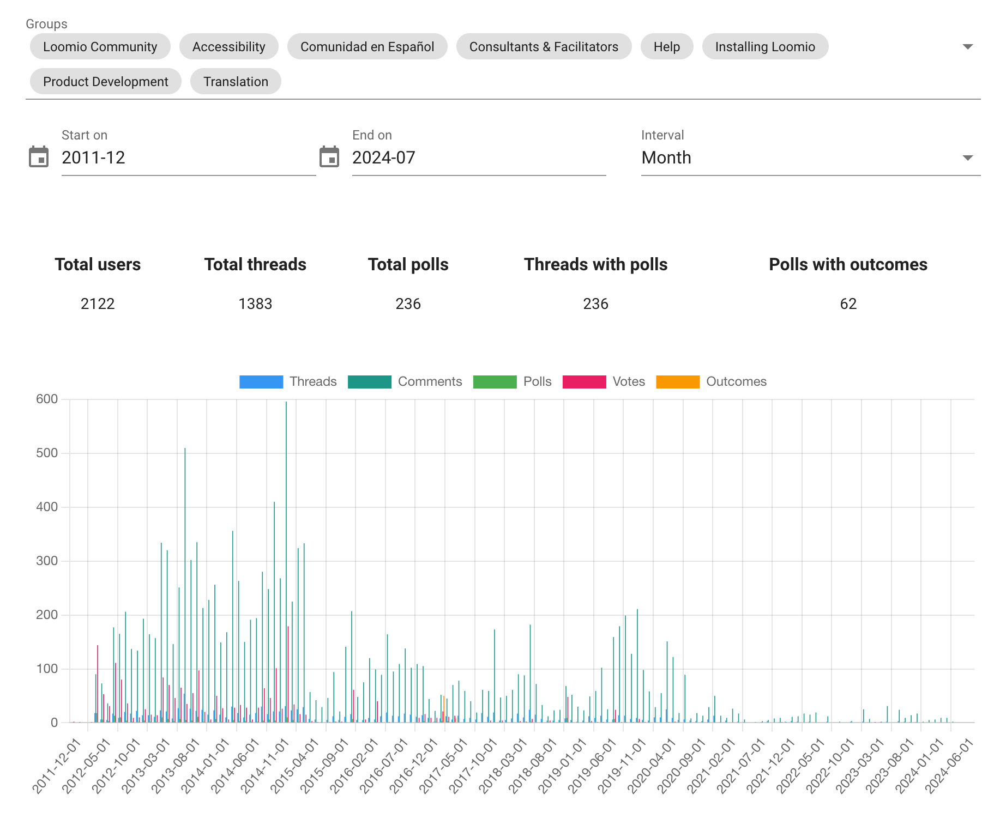
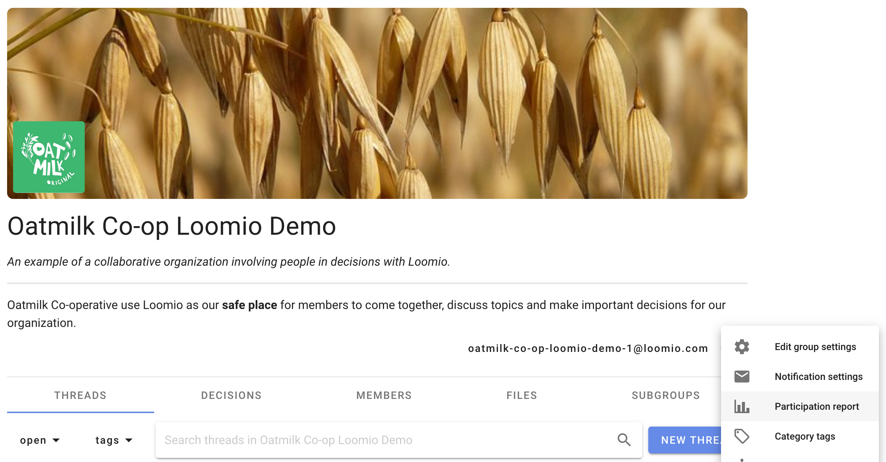

# Participation report

The group participation report gives insights into the usage of your Loomio group. 

You're able to choose which groups to include in the report, the start and end date for the report, and the interval (year, month, week or day) for grouping results. 

The report is available to everyone in your group, however users can only see results for groups that they belong to, this means that different users may see slighlty different reports.

You can find the report by clicking the group settings menu cog, as shown below. 

## What's in the report?

### Actions per month

Understand how much participation happens in your group over a given period of time. 

The report shows how many threads, comments, polls, votes and reactions have happened per month. This is graphed so you can see ebbs and flows of usage.

Click specific labels on the graph to remove them from.

Click specific headings in the table to sort the table by that column.

### Tag usage

This shows how frequently various tags have been applied during the specified time frame.

### Actions per user
Understand who are the most and least active contributors in your group.

This table shows how many threads, comments, polls, votes and reactions each user in the specified groups was responsible for during the time frame. Click specific headings in the table to sort the table by that column.

### Users per country

How many users are in each country. For all users in your group. This is based on the IP address of users.

### Actions per country

Understand which country's users participate the most and least.

Similar to "Actions per user", but the data is grouped by the country the user is detected as being in.
