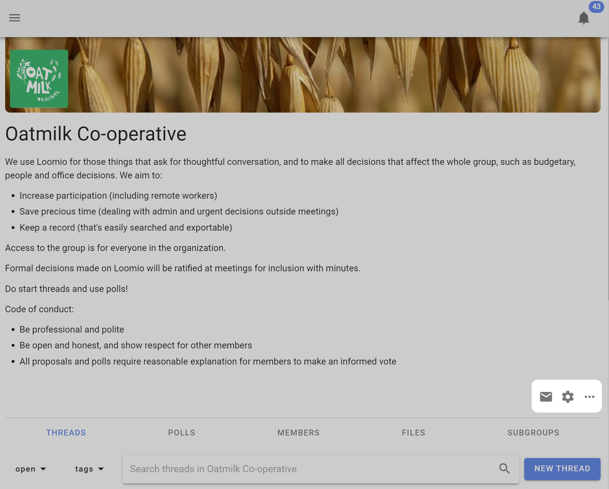
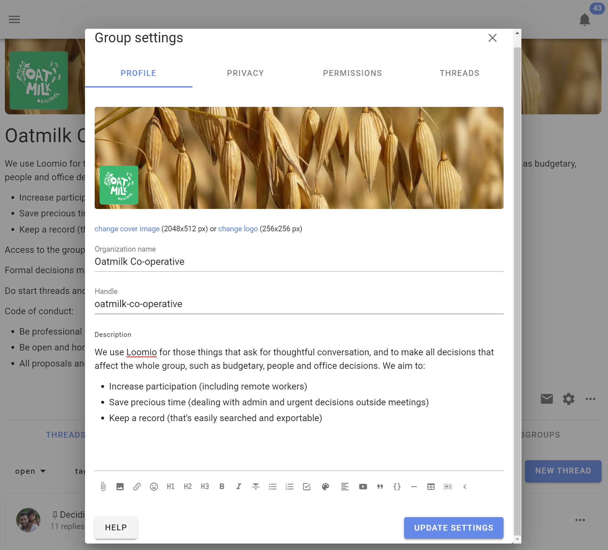

# Group Settings

*On this page*
- [Group profile](#group-profile)
- [Privacy](#privacy)
- [Permissions](#permissions)
- [Threads](#thread-settings)

In group settings you can change group name, add a group description, upload a photo or image for your group, change group privacy and member permissions, and set thread view default. Only people who are 'admin' can see and edit group settings. 

On your group page, find and click on the **Edit group settings** cogwheel icon to open Group settings and use the form that appears (click save when done). 

## Group profile

### Upload a group photo

Uploading a photo or image that has some meaning to your group significantly improves the sense of belonging. You can also add a logo which will appear alongside your group name in the sidebar menu.  Click on the image and logo to upload your file.

The ideal pixel resolution for the group image is 2048 x 512. But any image with aspect ratio of 4:1 will fit. 

You can also upload your logo icon, which will appear alongside your organization or group name in the sidebar menu.

### Change group name

You can edit the name for your organization or group. We recommend short names, particularly if you plan to use subgroups.
 
### Handle

Your group is automatically assigned a 'handle'. This provides a simplified url address for your group that can help you find your group, and that you can share with people to help them find your group.

The simplied url address for your group is **loomio.com/your-group-handle**.

You can edit the handle.

### Group description

In the Group description box think about the people you are inviting and write something about:

***What* you will use Loomio for.**
- The purpose of the group. 
- The work you are going to do.
- What you hope to achieve.

***Why* this work is important.**
- Why people should participate.

***Who* is invited into this work.**

***How* to participate.**
- What you expect of group members.
- How you see Loomio will complement your usual processes.
- An outline or attach the Terms of Reference, Code of Conduct or other doc that governs the group.

For example;

*We use Loomio to discuss and make decisions about issues, work priorities and plans, prepare for meetings, and collaborate on strategic documents.*

*We need a safe and private space for discussion, to share knowledge, perspective and wisdom, and to help us make good decisions together. Loomio will help us stay up to date, be involved and work together more effectively to achieve our objectives.*  

*This is a private group for our working team. You are invited to contribute in threads, vote in proposals and raise new topics by starting a new thread.*

*We will use Loomio to prepare for meetings and agree agenda items, upload draft papers and documents, agree actions, approve minutes, and progress discussions on issues we do not have time to cover during meetings."*

Use the formatting tools to format text, attach documents, add hyperlinks, and embed a video.

---

## Privacy

Go to the **Settings** tab on your group page. Click **Edit Group Settings** and go to the **Privacy** tab. Click **Update Settings** when done.

Your privacy settings determine who can find your group, who can see the threads in your group, and how people join.

The recommended privacy setting for new groups is **Secret**. This means everything is private to those invited members of the group. No one will know about this group (or subgroup) unless you invite them.

If you want the content of your discussions and decisions to be public and accessible by anyone on the internet, change your group privacy to **Open**. The members list will only be visible to other members.

Many groups use **Closed** to allow people to find the group and request to join. The **Name** and **Group description** are publicly accessible in Closed groups, but all threads are private.

Open groups may contain secret and closed subgroups.

A member of an open group can see that a closed subgroup exists, but not secret subgroups.

### Open group privacy - How do people join?

#### Anyone can join 

In open groups use this option if you want anyone on the internet to be able to join without restriction by clicking the 'Join group' button.  A Loomio user account is required to participate.  If the person joining does not already have a Loomio user account, they will be invited to create one.

#### Request to join

The default option is 'Anyone can request to join but must be approved.' A person visiting the group can request to join the group clicking the 'Join group' button. 

The person joining is invited to respond to 'Why do you want to join?'

Admin(s) of the group will receive an email notification with the request.

Following the link, admins can accept or decline the request.

#### Invitation only

Use this option to make a group and it's threads available to anyone as read-only.  Only people specifically invited can write or participate in the group.

### Privacy settings of trial groups

Group privacy settings cannot be changed for a group in trial. 

---

## Permissions

There are two levels of membership a person can have to a group: admin and member. 

Admins can edit group settings, make other people admins, and perform all the actions listed below.

Consider carefully each of these permissions and how they apply to your group.  In general groups with trusted members experienced with Loomio will have most settings ticked. However for most new groups, communities and larger networks, where people are less familiar with Loomio, you may want to restrict permissions to keep everyone safe.  You can always open permissions as confidence and experience of the group increases.  

Contact us if you have questions about the best permission settings for your group.

### Members can invite members

This allows everyone in your group to invite new people. When deselected only group admins will be able to invite and approve new members.

### Members can invite guests

Allows anyone in your group to invite a guest into a particular thread or poll in the group.  A guest can only see and participate in the thread or poll they are invited to - they cannot see other threads or polls in the group.

For example a board may want to invite their accountant to participate in a discussion about a financial report, so invites the accountant to the particular thread.

### Members can notify everyone in group

This allows a member to send a notification email to anyone or everyone in the group about a thread or poll.

### Members can create subgroups

This allows everyone in your group to create subgroups and become the admin of the subgroup. 

### Members can start new threads

This allows everyone in your group to start new threads. 

### Members can manage threads and comments

This allows everyone in your group to edit, move, pin, tag or close threads.

### Members can edit their own comments

This allows everyone in your group to edit their comments at any time. 

### Members can delete their own comments

This allows everyone in your group to delete their own comments from threads.

### Members can start polls

This allows everyone in your group to start a poll within a thread. 

### Admins can edit members' comments

This allows an admin to edit content written by a member.  Use this if you need to moderate or edit comments.

## Subgroup permissions

There is an additional permission setting available in subgroups.

### Members of parent group can see private threads

In closed subgroups you can allow members of the parent group to see discussions within the subgroup.  This setting is used to enable transparency of the discussions and decisions taking place within a subgroup to be visible to members of the parent group.   For example, a board that wishes to operate transparently within the organization.

---

## Thread settings

You can change the default settings for the way threads are displayed at the group level.  

### Oldest or Newest first

Threads set to **Oldest** display comments top to bottom from oldest to newest.  New comments start at the bottom of the thread.

You can reverse thread view with **Newest** so that the new comments start at the top of the thread.  This is useful for 'wall' threads, for example a thread used for posting regular reports.

### Flat or Nested replies

The thread can also be set to display chronologically, as a **flat list**, where all activity is displayed in the order that it happened, or as **nested replies** of one or two levels. 

Nested replies keeps replies to comments together, and is very helpful to easily see mini-discussions within an overall thread.
