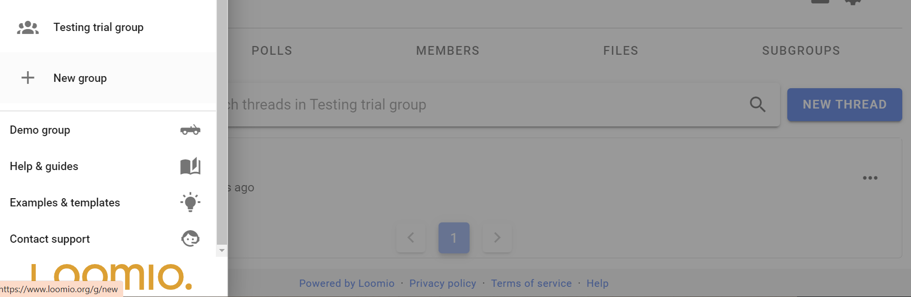

# Starting a new group

If you are new to Loomio, you can start a group on a free trial at any time from the [Loomio website](https://www.loomio.com/).

For many organizations, a single Loomio group is sufficient. You can start as many subgroups as you need within the group. See [Subgroups](https://help.loomio.com/en/user_manual/groups/subgroups/index.html) for more info.

If you already use Loomio and would like to start a new group for another organization or purpose, you can do this from the sidebar menu - click on **New group**.

A new Loomio group starts a new free trial and you will be invited to upgrade the trial to a paid subscription.  

If you are a Pro plan customer, we can add your group to your Pro plan subscription. [Contact us](https://www.loomio.com/contact) to connect your new group to your Pro plan subscription account.

### Group details

#### Group name

Type your group name. It's best to keep your group name short and concise.

#### Group handle

Your group is automatically assigned a 'handle'. This provides a simplified url address for your group that can help you find your group, and that you can share with people to help them find your group.

The simplied url address for your group is **loomio.com/your-group-handle**.

You can edit the handle.

**When you click 'Start Group' your new group is automatically created!**

---

