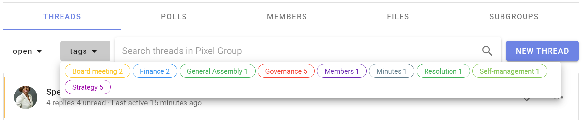

# Category Tags

Category tags make it easy to find threads of a certain type or topic.

On your group page, click on **tags** to see the category tags used in your group.  Note that alongside each tag name is the number of threads or polls with this tag.

Tags can be applied when starting or editing a Thread, Poll or Proposal.

When creating tags, use familiar category names. 

Clicking the **add tag** button allows you to edit, order, color, and **add new** tags.

Edit threads to add or remove tags after they're started.

<iframe width="100%" height="380px" src="https://www.youtube-nocookie.com/embed/ntauplSLsQE?rel=0" frameborder="0" allowfullscreen></iframe>
