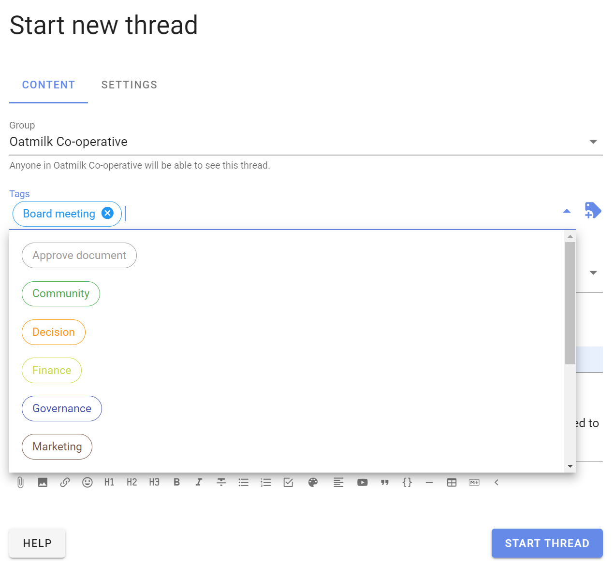
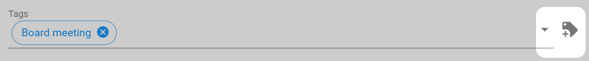
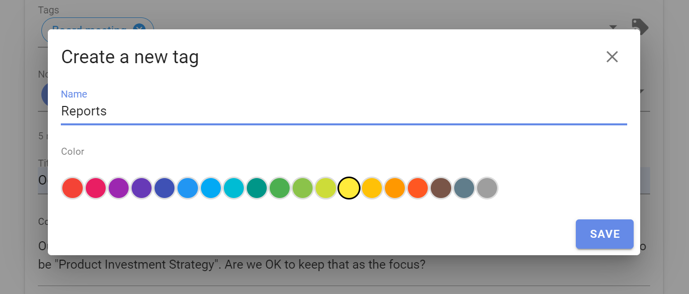
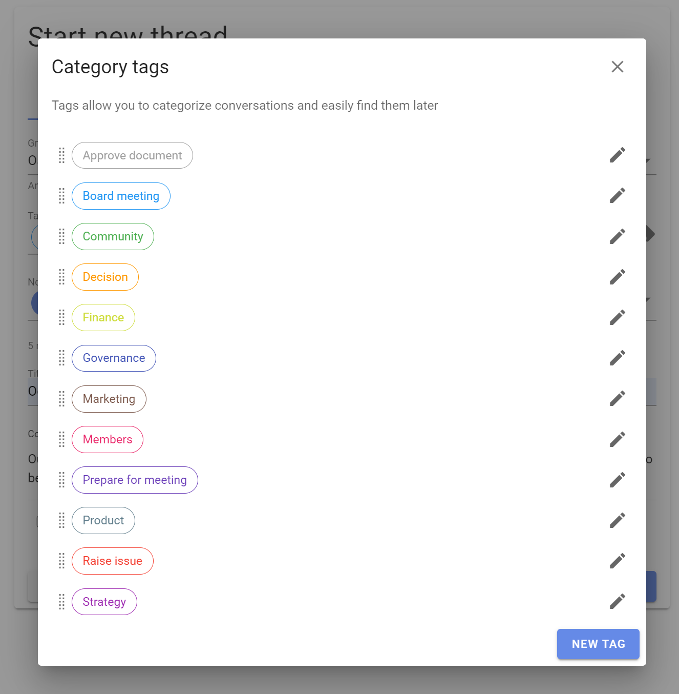
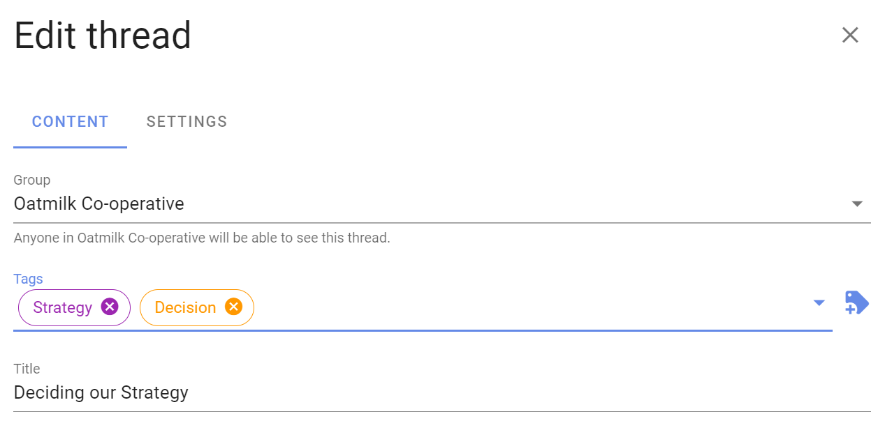

# Category Tags

Category tags make it easy to find threads of a certain type or topic.

On your group page, click on **tags** to see the category tags used in your group.  Note that alongside each tag name is the number of threads with this tag.

You can create and apply tags when you start or edit a thread.

Click on the tags field to display a list of the current tags in your group.  Click a tag to add to the thread.

Or you can start typing and existing tags will appear for you to add. 

To add a tag, go to the 'tag +' icon to the right of the page.

A page opens showing current tags.  Click **New tag** to add a new tag.

Type the tag name and select a color, then **Save**.

When creating tags, use familiar category names - for example; AGM, Board meeting, Finance, Members, Legal...

## Edit tags

To edit the tag use the pencil icon.

You can change the order that tags are displayed by dragging the tag to the position you want. 

To change the tag of an existing thread, go to the thread and click the Edit thread pencil icon.

