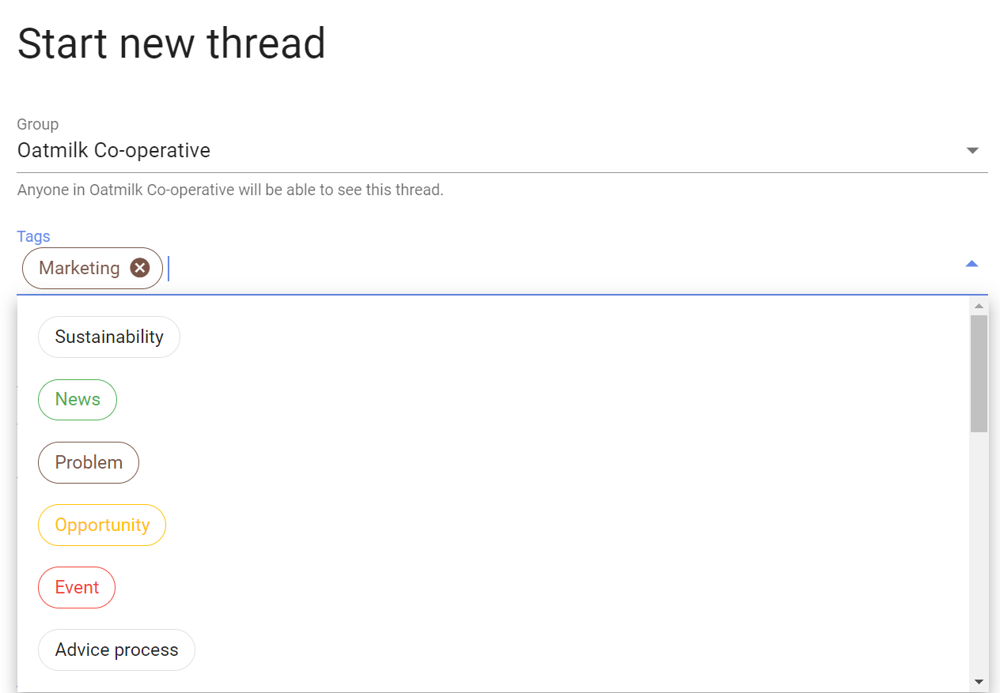
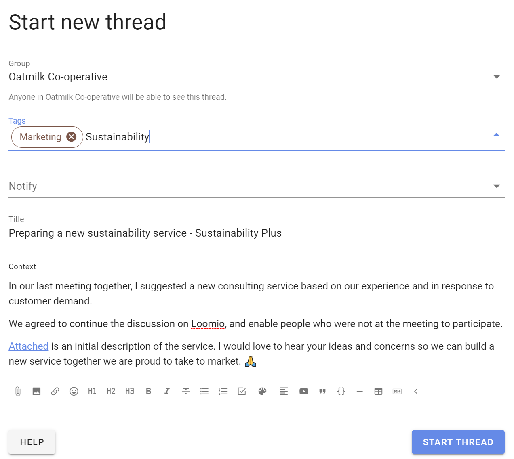
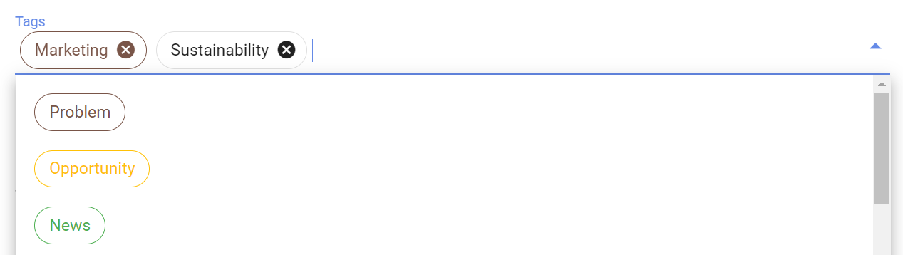
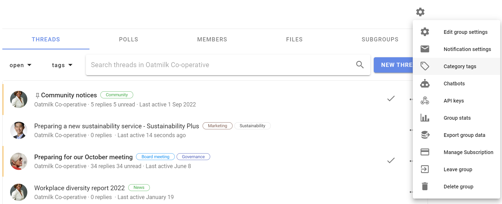
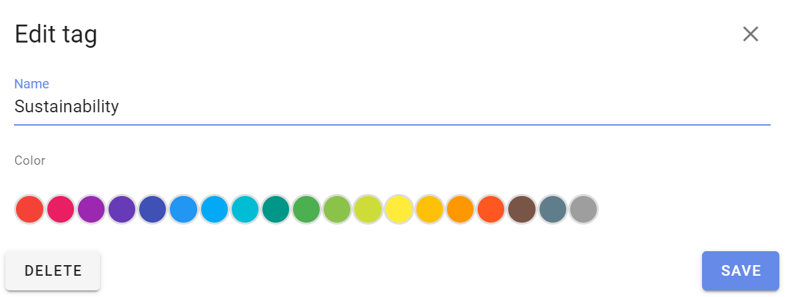
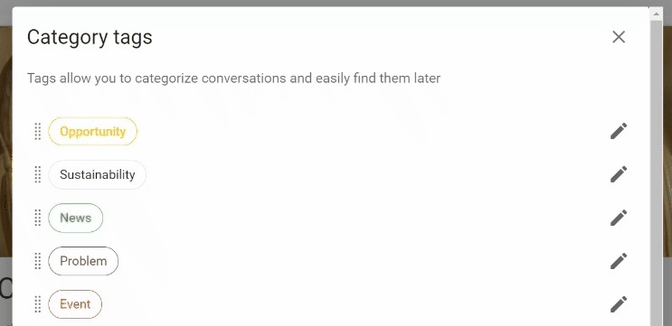

# Category Tags

*On this page*
- [Apply tags](#apply-tags)
- [Create tags](#create-tags)
- [Edit tags](#edit-tags)

Category tags make it easy to find threads and polls of a certain type or topic.

On your group page, click on **tags** to see the category tags used in your group.  Note that alongside each tag name is the number of threads with this tag.

## Apply tags

Tags can be applied by any member of the group or subgroup to threads and polls.  

Tags are applied when you start or edit a thread or poll.

Click on the tags field to display a list of the current tags in your group.  

Click a tag to add to the thread.

Or you can start typing and existing tags will appear for you to add. 

## Create tags

Only admins of the parent group can create tags for the parent group and any subgroup. 

You can create a tag when you start or edit a thread or poll. Type in the name of the new tag and 'Enter'.

When creating tags, use familiar category names that members of your group will easily recognize - for example; AGM, Board meeting, Finance, Members, Legal...

## Edit tags

Only admins can edit tags.  Admins of a subgroup can edit tags in the subgroup, and admins of the parent group can edit tags in the parent group and any subgroup.   

Go to your group page and select **Category tags** from the Settings menu.

Select the pencil icon to edit or delete the tag.

Edit the tag name and color and click **Save**.

Or click **Delete** to remove the tag from all threads in the group.

You can change the order that tags are displayed by dragging the tag handle, on the left of the tag name. 

#### Edit tag in thread or poll

To change the tag of an existing thread, go to the thread and click the edit thread pencil icon.

Click the x on the tag to remove it, and add or create tags as described above.

