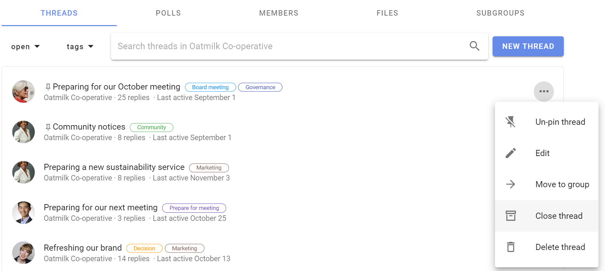

# Thread management

On the group page there are several tools to help you display and administer threads.

## Pin thread
Group admins can pin a thread to the top of the list of threads to make it easier to find. Pinned threads will appear above your other threads on your group page and are ordered by the most recently pinned item at the top. You can change position of the pinned thread by pinning and unpinning threads.

You can easily  **pin** or **un-pin** from the thread preview options.

## Close thread

To keep the list of discussions on your group page relevant, you can close threads that are no longer active.

Go to the Threads tab on your group page, and open the 3 dot menu (**...**) 

To view closed threads, first navigate to the relevant **group page**. You will need to use the drop-down just under the Threads tab to change the thread filter from its default of **open**.

Choose "closed" to view all your closed threads in the thread filter.

