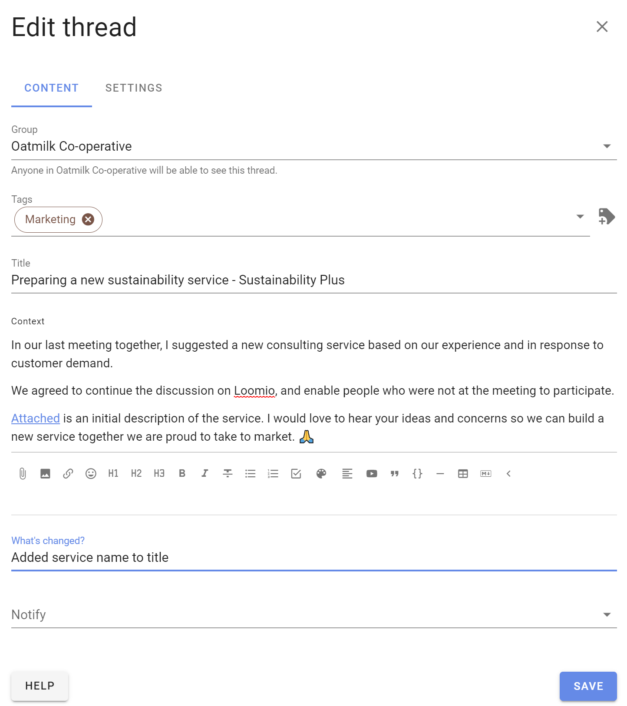

# Thread management

As the number of threads grows, you can help group members find the threads they need.

On the group page **Threads** tab there are several tools to help you display and administer threads.

You can pin important threads to the top of the thread list, edit a thread, move a thread to another group, close old threads and delete unwanted threads.

Open the 3 dot (**...**) thread management menu to the right of the thread.

These tools are available for group admins. 

If "Members can manage threads and comments" is permitted in [Group Settings](https://help.loomio.com/en/user_manual/groups/settings/index.html#permissions), any member of the group can access thread management tools.

If members are not permitted to manage threads, they can only **Close** a thread.

## Pin thread

The thread list is ordered by the most recent activity, so you will see current threads at the top and older threads lower down the list. 

You can **Pin thread** to the top of the list of threads to make it easier to find.   Welcome threads, news items and announcements are typical of pinned threads.

Pinned threads will appear above other threads on the group page and are ordered by the most recently pinned item at the top. You can change position of the pinned thread by pinning and unpinning threads.

Use **Un-pin** to release a thread so it is ordered by activity.

## Edit

**Edit thread** opens the thread edit panel, enabling you to edit any part of the thread.

When a thread has been edited, the **Show edits** icon appears on the thread page. Click on this to see what changes have been made. 

> Tip: Editing threads from the group page is a quick way to add a Category tag.

## Move to group

You can move a thread to another Loomio group or subgroup.

Select the destination group or subgroup, and click **Move thread**.

> Tip: Start a draft thread and move it to a group when you are ready to post.  Use a private subgroup of invite-only thread to work on the draft thread with one or two people.  

## Close thread

To keep the list of discussions on your group page relevant, you can close threads that are no longer active.

Go to the Threads tab on your group page, and open the 3 dot menu (**...**) 

To view closed threads, go to the group page and click on the drop-down menu just under the Threads tab. 

Change the thread filter from default **Open** to **Closed**.   You can also use this filter to see **All** threads, **Unread** threads and **Templates**

Use **Re-open thread** to restore it to the open thread list.

## Delete thread

Deleting a thread removes it from your group.  You can not restore a deleted thread.

If you are not sure if you will need to access the thread again, use **Close thread**.  Closed threads can be re-opened.

When you select **Delete thread** you will be asked to confirm before proceeding.

