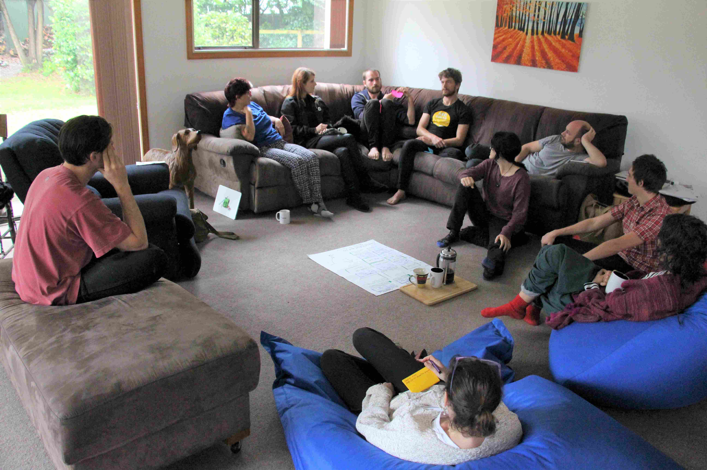

# Simple decision process

Ever since Loomio was founded, we have experimented, worked on and practiced what it means to make collaborative decisions.

Some organizations arrive at Loomio having already developed a deep culture and practice of collaborative decision making.  Such organizations have often written handbooks and codified their practices, and want to see how their decision making processes can be realized within Loomio.  If this sounds like you, then skip on to see how to apply your decision making processes in Loomio with templates.

However most organizations are still on the journey and looking for some helpful first steps towards making better decisions together.  If the burning question in your organization is **how do we make decisions together?**, then this guide is for you.

***Here are three steps to help you co-create a better, more cohesive decision with less stress and anxiety.***

## Simple decision making - in 3 steps

Good collaborative decisions rarely happen by themselves.  They almost always benefit from someone facilitating the discussion through to decision.  So when you launch a discussion thread, you take on a facilitation role (unless someone else is facilitating).

Follow these 3 steps as you facilitate your group to make a good decision.

### Step 1 - Introduce and discuss
Start a Loomio **thread** to introduce the topic, open discussion and invite people. Include all the context-setting information your group needs to meaningfully participate, along with relevant background so everyone understands the purpose.

Be clear about your objective - what is the decision to be made or intended outcome of the discussion? 

As discussion progresses, create space for diverse input - sometimes the best ideas and input come from outside the box.  Work together to explore and test ideas, encouraging a healthy and open discussion.  

Notice when the same voices are dominating and invite some of the quieter people to contribute by @mentioning them and asking them what they think. 

You can make a complex discussion easier to engage with by updating the thread context section with a summary of the key points.

### Step 2 - Sense check
As your group begins to converge on path forwards, use a **Sense check** poll to survey opinions and test how the group feels.

A ‘Sense check’ lets people know a proposal is forming and encourages them to engage.
It can also be used to clarify an issue, even if the solution might not be apparent yet.  

Sense check is a great way to surface concerns before moving to a formal agreement.  You can find out if people are happy with where this is going, if they have questions or need more time, or if they are concerned.

Use feedback to improve and refine the proposal. If there’s still some work to do, you may need to go back to Step 1 and then run another Sense check round. 

Good engagement will help you assess when you are ready to proceed to a proposal.

### Step 3 - Proposal
Now when you raise a formal **Proposal**, you do so with confidence that it will pass. 

There may have been a lot of discussion and variations suggested, so be specific about the decision being made, so that everyone knows what the voting options mean.

Set proposal deadlines consciously, so group members have time to consider and engage.  You can always extend the closing date if need be.

This step is important to formalize agreement with people’s vote and to state an outcome - what just happened and what will happen next.

Proposal results are logged, along with a record of the discussion leading to the decision.

### Outcome
When a Loomio poll closes, you will be prompted to set an **outcome** to let everyone know what happened and what is going to happen next.

## Proposals can help in many situations

Don't hesitate to start a proposal just because you're not sure everyone will agree - proposals are not only for when you have consensus, they're designed to surface issues that need resolving and are useful for clarifying disagreements. 
