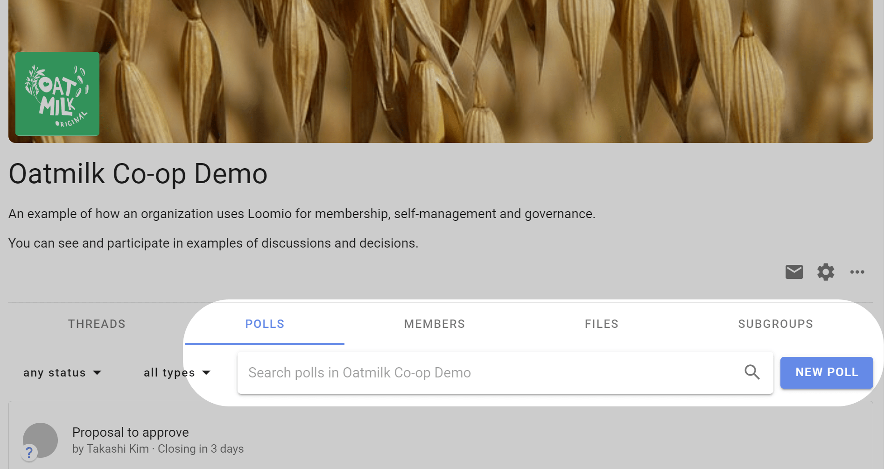

# Proposals and polls

Loomio proposals and polls help you involve people in decisions.  They are used to progress a discussion to an outcome.

- Involve the right people to make better decisions 
- Get engagement, test ideas, listen and sense, identify priorities, and clarify issues, even if the solution might not yet be apparent 
- Set a deadline, prompt people who haven’t participated, and state an outcome
- Apply decision making processes that work for your organization

Loomio includes a series of predefined proposal templates for common decision processes such as; Advice process, Consent process and Consensus. 

The proposal templates are the scaffolding to run a process. You can edit the templates to suit your particular needs, create new templates, or remove and rearrange templates to customize the experience for your organization.

A decision process is usually contained within a Loomio thread and may use one or more proposal templates as you progress towards an outcome. 

See our guides for [Advice process](https://help.loomio.com/en/guides/advice_process/index.html), [Consent process](https://help.loomio.com/en/guides/consent_process/index.html) and [Consensus process](https://help.loomio.com/en/guides/consensus_process/index.html) for help and examples of using proposal templates at key steps in each process.

## Start a proposal or poll

### Within a thread

You can start a proposal or poll within a thread to run a decision process or progress a discussion. 

Open the thread, scroll to the **Add Comment** bar and click on the **Run Process** tab, and select your proposal or poll template.

### Standalone proposal or poll

You can also start a standalone proposal or poll from your group page, from the **Polls** tab on your group page. Click on **New Poll** and select your proposal or poll template.

## Proposals

**[Advice](https://help.loomio.com/en/user_manual/polls/proposals/index.html#advice-proposal)** Seek advice on a decision you need to make.

**[Consent](https://help.loomio.com/en/user_manual/polls/proposals/index.html#consent-proposal)** Make a decision that is ‘safe to try’, without objections.

**[Consensus](https://help.loomio.com/en/user_manual/polls/proposals/index.html#consensus-proposal)** Reach collective agreement with everyone involved.

**[Question round](https://help.loomio.com/en/user_manual/polls/proposals/index.html#question-round)** Invite clarifying questions to help people understand a proposal.

**[Sense check](https://help.loomio.com/en/user_manual/polls/proposals/index.html#sense-check)** To ask people for feedback, questions and concerns before moving to a decision.

**[Gradients of agreement](https://help.loomio.com/en/user_manual/polls/proposals/index.html#gradients-of-agreement)** Express support for a proposal on an 8-point scale.

**[Proposal (classic)](https://help.loomio.com/en/user_manual/polls/proposals/index.html#proposal-classic)** Raise a proposal to make a decision.

## Polls

**[Simple poll](https://help.loomio.com/en/user_manual/polls/proposal_types/index.html#simple-poll)** A simple poll to ask people which option or options they approve.

**[Score poll](https://help.loomio.com/en/user_manual/polls/proposal_types/index.html#score-poll)** Find the degree of support for each option.

**[Dot vote](https://help.loomio.com/en/user_manual/polls/proposal_types/index.html#dot-vote)** Find degree of support by asking people to allocate a budget of points to options. 

**[Ranked choice](https://help.loomio.com/en/user_manual/polls/proposal_types/index.html#ranked-choice)** Rank a list of options in order of preference — useful for elections.

## Meetings

**[Time poll](https://help.loomio.com/en/user_manual/polls/meeting_polls/index.html#time-poll)** Find the best time to meet, or to schedule an event. Like Doodle without all the ads…  

**[Opt-in](https://help.loomio.com/en/user_manual/polls/meeting_polls/index.html#opt-in)** Find volunteers or participants to help or join a working group.

## Settings

**New poll type**: Configure the poll type you need with custom terminology, options and settings.

## All proposals and polls have a similar structure

As you start using proposals and polls, you will notice the setup, running and closing follow a similar pattern:

**Set up proposal or poll:**
- Give it a title
- Assign a category tag
- Describe the poll question, and how you want people to vote
- Configure poll options
- Set a closing deadline 
- Invite people

In the "Settings" tab you can also set:
- Hide results, until vote is cast or poll closes
- Anonymous voting
- Vote reason to required, optional or disabled
- Reminder that poll is closing soon to nobody, author, undecided voters or all voters

**Running proposal or poll:**
- People vote and add a reason (optional) 
- Results are updated live
- People can change their vote if new info emerges
- A reminder is sent to people who haven’t voted 

**Proposal or poll closed:**
- The proposal or poll closes, and everyone can see the results
- The author sets an outcome, notifying everyone of what will happen next.
