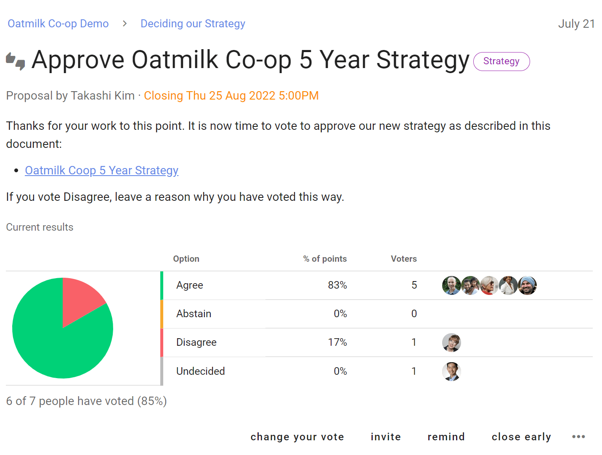

# Proposals and Polls

Proposals and Polls help you make decisions and progress discussion to an outcome.

- Involve the right people to make better decisions 
- Get engagement, test ideas, listen and sense, identify priorities, and clarify issues, even if the solution might not yet be apparent 
- Set a deadline, prompt people who haven’t participated, and state an outcome
- Flexibly use decision making processes that work for your group

## Proposals

**Advice proposal**: Seek advice on a decision you need to make.

**Consent proposal**: Make a decision that is ‘safe to try’, without objections.

**Consensus proposal**: Reach collective agreement with everyone involved.

**Question round**: Invite clarifying questions to help people understand a proposal.

**Sense check**: To ask people for feedback, questions and concerns before moving to a decision.

**Gradients of agreement**: Express support for a proposal on an 8-point scale.

**Proposal (classic)**: Raise a proposal to make a decision.

## Polls

**Simple poll**: A simple poll to ask people which option or options they approve.

**Score poll**: Find the degree of support for each option.

**Dot vote**: Find degree of support by asking people to allocate a budget of points to options. 

**Ranked choice**: Rank a list of options in order of preference — useful for elections.

## Meetings

**Time poll**: Find the best time to meet, or to schedule an event. Like Doodle without all the ads…  

**Opt-in**: Find volunteers or participants to help or join a working group.

## Settings

**New poll type**: Configure the poll type you need with custom terminology, options and settings.

## Proposal

The proposal poll is the heart of Loomio. A proposal helps convert a discussion into a clear, practical outcome. 

For example, someone suggests a course of action and invites people to respond by voting agree, abstain or disagree. 

As people vote, they can give a reason why they have voted this way. You can see where everyone else stands on the matter, and why. If someone contributes some new information or a strong opinion you can change your vote, if you wish.

In this way you can use proposals to prompt people for a response, uncover new information, and build shared understanding - to help your group make a better, more informed decision.

A proposal and associated discussion, creates a record of how the decision came about.

## All proposals and polls have a similar structure

As you start using proposals and polls, you will notice the setup, running and closing follow a similar pattern:

**Set up proposal or poll:**
- Give it a title
- Assign a category tag
- Describe the poll question, and how you want people to vote
- Configure poll options
- Set a closing deadline 
- Invite people

In the "Settings" tab you can also set:
- Hide results, until vote is cast or poll closes
- Anonymous voting
- Vote reason to required, optional or disabled
- Reminder that poll is closing soon to nobody, author, undecided voters or all voters

**Running proposal or poll:**
- People vote and add a reason (optional) 
- Results are updated live
- People can change their vote if new info emerges
- A reminder is sent to people who haven’t voted 

**Proposal or poll closed:**
- The proposal or poll closes, and everyone can see the results
- The author sets an outcome, notifying everyone of what will happen next.
