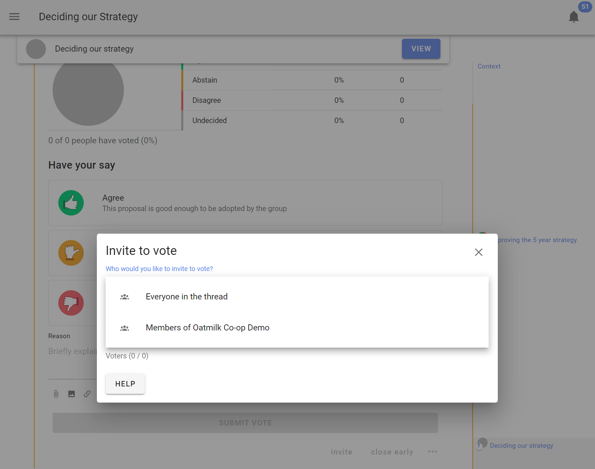
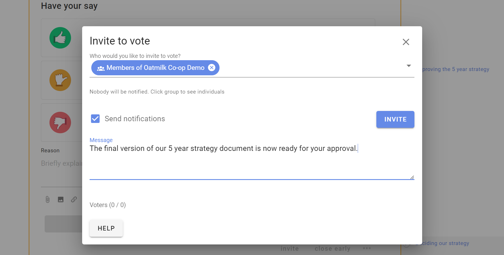

# Inviting people

## Inviting people to vote in a poll

Invite people to your poll by sending them a notification.

After you start the poll an **Invite to vote** box appears.  You can select the pre-set groupings; **Everyone in the thread** or **Members of [your group name]** and you can enter names or the email addresses of group members.   

You can add a message with your invitation to vote (optional).

Click on the group to see the people you are inviting.  You can remove people from the list by clicking the x beside their name.

### Invite guests or experts

You can also invite a guest to the poll by typing their email address. They will be given permission to participate in only this poll.  

However if the poll is within a thread, they will also be able to see the thread and comments. They will not be able to comment or participate in other polls in the thread, nor see any other threads in the group.

