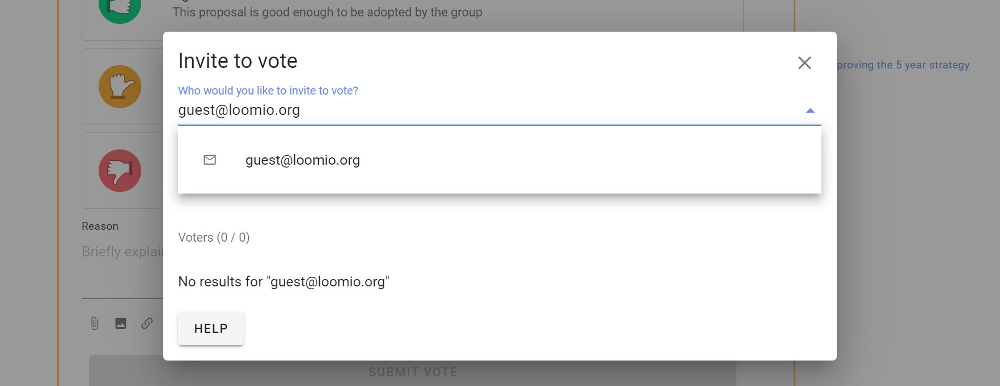
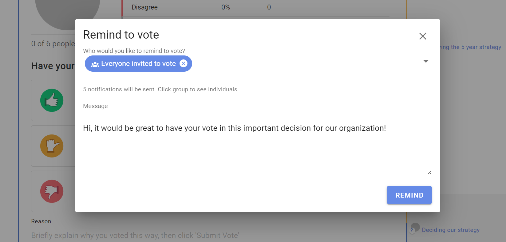
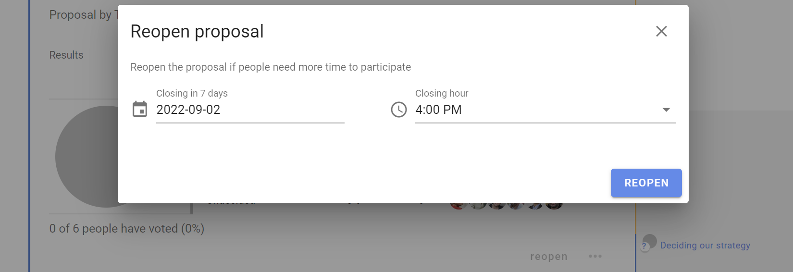

# Invite to vote

## Inviting people to vote in a poll

Invite people to your poll by sending them a notification.

After you start the poll an **Invite to vote** box appears.  You can select the pre-set groupings; **Everyone in the thread** or **Members of [your group name]** and you can enter names or the email addresses of group members.   

You can add a message with your invitation to vote (optional).

Click on the group to see the people you are inviting.  You can remove people from the list by clicking the x beside their name.

### Invite guests or experts

You can also invite a guest to the poll by typing their email address. They will be given permission to participate in only this poll.  

However if the poll is within a thread, they will also be able to see the thread and comments. They will not be able to comment or participate in other polls in the thread, nor see any other threads in the group.

### Invite a subgroup to vote

It is possible to invite a subgroup of people to vote in a poll within the parent group. Please be aware of the [Delegated voters](https://help.loomio.com/en/user_manual/groups/membership/management.html#delegated-voters) feature also.

## Engaging people when poll is running 

At the bottom of the poll are several features to help you engage with people once the poll is running.

### Inviting new people to the poll

You can add new people to the poll after it has started.

Click **invite**, and enter the names or the email addresses of the people you want to invite.

### Remove people from the poll

You may want to remove a person(s) from the poll.  Click **invite**, find the person's name and click on the 3 dot menu to the right and select **Remove from proposal**. 

For example an administrator sets up a poll on behalf of board members.  The administrator is not authorized to vote, so is removed from the poll. 

### Remind to vote

If voting is slow, you can **remind** people to vote by sending them a notification.  The page is similar to **invite** and shows a pre-group of 'Everyone invited to vote'.  Click on the group to see the people you are reminding.  

### Close early

You can close the poll early, before the closing time with **close early**.  

This is used when everyone has voted or you need to close the poll for some other reason.

### Reopen

You can **reopen** a poll that has closed.  Set the new closing date and time.

