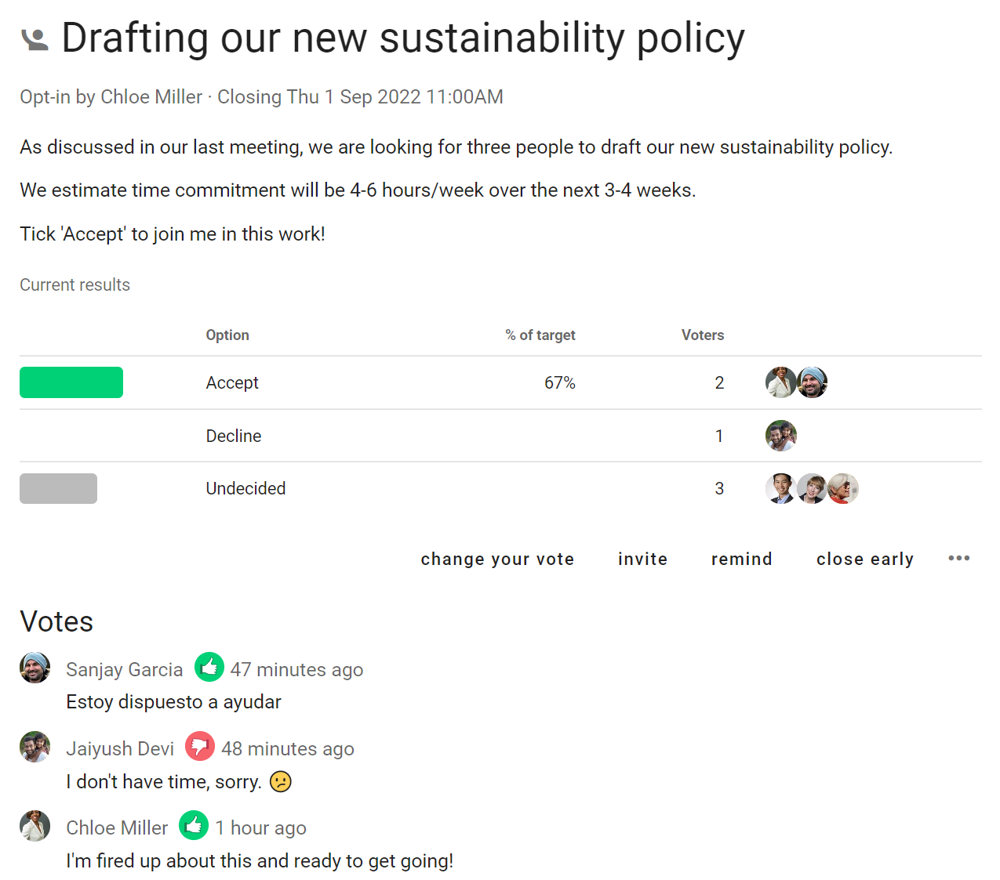

# Meeting polls

Polls to help you organize meetings!  

Find a time for your meeting or event. **Time poll** is particularly useful for people in multiple timezones.

Invite people to **Opt-in** to the meeting, event or to join your working group.

## Time poll

_Find when people are available to meet_

Save time arranging a date for your meeting or event. 

Time poll makes it easy to see everyone's availability and find the best time.

Give your Time poll a title and details. Enter a list of date and time options in your time zone.  

When setting timeslots, consider people in different time zones. Participants will see times localized in their time zone.

Set a meeting duration.

### Voting

People mark the timeslots they are available with the green 'thumbs up' icon or leave the red 'thumbs down' in place when unavailable.  They can also use the 'thumbs sideways' icon to say they are available 'if need be'. 

Participants can leave a reason comment to help the organizer find a suitable time.

If the times don't work, participants can suggest alternatives using the message field. You can then update the poll with new times.

The results update as voting proceeds in a table showing who is available when, so everyone can see which timeslots are popular.

### Outcome

When the Time poll closes, pick the best time slot and state an Outcome.

**Notify**: Add the people you are inviting to the meeting or event.

**Meeting time**: Click on the meeting time to select the best meeting time.  

**Meeting name**: Give your meeting a name. (Default name is the Time poll title.)

**Location**: You can add a location for the meeting.

**Statement**: State the outcome of the Time poll and any instructions for the meeting.

Loomio will include a calendar invitation with the Outcome notification email, so participants can add to their calendar.

## Opt-in

_Find volunteers or participants_

Use Opt-in to invite people to a join a team, committee or working group, or to participate in an event.  

‘Opt-in’ has two voting options: Accept or Decline. 

Set how many people you are looking for, say 3 people to join your working group.

Use Opt-in to seek engagement and encourage participation.  For example think of Opt-in as the online way to ask a room of people *"Raise you hand if ..."*

Like other Loomio polls, Opt-in asks you to set a closing time and will automatically notify people 24 hours before close - encouraging people to participate in a timely way so you can get on with the work. 
