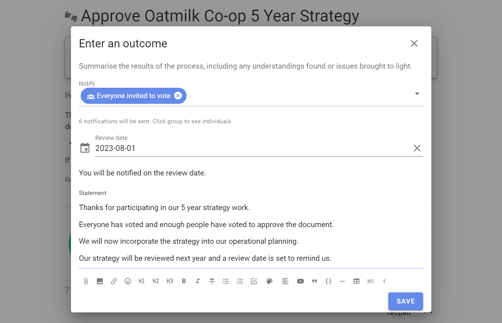
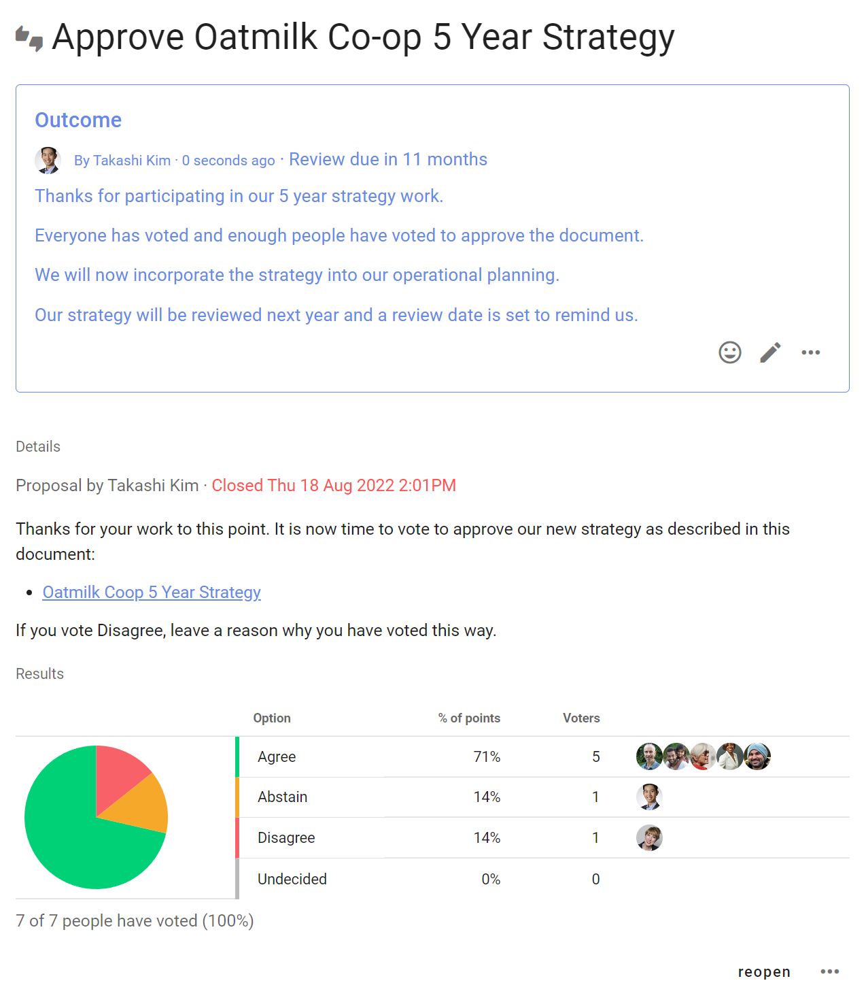

# Outcome
_Take time to consider the results then share an outcome so people know what will happen next._

When your poll closes, you’ll be prompted to set a poll outcome.

In Loomio, the outcome or conclusion of a poll is up to you to define on behalf of the group - it's not assumed that majority wins.  

A formal decision may be governed by constitution or by prior agreement within your organization.  

Sometimes it makes sense to go with the majority, but sometimes even one dissenting voice means it's a no.  For example, the Consent decision process continues until there are no objections.

Whatever the results, there is always something to learn from the proposal. 

Your outcome statement is an opportunity to state the results and what has been learnt.  Use outcome to let everyone know what will happen next.

Review the poll intentions and results and write your outcome.

You can notify people - they will receive an email from Loomio containing the poll results and your outcome statement.

You can also choose to set a **Review date** - a future date when you would like to review this poll or decision.  For example to review a strategy at the same time next year.

**Example outcomes**

> _This proposal did not reach consensus because several people were concerned about budget impacts. George and Jimena will do some financial modelling and raise a new proposal next week._

or

> _I've taken on board everyone's input. As the project manager, this is my call to make and I've decided we are going to extend the timeline by 10 days._

Setting outcomes makes your decision archive easy to search, because you have a succinct statement for each proposal.
