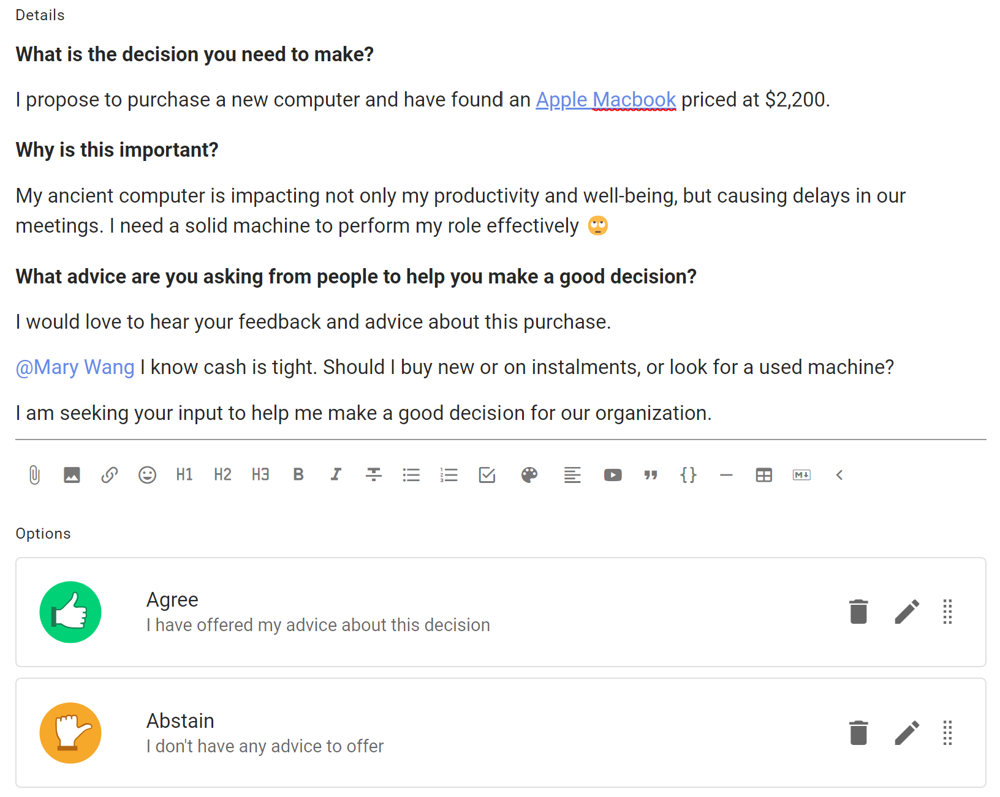
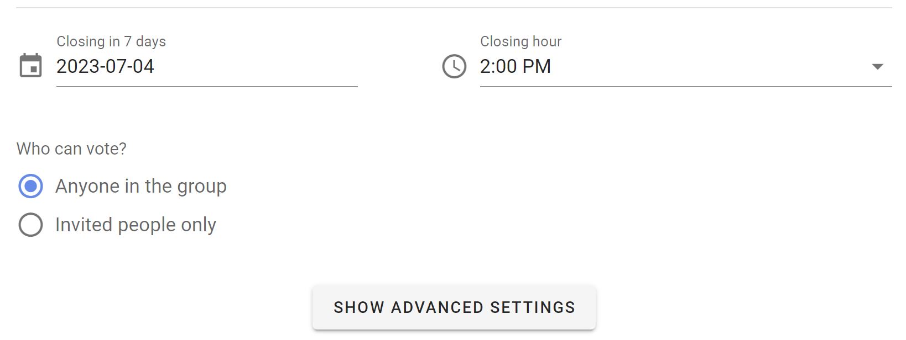

# New poll template

*Note, this page is currently being updated with new poll templates. Some descriptions and screenshots may differ from the current software version.*

## Introducing proposal templates

We’re delighted to introduce a big update to proposal templates in Loomio.

Loomio proposals and polls help you involve people in decisions.  They are used to progress a discussion to an outcome.

Loomio now includes a series of predefined proposal templates for common decision processes such as Advice process, Consent process and Consensus. 

The proposal templates are part of the scaffolding used to run a process. You can edit the templates to suit your particular needs, create new templates, or remove and rearrange templates to customize the experience for your organization.

A decision process is usually contained within a Loomio thread and may use one or more proposal templates as you progress towards an outcome. 

See our guides for [Advice process](https://help.loomio.com/en/guides/advice_process/index.html), [Consent process](https://help.loomio.com/en/guides/consent_process/index.html) and [Consensus](https://help.loomio.com/en/guides/consensus_process/index.html) for help and examples of using proposal templates at key steps in each process.

## Using templates

When you next open a thread in Loomio, or start a new poll, you have the option to run a predefined Loomio proposal template. 

Under the Proposal tab, you will find templates for proposals commonly used in decision processes like Advice, Consent and Consensus. 

The Question round template uses the standard Loomio proposal format to invite questions, and does not have any voting options.  It is often used as an early step in the Consent process.

Sense check is an easy way to invite feedback, questions and concerns.  Sense check can also be used in the Consent process or to test for consensus.

You will find more proposal and poll templates under the tabs:
- Poll - Simple poll, Score poll, Dot vote and Ranked choice
- Meeting - Time poll, Opt-in
- Settings - Proposal (classic), Gradients of Agreement

### Example

Let's look at how to use a proposal template when running an Advice process.

There is an info box at the top of the page outlining what this proposal is intended for, and a link to a guide in the Loomio user manual outlining how to run the Advice process with Loomio.

The proposal template includes some text prompts to help you write a great proposal; for example a clear title, tag and proposal details.

The proposal template has predefined voting options, however you can edit these to suit your proposal.

As usual, you can set a closing date for the proposal to give some time for people to respond.

See **Advanced settings** if you want to change settings like the reminder email, anonymous voting, vote reason requirement and character limit, and hide results.

When the poll is started, participants invited can vote to offer advice and write it in the reason field.

Results are available as people participate.

## Creating your own templates

You can create your own proposal or poll template under the Settings tab.

The new poll template page provides all of the tools you need to design your template and help people to use it.

Create a new poll template for use in your organization. Customize terminology and settings so it's easy for other people to run a specific decision making process.

Only group admins can create poll templates.

**Choose the Loomio group for your template**: Poll templates are associated with a particular Loomio group.  (So it's a good idea to create your templates in a group that everyone can access.)  (For example, this could be your Loomio 'parent' group or a special group/subgroup you set up for templates.)

Tip: Invite-only threads can use prposal and poll templates from any group you are a member of.

With the **New poll template** form, you can add a process name, subtitle and introduction.  You can give it an example title to help people using the template, provide default Category tag(s), and provide some example details. You can change voting options, name, meaning and reason prompt.

### Voting method

Choose the voting method you want to use.

Show of thumbs is the voting method for Proposal, Sense check and common in Advice and Consent processes.

Other methods include:
- Simple poll - single or multiple choice of options
- Dot vote - allocate a budget of points across a list of options, where people can assign points to options however they like.
- Score poll - people can assign a score on a scale, say 1 to 10 for each option
- Ranked choice - invite people to put options in their order of preference, first to last.

### Poll type name and description

Give the poll type a name and add a description of the purpose of your poll type.

Then give your poll type an example title and details to prompt people using your poll.  The title and details can be edited when used.

### Poll type options

There is a lot of flexibility to configure voting options for your new poll type.

Use the pencil icon alongside the voting option to open the edit modal:

**Option name**: A short name for the option.

**Icon**: Select the icon for the option; thumbs up, thumbs down, thumbs sideway or hand up.

**Meaning**: A sentence that explains what choosing this options means.

**Reason prompt**: A question to prompt voters to provide their reasoning or reconsider their position.  Use the reason prompt to uncover what people like or dislike about the poll. It is also an opportunity to find out what needs to changed to reach agreement.

### Default duration

You can set the default duration for your poll type.  This can be changed by people using the poll.

### Settings

You can configure default settings for your poll type.

See [Poll Settings](https://help.loomio.com/en/user_manual/polls/starting_proposals/index.html#poll-settings).

### Invite to give feedback

When configured, you can invite colleagues to view the new poll type and provide feedback.

### Poll template

Your new poll type is now saved as a poll template.

Notice that as this poll is a template, voting is disabled.

To use the poll template, click **Make a copy**.

When anyone in your group starts a new poll, your new poll template is available for use and included in the list of custom poll types.

The ability to configure poll types is a new feature, so please do [Contact us](https://www.loomio.com/contact) and let us know how you use it!
