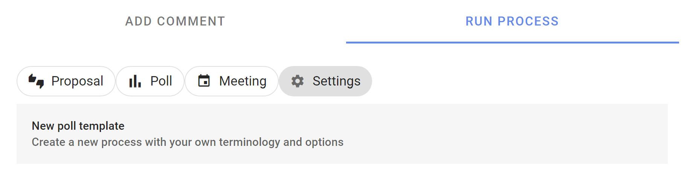
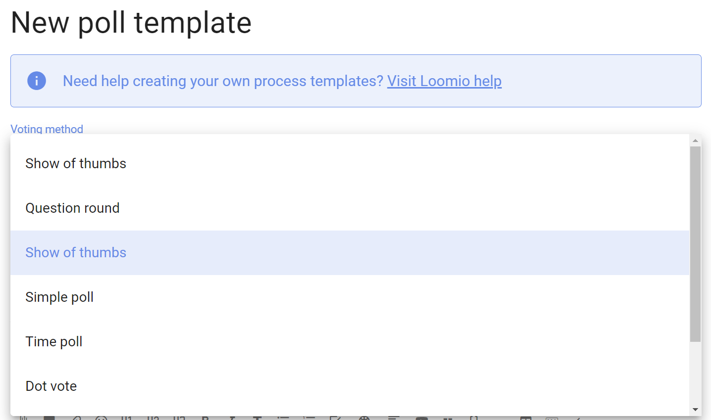
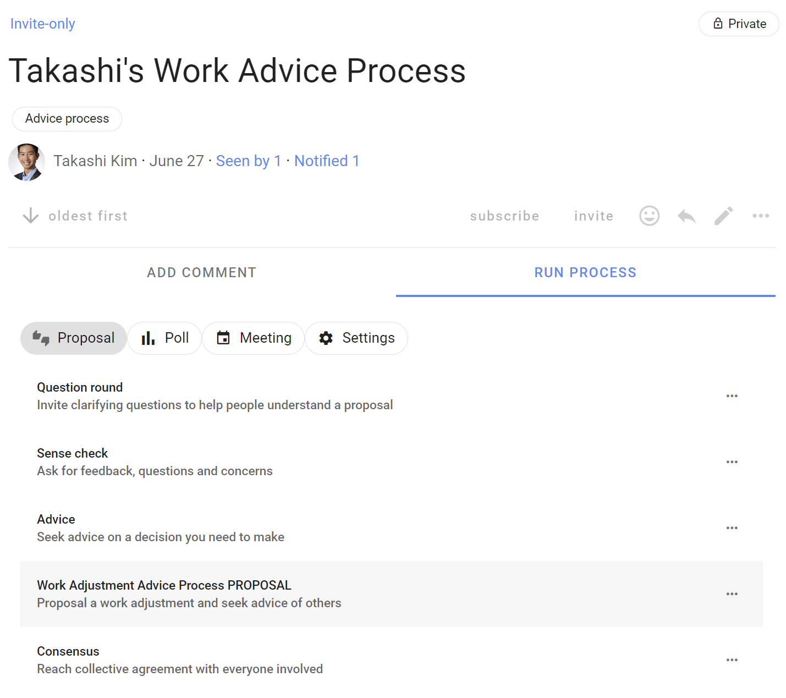
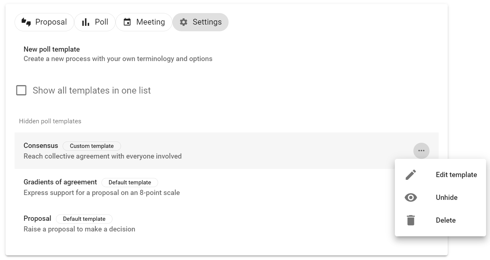

# New poll template

*Note, this page is currently being updated with new poll templates. Some descriptions and screenshots may differ from the current software version.*

---

## Introducing proposal templates

We’re delighted to introduce a big update to proposal templates in Loomio.

Loomio now includes a series of predefined proposal templates for common decision processes such as Advice process, Consent process and Consensus. 

The proposal templates are part of the scaffolding used to run a process. You can edit the templates to suit your particular needs, create new templates, or remove and rearrange templates to customize the experience for your organization.

<iframe width="560" height="315" src="https://www.youtube.com/embed/at--PUMjXfo" title="YouTube video player" frameborder="0" allow="accelerometer; autoplay; clipboard-write; encrypted-media; gyroscope; picture-in-picture; web-share" allowfullscreen></iframe>

You will find more proposal and poll templates under the tabs:
- Poll - Simple poll, Score poll, Dot vote, Ranked choice
- Meeting - Time poll, Opt-in
- Settings - Proposal (classic), Gradients of Agreement, Question round

The classic Loomio proposal is still available under the Proposal tab if you have used it in your group. Otherwise you can find the Proposal under the Settings tab.

See our guides for [Advice process](https://help.loomio.com/en/guides/advice_process/index.html), [Consent process](https://help.loomio.com/en/guides/consent_process/index.html) and [Consensus](https://help.loomio.com/en/guides/consensus_process/index.html) for help and examples of using proposal templates at key steps in each process.

---

## Using templates

When you next open a thread in Loomio, or start a new poll, you have the option to run a predefined Loomio proposal template. 

Under the Proposal tab, you will find templates for proposals commonly used in decision processes like Advice, Consent and Consensus. 

Sense check is an easy way to invite feedback, questions and concerns.  Sense check can also be used in the Consent process or to test for Consensus.

You will find more proposal and poll templates under the tabs:
- Poll - Simple poll, Score poll, Dot vote and Ranked choice
- Meeting - Time poll, Opt-in
- Settings - Proposal (classic), Gradients of Agreement, Question round

### Example

Let's look at how to use a proposal template when running an Advice process.

There is an info box at the top of the page outlining what this proposal is intended for, and a link to a guide in the Loomio user manual outlining how to run the Advice process with Loomio.

The proposal template includes some text prompts to help you write a great proposal; for example a clear title, tag and proposal details.

The proposal template has predefined voting options, however you can edit these to suit your proposal.

As usual, you can set a closing date for the proposal to give some time for people to respond.

See **Advanced settings** if you want to change settings like the reminder email, anonymous voting, vote reason requirement and character limit, and hide results.

When the poll is started, participants invited can vote to offer advice and write it in the reason field.

Results are available as people participate.

## Creating your own templates

Create a new poll template for use in your organization. Customize terminology and settings so it's easy for other people to use it and run a specific decision making process.

With the **New poll template** form, you can add a template name, subtitle and introduction.  You can give it an example title to help people using the template, provide default Category tag(s), and provide some example details. You can change voting method and voting options; name, meaning and reason prompt.

**Choose the Loomio group for your template**: Poll templates are created within a particular Loomio group.  They can be accessed for use within your Loomio group and when using Invite-only threads.

Only group admins can create poll templates.

Create your poll template under the Settings tab.

The **New poll template** page provides all of the tools you need to design your template and help people to use it.

### Voting method

Choose the voting method you want to use.

Show of thumbs is the voting method for proposals; Sense check, Advice, Consent, Consensus and classic Proposal.

Other methods include:
- Simple poll - single or multiple choice of options
- Dot vote - allocate a budget of points across a list of options, where people can assign points to options however they like
- Score poll - people can assign a score on a scale, say 1 to 10 for each option
- Ranked choice - invite people to put options in their order of preference, first to last

### Template title and subtitle

Name your template in the title.

Add a one-line description of when or why to use this template.

### Template help

You can add a description of the template and how to use it.  Include links to resources that might be helpful.

The description will appear in the top blue box whenever someone uses the template. 

Here is an example of a specific process.

### Poll template example title and details

You can write an example title for the template, preset category tags, and add text in the details field to help people using the template.

The title and details can be edited when the template is used.

### Poll template options

Configure the voting options for your new template.

Use the pencil icon alongside the voting option to open the edit modal:

**Option name**: A short name for the option.

**Icon**: Select the icon for the option; thumbs up, thumbs down, thumbs sideway or hand up.

**Meaning**: A sentence that explains what choosing this options means.

**Reason prompt**: A question to prompt voters to provide their reasoning or reconsider their position.  Use the reason prompt to uncover what people like or dislike about the poll. It is also an opportunity to find out what needs to changed to reach agreement.

### Default duration

You can set the default duration for your poll type.  This can be changed by people using the poll.

### Settings

You can configure default advanced settings for your poll template.

See [Advanced Settings](https://help.loomio.com/en/user_manual/polls/starting_proposals/index.html#advanced-settings).

### Poll template

Your new poll template is ready to use. When anyone in your group run a new process, your poll template is available for use in the list of poll templates.

## Managing poll templates

You can manage the poll templates available for use within your group.

**Edit template** - Edit any template to suit your needs.

**Move** - Change the order templates are displayed.

**Hide** - Hide the template so it is not visible.  

Under the **Settings** tab, you can see all hidden poll templates and **Unhide** to restore for use in your group.

Default and Custom templates are tagged.

You can **Delete** a Custom template, but not the default templates.

> The ability to configure poll templates is a new feature, so please do [Contact us](https://www.loomio.com/contact) and let us know how you use it!
