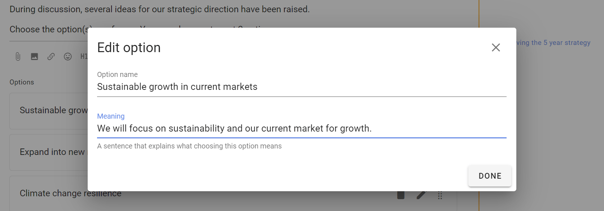

# Poll types

Polls help you facilitate collaborative decision-making.  Use polls to engage people, survey opinion, seek contributions, uncover information, identify priorities, vote on issues, approve documents, organize events and hold elections.

*On this page*
- [Sense check](#sense-check)
- [Proposal](#proposal)
- [Simple poll](#simple-poll)
- [Time poll](#time-poll)
- [Opt-in](#opt-in)

## Sense check

_Ask for feedback, questions and concerns_

Collaborative decisions include one or more rounds of feedback before a decision is made.

The **Sense check** poll is a simple way to get feedback on a decision before things get finalized - clarify and improve an idea before moving to a proposal. 

Sense check lets people know a proposal is forming and encourages them to engage. It is an opportunity to listen to people, sense how they feel and respond appropriately - opening the potential to incorporate their contributions to make a better proposal - that’s more likely to pass.

Use Sense check when you want to survey opinions, rather than advocate for a particular position. It is a great way to surface concerns before moving to a formal agreement.  You can find out if people are happy with where this is going, if they have questions or need more time, or if they are concerned and want something to change.

You can use one or more rounds of ‘Sense check’ to help you co-create a better, more cohesive decision with less stress and anxiety.

## Proposal

_Make a decision together_

The Proposal poll is at the heart of collaborative decisions.

A Proposal is used to present a decision to be made. For example an agreement, document or policy for approval, resolution or appointment.  

Proposal is also used in Advice, Consent and other collaborative decision making processes.

Use the default voting options or change to suit your decision process.

### Consent process

Edit voting options for the Consent process.

## Simple poll

_Find the most popular option_

Before making a decision, find which option(s) people care most about.

Simple poll helps you find the most popular option or options with single or multiple choice.

Write any details about the options in the details field, then enter the name of the option and click + to add.

Set the **Minimum choices** and **Maximum choices** a voter may choose.  Leave the maximum choice as 1 for a single choice poll.

You can use the pencil icon alongside each option to add a meaning, or elaboration, of the option.

### Settings

As well as the usual Poll Settings, simple poll includes a setting: 

**Shuffle options** allows you to show options in random order, if you are concerned the order of options may bias voting.

### Voting

People invited to the simple poll can choose options and leave a reason for their choice.

### Results 

Results update as voting takes place.

### Outcome

When the poll closes, state an **Outcome** and say what will happen next.

## Time poll

_Find when people are available to meet_

Save time arranging a date for your meeting or event. 

Time poll makes it easy to see everyone's availability and find the best time.

Give your Time poll a title and details. Enter a list of date and time options in your time zone.  

When setting timeslots, consider people in different time zones. Participants will see times localized in their time zone.

Set a meeting duration.

### Voting

People mark the timeslots they are available with the green 'thumbs up' icon or leave the red 'thumbs down' in place when unavailable.  They can also use the 'thumbs sideways' icon to say they are available 'if need be'. 

Participants can leave a reason comment to help the organizer find a suitable time.

If the times don't work, participants can suggest alternatives using the message field. You can then update the poll with new times.

The results update as voting proceeds in a table showing who is available when, so everyone can see which timeslots are popular.

### Outcome

When the Time poll closes, pick the best time slot and state an Outcome.

**Notify**: Add the people you are inviting to the meeting or event.

**Meeting time**: Click on the meeting time to select the best meeting time.  

**Meeting name**: Give your meeting a name. (Default name is the Time poll title.)

**Location**: You can add a location for the meeting.

**Statement**: State the outcome of the Time poll and any instructions for the meeting.

Loomio will include a calendar invitation with the Outcome notification email, so participants can add to their calendar.

## Opt-in

_Find volunteers or participants_

Use Opt-in to invite people to a join a team, committee or working group, or to participate in an event.  

‘Opt-in’ has two voting options: Accept or Decline. 

Set how many people you are looking for, say 3 people to join your working group.

Use Opt-in to seek engagement and encourage participation.  For example think of Opt-in as the online way to ask a room of people *"Raise you hand if ..."*

Like other Loomio polls, Opt-in asks you to set a closing time and will automatically notify people 24 hours before close - encouraging people to participate in a timely way so you can get on with the work. 

## Score Poll

_Express the degree of preference for each option_

The score poll is commonly used for general surveys or 'temperature checks', in which electing a single 'winning' option is not necessarily the point.

People get to express their desire, preference or interest in each option. The poll produces more granular results than a simple majority vote.

Examples:

* How would you rate your interest in these topics for the next meeting agenda?
* How important is each of these principles to you when considering our team vision?
* How much would you like to see each of the following speakers at the next conference?

## Dot vote

_Prioritise options together by allocating a 'budget' of points_

This style of poll is useful for groups trying to allocate a limited resource (even time) to a number of options (eg, agenda items, or budget line-items)

Everyone gets a number of dots to allocate against a set of options to represent their priorities. This can build a more detailed picture than a simple poll.

Examples:

* You're given $100 to spend on the business; how would you spend it?

See [dotmocracy.org](http://dotmocracy.org/) for more tips and resources about this voting method.

## Ranked choice

_Rank options in the order of preference._

Offers a series of options for people to vote in their preferred order. You can choose the number of votes people can give and rank. This decision-making type allows people to express their opinion in more detail than traditional polls.

Ranked choice is particularly useful when you have a large number of options or an election setting, where you are concerned with two somewhat similar options 'stealing' votes from one another, resulting in a less popular option gaining the plurality.

Examples:

* What would you like to eat at the company summer party?
* Who should be our next deputy mayor?

