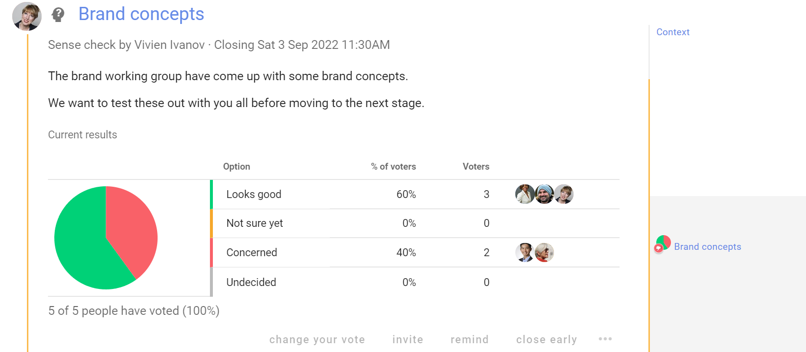
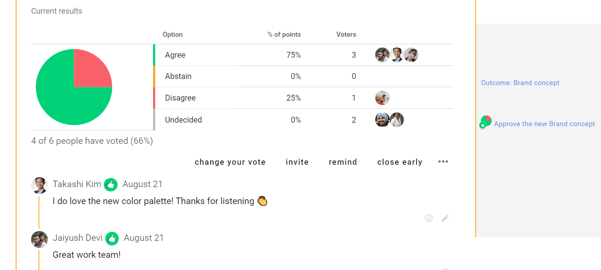
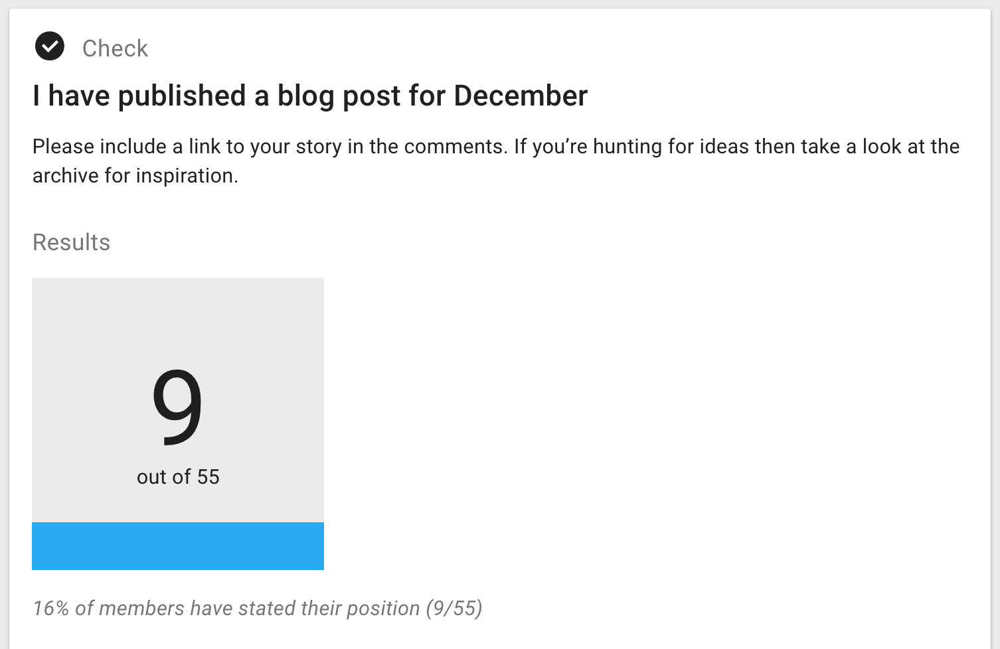
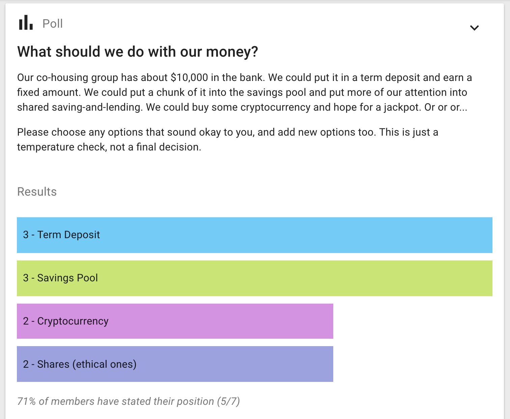
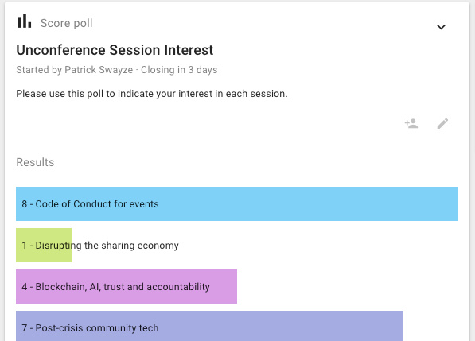

# Poll types

Polls help you facilitate collaborative decision-making.  Use polls to engage people, survey opinion, seek contributions, uncover information, identify priorities, vote on issues, approve documents, organize events and hold elections.

## Sense check

Collaborative decisions include one or more rounds of feedback before a decision is made.

The **Sense check** poll is a simple way to get feedback on a decision before things get finalized - clarify and improve an idea before moving to a proposal. 

Sense check lets people know a proposal is forming and encourages them to engage. It is an opportunity to listen to people, sense how they feel and respond appropriately - opening the potential to incorporate their contributions to make a better proposal - that’s more likely to pass.

Use Sense check when you want to survey opinions, rather than advocate for a particular position. It is a great way to surface concerns before moving to a formal agreement.  You can find out if people are happy with where this is going, if they have questions or need more time, or if they are concerned and want something to change.

You can use one or more rounds of ‘Sense check’ to help you co-create a better, more cohesive decision with less stress and anxiety.

## Proposal

The Proposal poll is at the heart of collaborative decisions.

A Proposal is used to present a decision to be made. For example an agreement, document or policy for approval, resolution or appointment.  

Proposal is also used in Advice, Consent and other collaborative decision making processes.

Use the default voting options or change to suit your decision process.

### Consent process

Edit voting options for the Consent process.

## Time poll

_Find a time to meet_

Time poll makes it easy to identify when is the best time to meet.

Enter a selection of times and share the poll with the people involved. Participants tick the times they can attend and the result is a table showing who is available when, so you're able to pick the best time for the group.

So that you can arrange calls with people in other parts of the world, Loomio adjusts times so they are correct when displayed for each participant.

When you are selecting your times, Loomio will display your team’s most used time zones so you can quickly propose times that suit most members.

If the times don't work, participants can suggest alternatives using the message field. You can then update the poll with new times.

## Check

_Count how many people have completed a task, or ask for volunteers_

Make an offer or ask people to take some action. Think of it as the online equivalent of asking a room of people "Please raise your hand if you…".

There are many ways you can use a check, but only one or two ways to respond: a Tick \(✔\), meaning affirmative, or an X mark \(✘\) meaning no or unsure.

You can choose to use just one or the other if that makes more sense; _eg, it may not help to receive_ ***No*** _responses for an opt-in or volunteer opportunity, in which case you will select the_ ***Yes*** _option only_

<iframe width="100%" height="380px" src="https://www.youtube-nocookie.com/embed/b28F7mciATA?rel=0" frameborder="0" allowfullscreen></iframe>

Other examples:

* I've checked my contact details are correct
* I've read the document and left my feedback
* I'm coming to the event
* I'll join the working group.

A benefit of Count is that it automatically notifies those people who forget to participate, giving people a little encouragement to get the job done.

## Poll

_Measure popularity or offer a choice_

Enter a question and provide some options for people to choose from. People vote for one or more options - depending on if you allow single or multiple choice.

Write any details about the options all together in the details field, then just enter the name of the option in each poll option field.

Examples:

* Where should we have our Christmas party?
* Which catering company should we use?
* What size t-shirt would you like?
* If we ran a workshop, how likely are you to attend?

### Multiple choice

Select the tick box, **Multiple choice**, if you wish for people to be able to choose multiple options rather than just a single choice off of the list of options.

## Score Poll

_Express the degree of preference for each option_

The score poll is commonly used for general surveys or 'temperature checks', in which electing a single 'winning' option is not necessarily the point.

People get to express their desire, preference or interest in each option. The poll produces more granular results than a simple majority vote.

Examples:

* How would you rate your interest in these topics for the next meeting agenda?
* How important is each of these principles to you when considering our team vision?
* How much would you like to see each of the following speakers at the next conference?

## Dot vote

_Prioritise options together by allocating a 'budget' of points_

This style of poll is useful for groups trying to allocate a limited resource (even time) to a number of options (eg, agenda items, or budget line-items)

Everyone gets a number of dots to allocate against a set of options to represent their priorities. This can build a more detailed picture than a simple poll.

Examples:

* You're given $100 to spend on the business; how would you spend it?

See [dotmocracy.org](http://dotmocracy.org/) for more tips and resources about this voting method.

## Ranked choice

_Rank options in the order of preference._

Offers a series of options for people to vote in their preferred order. You can choose the number of votes people can give and rank. This decision-making type allows people to express their opinion in more detail than traditional polls.

Ranked choice is particularly useful when you have a large number of options or an election setting, where you are concerned with two somewhat similar options 'stealing' votes from one another, resulting in a less popular option gaining the plurality.

Examples:

* What would you like to eat at the company summer party?
* Who should be our next deputy mayor?

