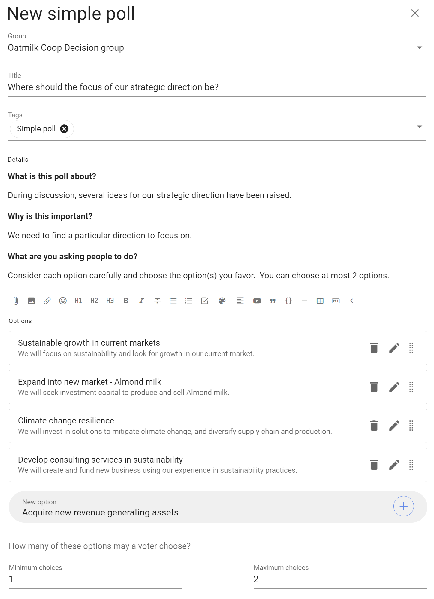
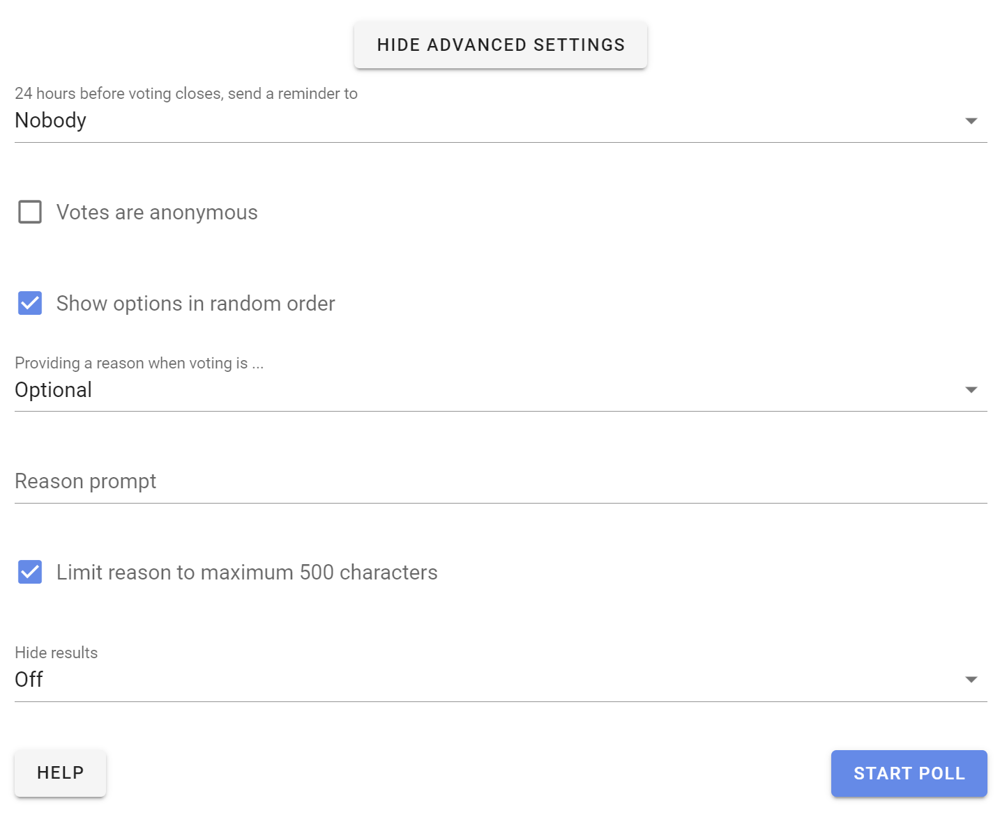

# Polls

Polls help you facilitate collaborative decision-making.  Use polls to engage people, survey opinion, seek contributions, uncover information, identify priorities, vote on issues, approve documents, organize events and hold elections.

*On this page*
- [Simple poll](#simple-poll)
- [Score poll](#score-poll)
- [Dot vote](#dot-vote)
- [Ranked choice](#ranked-choice)

## Simple poll

_Find the most popular option_

Before making a decision, find which option(s) people care most about.

Simple poll helps you find the most popular option or options with single or multiple choice.

Write any details about the options in the details field, then enter the name of the option and click + to add.

Set the **Minimum choices** and **Maximum choices** a voter may choose.  Leave the maximum choice as 1 for a single choice poll.

You can use the pencil icon alongside each option to add a meaning, or elaboration, of the option.

### Advanced Settings

As well as the usual Poll Settings, simple poll includes a setting: 

**Show options in random order** - helpful if you are concerned the order of options may bias voting.

### Voting

People invited to the simple poll can choose options and leave a reason for their choice.

### Results 

Results update as voting takes place.

### Outcome

When the poll closes, state an **Outcome** and say what will happen next.

## Score Poll

_Measure the degree of support for each option_

Use Score poll when you want to survey people for their desire, preference or interest in each option. 

'Anonymous voting' and 'Shuffle options' settings are common for Score poll to reduce any voting bias.

Participants are asked to evaluate each option and assign a score by moving a slider along a scale.

Results are displayed graphically along with a table for each option showing total points, mean points and the number of voters.

Examples:

* How would you rate your interest in these topics for the next meeting agenda?
* How important are each of these principles to you?
* Which speakers would you like at the next conference?

## Dot vote

_Allocate a budget of points to reveal priorities_

This poll type is useful for groups trying to allocate a limited resource to a number of options.  It goes beyond a simple poll by helping participants appreciate there is a constraint when selecting options.

Participants are each given a set number of dots.  You decide how many.

They place dots next to options presented that they like.  Participants can place all their dots on a single option or spread over multiple options.  

As participants allocate dots, they may exceed the dot budget limit and so are encouraged to consider how they spend their dots carefully.

Options with the most dots “win”.  The results table provides additional data to help you analyse results.
- % of points
- Points
- Mean
- Voters 

Examples:

* Choose strategic priorities for the year ahead.
* Choose agenda items for meeting, conference or General Assembly.
* Allocate spend in a fixed budget.

## Ranked choice

_Understand the ordered preference of options_

Ranked choice is particularly useful when you have a large number of options or holding an election. 

This poll type offers a series of options for people to vote in their preferred order. 

'Anonymous voting' and 'Shuffle options' settings are common for Ranked choice to reduce any voting bias.

You can choose the number of votes people can give and rank. 

Voters drag and drop options in order of preference (#1 being your most preferred option). 

Results are showed in ranked order. The results table provides additional data to help you analyse results.
- Rank
- % of points
- Points
- Mean

Examples:

* Electing directors to governance board.
* What topics should we focus on at our next conference?

