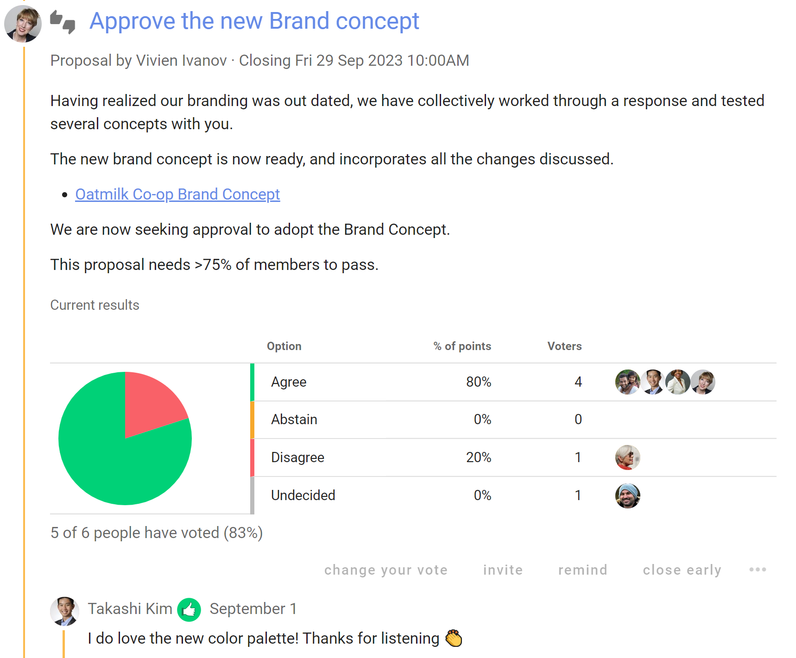

# Proposals

The proposal poll is the heart of Loomio. A proposal helps convert a discussion into a clear, practical outcome. 

For example, someone suggests a course of action and invites people to respond by voting agree, abstain or disagree. 

As people vote, they can give a reason why they have voted this way. You can see where everyone else stands on the matter, and why. If someone contributes some new information or a strong opinion you can change your vote, if you wish.

In this way you can use proposals to prompt people for a response, uncover new information, and build shared understanding - to help your group make a better, more informed decision.

A proposal and associated discussion, creates a record of how the decision came about.

