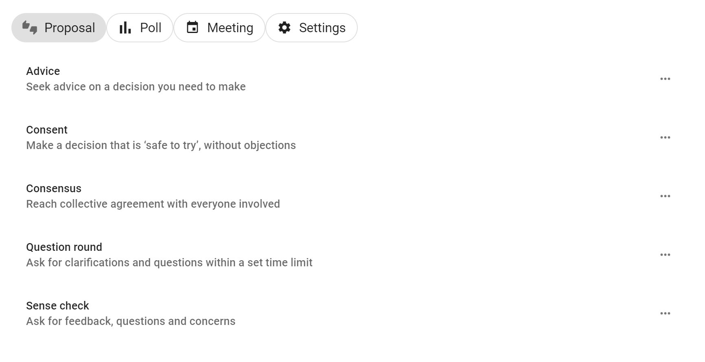
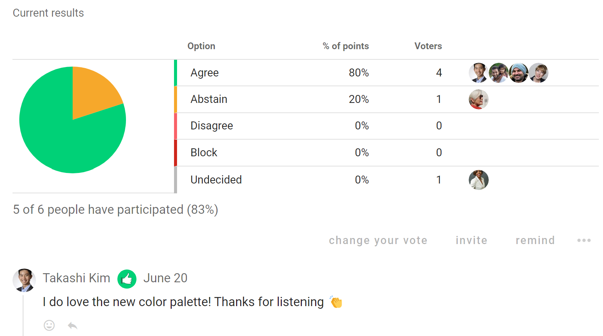
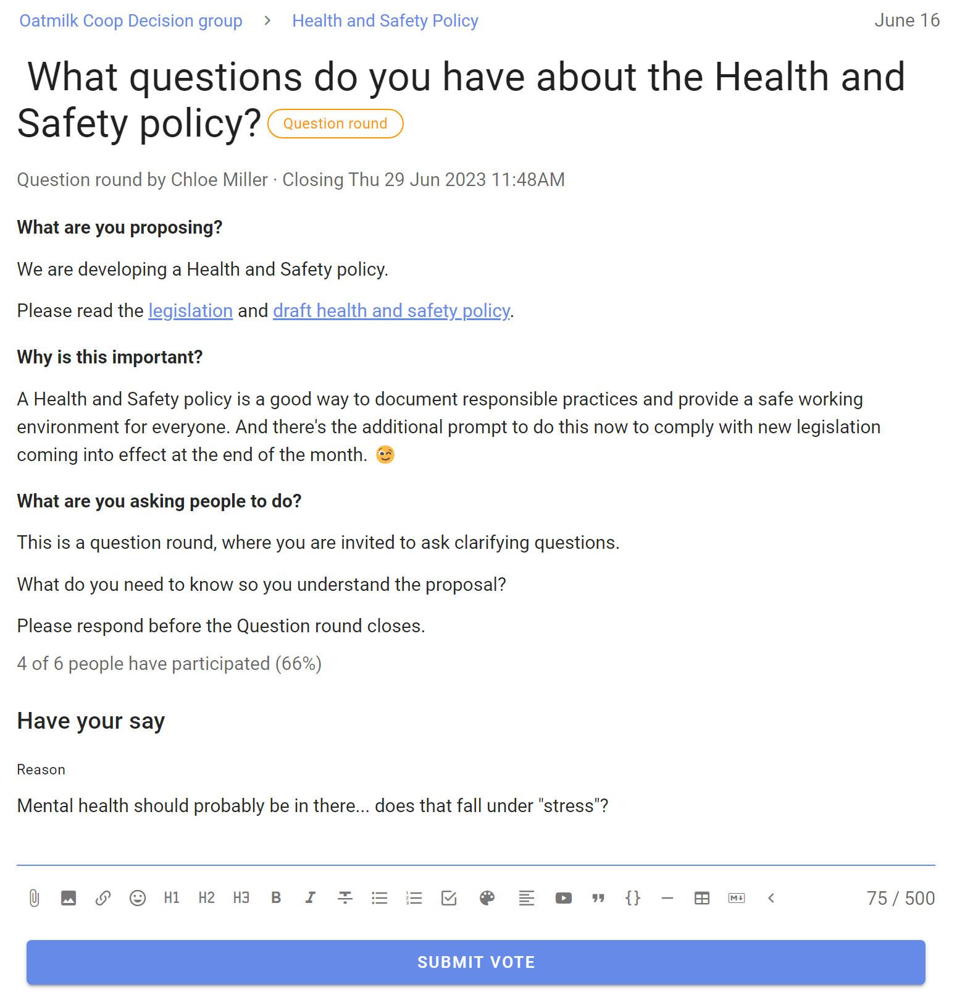
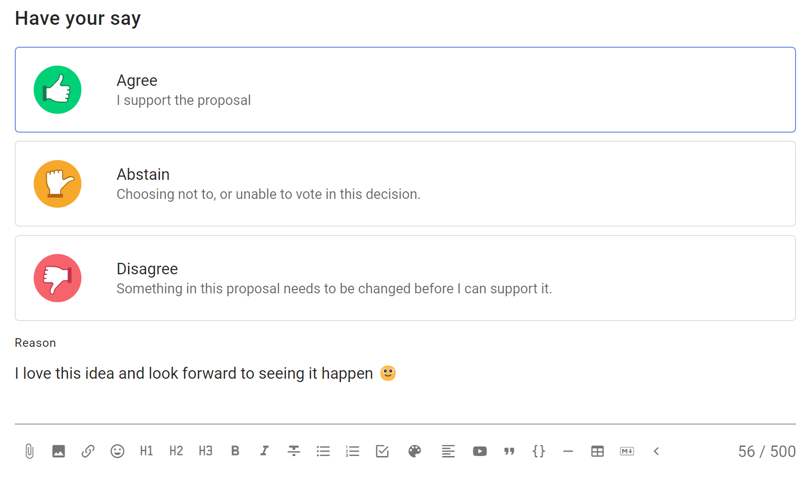

# Proposals

*Note, this page is currently being updated with new proposal templates.  Some descriptions and screenshots may differ from the current software version.*

The proposal is the heart of Loomio. A proposal helps convert a discussion into a clear, practical outcome. 

For example, someone suggests a course of action and invites people to respond by voting. As people vote, they can give a reason why they have voted this way. You can see where everyone else stands on the matter, and why. If someone contributes some new information or a strong opinion you can change your vote, if you wish.

In this way you can use proposals to prompt people for a response, uncover new information, and build shared understanding - to help your group make a better, more informed decision.

A proposal and associated discussion, creates a record of how the decision came about.

Read on to see proposal templates you can use to involve people in decisions.

# Proposal templates

Under **Proposal** you can select proposal templates for Advice, Consent and Consensus decision making processes.  There are more templates under the other tabs.

## Using proposal templates with decision processes

Quick summary of Loomio proposal templates you can use with common decision processes.

| **Decision process** | **Loomio proposal templates** |
|---|---|
| Advice process | Advice proposal |
| Consent process | Question round   Sense check proposal   Consent proposal |
| Consensus process | Sense check proposal   Consensus proposal |

## Advice proposal

Seek advice on a decision you need to make.

Invite advice from people impacted or who have expertise, so you can make a better decision for your organization.

- Advice helps you make a better decision for your organization
- Foster relationships, learning opportunities and diverse input
- Stimulate initiative and creativity, and more enjoyable work

[Read more about the Advice process](https://help.loomio.com/en/guides/advice_process/index.html).

**Voting with the Advice proposal**

**Example results**

## Consent proposal

Make a decision that is ‘safe to try’, without objections.

Seek consent on a decision you need to make, where there are no meaningful objections to your proposal, so you can make a fast decision for your organization that is 'safe to try'.

- Aim for a ‘good enough’ decision
- Involve many voices to develop a workable proposal
- Ask if anyone has a valid objection
- Amend the proposal to resolve objections

[Read more about the Consent process](https://help.loomio.com/en/guides/consent_process/index.html).

**Voting with the Consent proposal**

**Example results**

## Consensus proposal

Reach collective agreement with everyone involved.

Build consensus for a decision you need to make, to reach an agreement that satisfies the needs and concerns of all participants.

- Discuss and develop a proposal together
- Include and respect everyone involved
- Seek agreement from most people 

[Read more about the Consensus process](https://help.loomio.com/en/guides/consensus_process/index.html).

**Voting with the Consensus proposal**

**Example results**

## Question round

Invite clarifying questions to help people understand a proposal.

A Question round is an opportunity for people to ask clarifying questions about the proposal, so that everyone understands the proposal before they say what they think about it.

The Loomio Question round is a special proposal with no voting options. It enables participants to ask questions within a duration you set for the round.

A Question round is commonly used as a step in the Consent process.

[Read more about the Consent process](https://help.loomio.com/en/guides/consensus_process/index.html).

**Example**

## Sense check

Ask for feedback, questions and concerns.

The Sense check proposal is a good way to get feedback, invite questions and uncover concerns. It helps to clarify and improve a proposal before moving to a decision.

Sense check lets people know a proposal is forming and encourages them to engage. It is an opportunity to listen to people, sense how they feel and respond appropriately - opening the potential to incorporate their contributions to make a better decision.

Use the Sense check proposal in the Consent process to invite reactions and comments to improve the proposal, and in a Consensus process to test for consensus.

You can use one or more rounds of ‘Sense check’ to help you co-create a better, more cohesive decision with less stress and anxiety.

[Read more about using Sense check in the Simple decision process](https://help.loomio.com/en/user_manual/polls/decisions/index.html).

**Voting with the Sense check proposal**

**Example results**

# More proposal templates

There are more proposal templates! They can be found in the **New poll** menu under **Settings**.

**Unhide** the proposal templates to make them available for use in your group.

## Proposal (Classic)

Raise a proposal to make a decision.

The classic Loomio proposal helps you make a decision, converting a discussion into a clear outcome.

Suggest a course of action and invite people to respond by voting agree, abstain or disagree.

As people vote, they can give a reason why they have voted this way. You can see where everyone else stands on the matter, and why.

In this way you can use a proposal to prompt people for a response, uncover new information, and build shared understanding - to help your group make a better, more informed decision.

A proposal and associated discussion creates its own record of how the decision came about.

[Read more about using the classic Loomio proposal in the Simple decision process](https://help.loomio.com/en/user_manual/polls/decisions/index.html).

**Voting with the classic proposal**

## Gradients of agreement

Express support for a proposal on an 8-point scale.

The Gradients of agreement proposal enables members of a group to express their support for a proposal in degrees on a scale, offering more ways of expressing support than in terms of “agree” and “disagree”.

Use Gradients of agreement as a preliminary round, to test support for a proposal before moving to a formal agreement.

Gradients of agreement lets people know a proposal is forming and encourages them to engage. It is an opportunity to listen to people, sense how they feel and respond appropriately - opening the potential to incorporate their contributions to make a better decision.

**Voting with the Gradients of agreement proposal**

**Example results**

