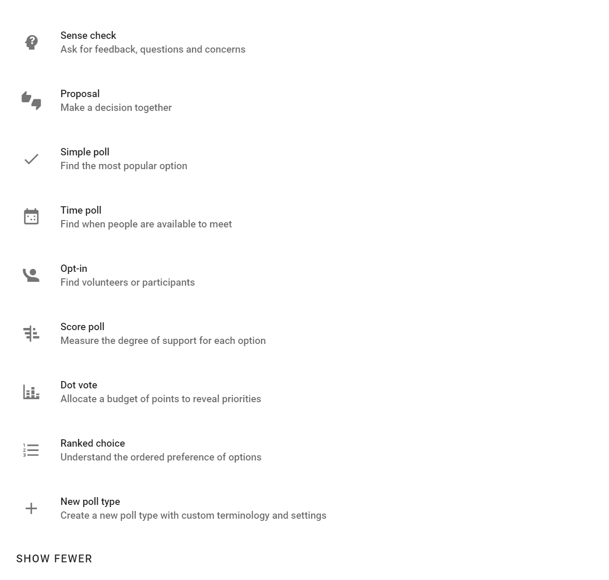
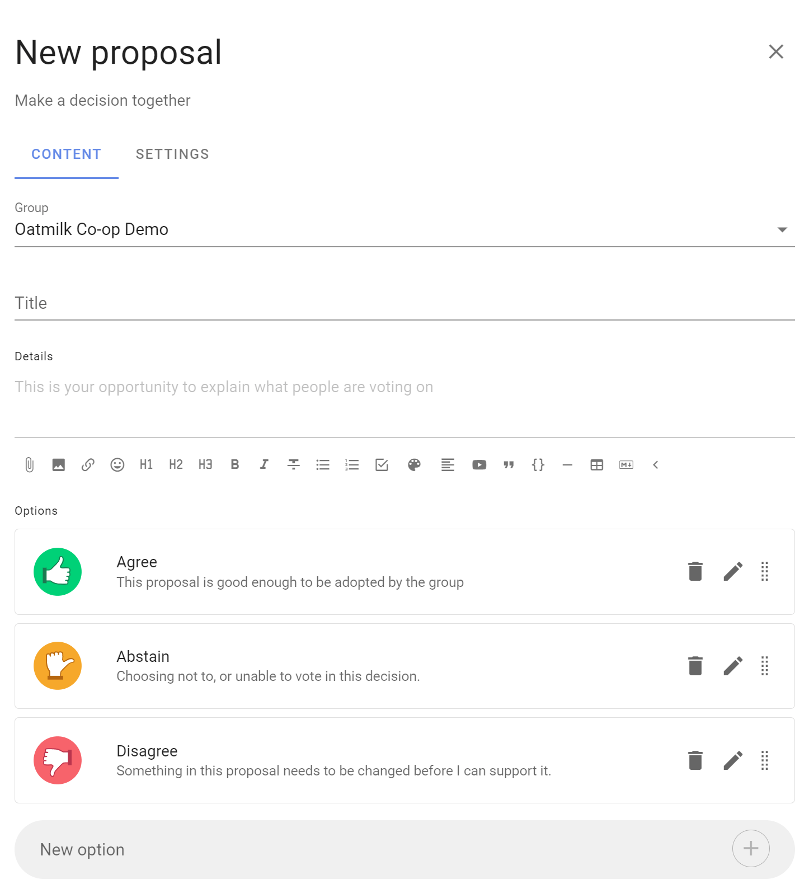
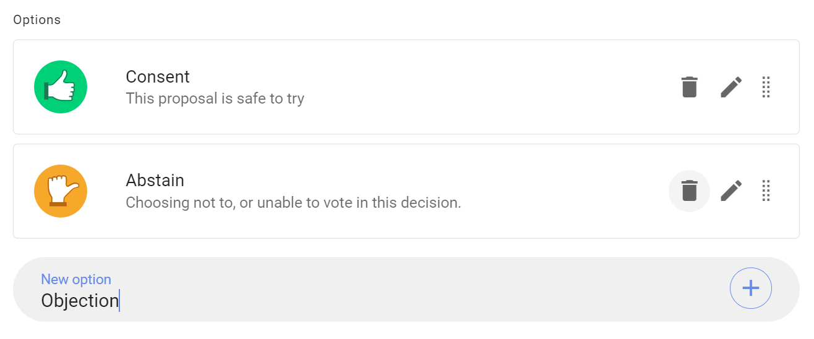
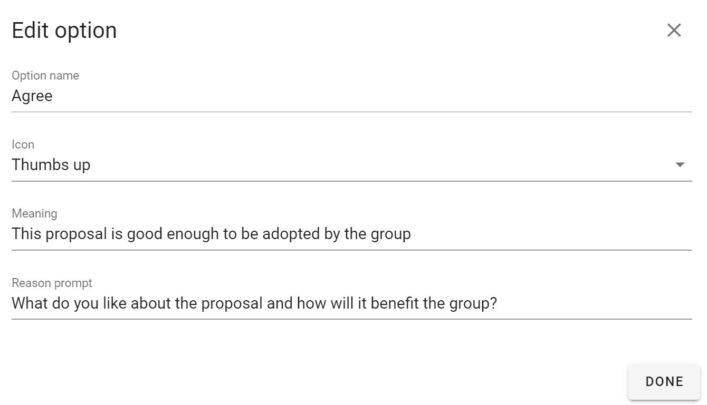
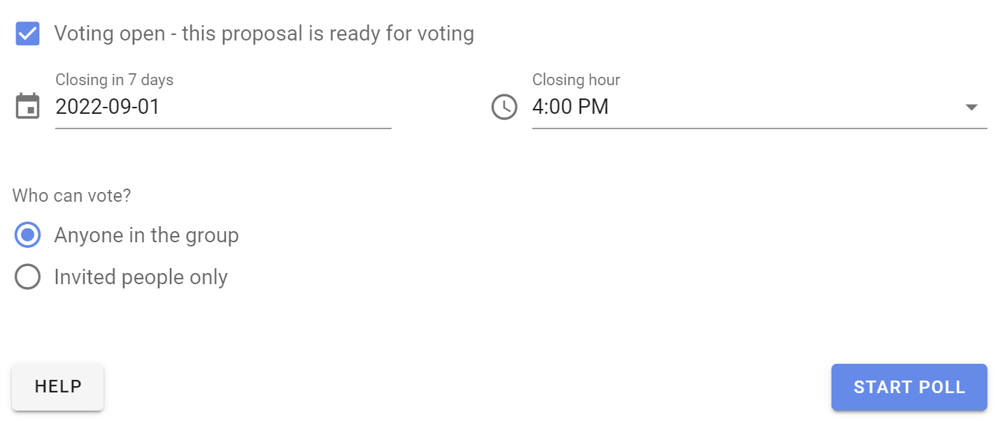
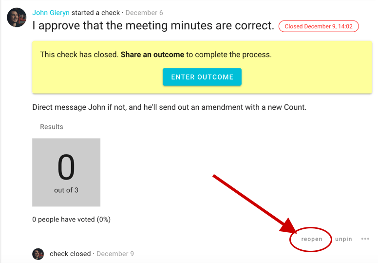
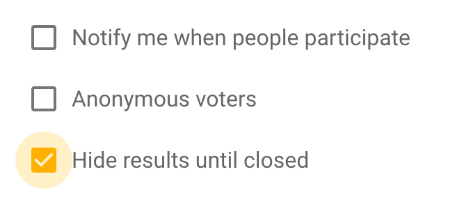
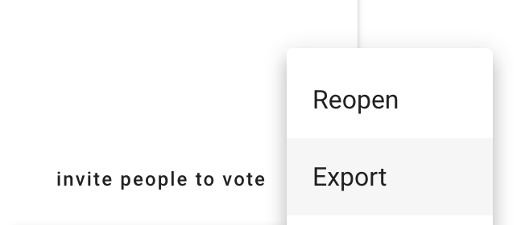

# Starting a Poll

## Start a poll

### Within a thread

You can start a poll within a thread to progress a discussion or make a decision. 

Open the thread, scroll down and click on the **Start Poll** tab.

### Standalone poll

You can also start a standalone poll from your group page, by going to the **Polls** and click on **New Poll**.

Select the poll type you want.

## Set up poll

The poll set up page has two tabs: 
- **Content** to write content for your poll and configure voting options. 
- **Settings** to configure how the poll runs.

### Content tab

**Group:** (Standalone poll only.) If you are starting a standalone poll, check that the correct group is selected for your poll.

**Title:** Give your poll a short, relevant title.

**Details:** Explain what you are asking people to do and include enough details so everyone knows what it means to 'agree' or 'disagree'.

Avoid combining a range of ideas in one proposal, because people might agree to some aspects but not others and be unsure how to respond. You can break complex decisions down into multiple proposals.

When making a proposal, state your expectations and describe the impact the proposal will have if adopted. If it's a formal or binding proposal it's often worth describing what a 'disagree' or 'block' means.

Use the formatting tools to support your poll.  For example, attach a document file with the paperclip icon, insert an image, link to a website or online document, or even embed a video.

**Options:** Each poll type provides options for voting.

In a Proposal poll, the default options are Agree, Abstain and Disagree with corresponding ‘show of thumbs’ voting icons.

You can add, edit and remove options to suit the decision process you are running.  

For example if you are using a Consent process;
- Type ‘Consent’ in the new option panel, and click the + button to add the option
- Type ‘Objection’ in the new option panel
- Remove unwanted voting options by clicking the trash can symbol beside each option.

#### Edit voting options
There is a lot of flexibility to configure voting options to suit the way your organization makes decisions.

Use the pencil icon alongside the voting option to open the edit modal:

**Option name:** A short name for the option.

**Icon:** Select the icon for the option; thumbs up, thumbs down, thumbs sideway or hand up.

**Meaning:** A sentence that explains what choosing this options means.

**Reason prompt:** A question to prompt voters to provide their reasoning or reconsider their position. 

### Content tab continued

**Voting open:** When ticked, voting will open as soon as the poll starts.  

Untick if you want voting to open at a later time. For example if you are setting up a poll in advance of a general assembly meeting.

**Closing date and time:** Select the closing date and time for your poll. 

Give sufficient time for people to vote. You could time the proposal so it closes before a meeting, or avoid closing over a weekend, so that people will receive a timely reminder. If necessary, you can close the poll early or extend the closing time.

**Who can vote?** Invite everyone in the group or only specific people.  

You can later add or remove people from an ‘Invite people only’ poll.

## Invite Members

It's good to let people know when you're taking a poll or a vote. After you start your proposal you will see a box allowing you to **Invite to vote**, where you will have the opportunity to select **Members of group** or **Members of thread**, or input the names of some of your group. You can select all and then remove some people from the list. This will send a notification to all those listed.

### Invite guests or experts

Similar to the **invite people** feature, if you input the email of someone outside your group in the **invite people to vote** form they will be given permission to participate in _only_ that proposal or poll; _however_, they will be able to see the _whole_ thread in which their participation has been invited (but _not_ any of the group's content beyond that). They will not be able to comment or participate in other proposals or polls even though they can see those that are in the same thread.

### Reopen

If a poll closes earlier than what is ideal for your group arriving to a clear shared outcome, you might want to **reopen** it, setting a new closing time.

### Close

Similarly, if you no longer need to let the poll or proposal continue, you can choose **close** to end it before its closing date. Don't forget to [set an outcome](../outcomes) so everyone is clear on where you got to and/or what's next!

## Proposal options

There are some universal options that apply to most of the proposals and polls that Loomio offers. If you're interested in a specific tool's options (eg, the time poll's **if need be** option) see the section on the relevant tool… [→ Types of proposals and polls](../proposal_types)

### Anonymous voting

If you tick the **Anonymous voters** box, participant information will not be recorded with each response. This means that nobody will be able to know the author of a vote.

### Notify me when people participate

When selected, you will be notified whenever someone participates – within the app, and by email (by default).

### Voters may add options

For all polls except the **Count**. When selected, participants may add their own options when voting.

When users add options the person who created the poll will be notified.

### Hide results until closed

Select this option if you want results to be hidden until the poll or proposal closes.

The poll will appear as below until the poll closes.

Once the poll is closed, you will see the results and be invited to leave an [outcome](../outcomes) as normal.

## Export poll

Export the stances and outcome of a poll as a spreadsheet (.csv) file. Click the three horizontal dots (**⋯**) at the bottom of the poll or proposal – you will find it to the right of **invite people to vote** – and click **Export**.

## Proposals can help in many situations

Don't hesitate to start a proposal just because you're not sure everyone will agree - proposals are not only for when you have consensus, they're designed to surface issues that need resolving and are useful for clarifying disagreements. We have identified a number of ways to take advantage and step towards clear, shared outcomes, from a 'series of small yeses' to 'temperature checks'… [→ Ways of using proposals](../proposal_types/#ways-of-using-proposals)

---

To keep learning how to best use proposals and polls, read on…
- [Using outcomes](../outcomes)
- [Types of proposals and polls](../proposal_types)
