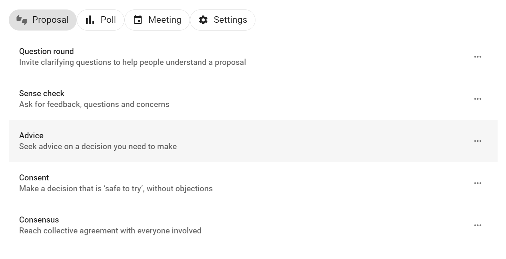
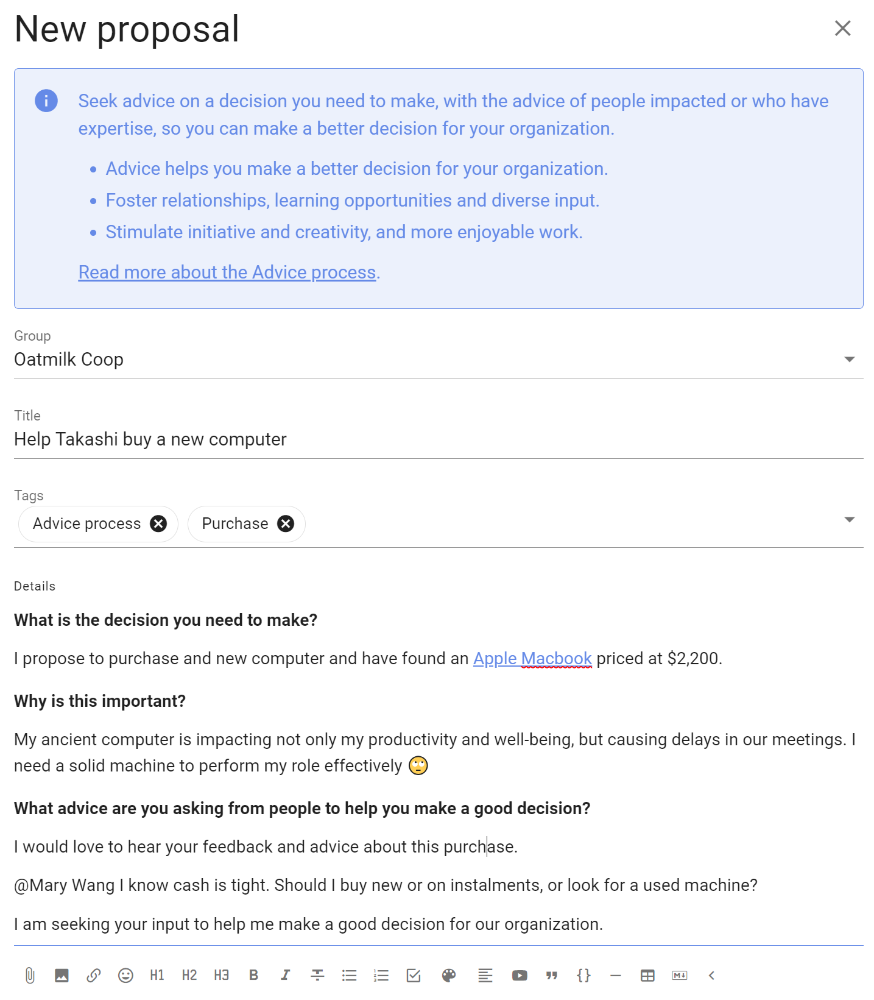
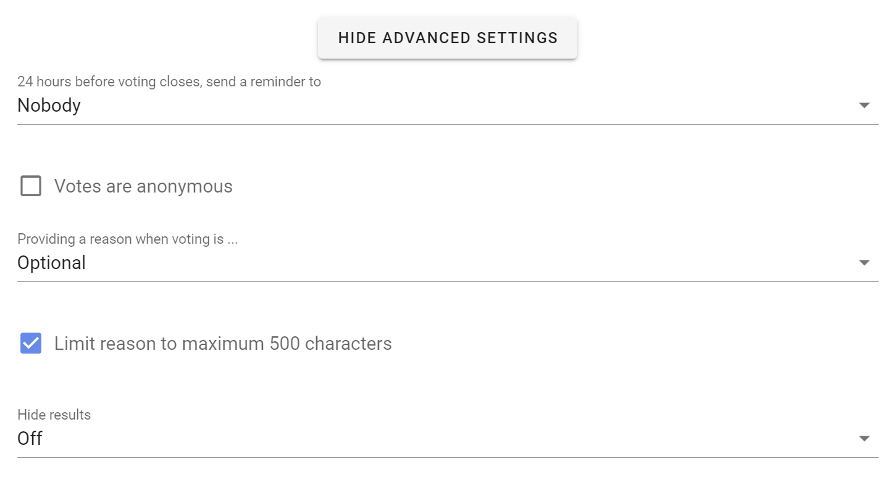

# Using polls and proposals

*On this page*
- [Run a proposal or poll](#run-a-proposal-or-poll)
- [Advanced settings](#advanced-settings)
- [Managing polls](#managing-polls)

## Run a proposal or poll

### Within a thread

You can run a proposal or poll within a thread to run a decision process or progress a discussion. 

Open the thread, scroll to the **Add Comment** bar and click on the **Run Process** tab, select a proposal or poll template.

### Standalone proposal or poll

You can also run a standalone proposal or poll from your group page, from the **Polls** tab on your group page. Click on **New Poll** and select your proposal or poll template.

### Proposal and poll templates

Choose the proposal template you want to use. 

### Add content

**Group:** Check that the correct group is selected for your proposal or poll.

**Title:** Give your proposal or poll a short, relevant title.

**Details:** Explain what you are asking of people and include enough details so everyone knows what it means to vote.  

The predefined templates include some prompts to help you write a good proposal - use these or add your own details.

Avoid combining a range of ideas in one proposal, because people might agree to some aspects but not others and be unsure how to respond. You can break complex decisions down into multiple proposals.

When making a proposal, state your expectations and describe the impact the proposal will have if adopted. If it's a formal or binding proposal it's often worth describing what it means if the proposal is not adopted.

Use the formatting tools to support your poll.  For example, attach a document file with the paperclip icon, insert an image, link to a website or online document, or even embed a video.

### Voting options

Each proposal and poll template provide options for voting.

You can add, edit and remove voting options to suit the proposal or decision process you are running.  

- Use the pencil icon to edit voting option 
- Use the trash can icon to remove unwanted voting options
- Use the handle to move the order of voting options
- Add voting options with **New option** and click the + button 

### Edit voting options
There is a lot of flexibility to configure voting options to suit the way your organization makes decisions.

Use the pencil icon alongside the voting option to open the edit modal:

**Option name:** A short name for the option.

**Icon:** Select the icon for the option; thumbs up, thumbs down, thumbs sideway or hand up.

**Meaning:** A sentence that explains what choosing this options means.

**Reason prompt:** A question to prompt voters to provide their reasoning or reconsider their position. 

**Closing date and time:** Select the closing date and time for your poll. 

Give sufficient time for people to vote. You could time the proposal so it closes before a meeting, or avoid closing over a weekend, so that people will receive a timely reminder. If necessary, you can close the poll early or extend the closing time.

**Who can vote?** Invite everyone in the group or only specific people that you invite.  

You can later add or remove people from an ‘Invite people only’ poll.

## Advanced Settings

### Reminder
Send a 'Closing soon' notification 24 hours before the poll closes. This can be an opportunity for people to see how others have voted and reconsider their own vote, or just a way to increase participation in the poll.

Setting options:
- Nobody
- Author
- Undecided voters (default)
- All voters

### Votes are anonymous
If enabled, this allows people to vote anonymously - the identity of voters will not be associated to their votes.  This is useful for elections and secret ballots.  

> **Warning**: Once a poll has started you cannot edit the poll to make it anonymous or to undo the anonymous setting.  

> **Warning**: You cannot re-open an anonymous poll after it has closed.  Voter information including the voter identity is discarded, so Loomio doesn't know who has voted.

### Vote reason
It can be helpful to understand why people voted the way they did. With this setting, you can prompt people to share their thoughts when they vote.

Setting options:
- Optional (default) - reason is optional.
- Required - people must write something in the reason field before their vote is submitted.
- Disabled - the reason text box is not available.

> **Tip**: In an election or anonymous poll, consider disabling vote reason to avoid a voter inadvertently revealing their identity with their text comment.

**Limit reason to maximum 500 characters:** Keeping vote reasons short makes them easier to understand. A collection of concise reasons is a great resource for making a decision.  This setting is ticked by default. Untick to allow for longer reasons.

### Hide results
If you want people to vote without knowing how others have voted, you can hide the results of the poll.  Useful if you do not want people to be affected by how other people have voted.

Setting options:
- Off (default) - means voting results are visible.
- Until vote is cast - means voting results are not visible until you vote, and are then revealed.
- Until proposal is closed - means voting results are not visible until the proposal closes. 

### Start Poll
Click the **Start Poll** button.

## Managing polls

Click on the 3 dot menu at the bottom right of the poll.

### Edit poll

Use **Edit poll** to edit poll content or settings.   You can not change voting options once voting commences.

### Make a copy

Use **Make a copy** to create a copy of the poll and settings.  Useful when you have a repeating workflow.

### Show notifications

**Show notifications** indicates that the notification has been read or the email has been opened.

### Export poll

**Export** poll status and results to a spreadsheet (.csv) file, to download unformatted poll data for analysis or archive.

### Print

**Print** exports the poll as an html document preserving the poll format. You can print the html document to a printer or to pdf document format for publishing and archiving.

### Delete

**Delete** will delete the poll.  You will first be asked to confirm you want to delete the poll.

Make sure you want to delete the poll.  There is no 'restore' option.

After deletion an **Item removed** marker is left in the thread. This cannot be removed.

### Move item

**Move item** enables you to move the poll to another thread and/or group.

Select the items (poll, reasons) along with any other comments in the thread you want to move, and then select the group and thread you want to move them to.

### Unpin from timeline

Removes the poll from the timeline.  You can re-pin the poll to the timeline.

### Copy link

Copies a unique link to the poll to your computer clipboard, so you can paste it in a document, thread or any other internet property.

Use this when you want to directly refer people to the poll. For example, paste the poll link in an email newsletter to members.

