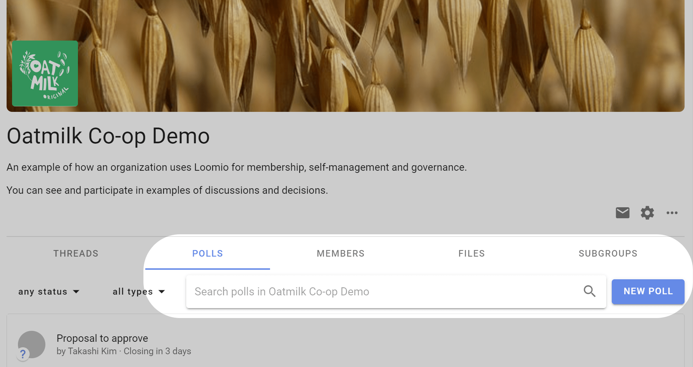
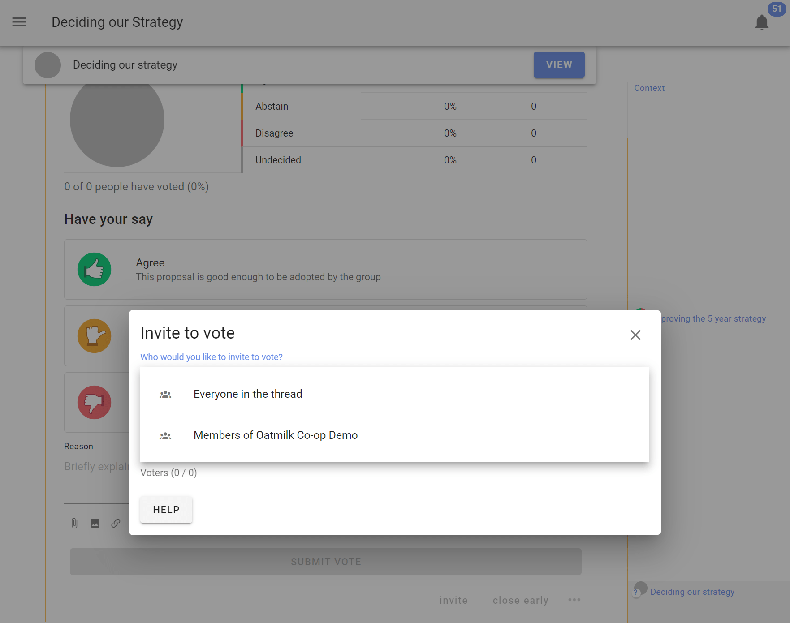
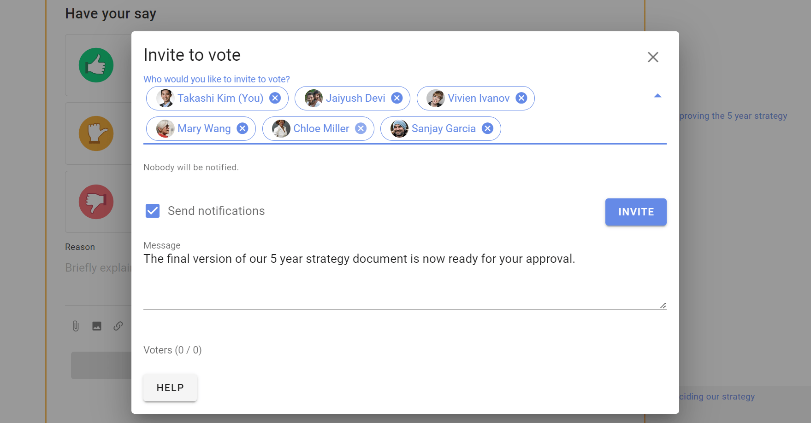

# Starting a Poll

*On this page*
- [Start a poll](#start-a-poll)
- [Set up poll](#set-up-poll)
- [Poll settings](#poll-settings)
- [Inviting people to vote in a poll](#inviting-people-to-vote-in-a-poll)
- [Managing polls](#managing-polls)

## Start a poll

### Within a thread

You can start a poll within a thread to progress a discussion or make a decision. 

Open the thread, scroll down and click on the **Start Poll** tab.

### Standalone poll

You can also start a standalone poll from your group page, by going to the **Polls** and click on **New Poll**.

Select the poll type you want.

## Set up poll

The poll set up page has two tabs: 
- **Content** to write content for your poll and configure voting options. 
- **Settings** to configure how the poll runs.

### Content tab

**Group:** (Standalone poll only.) If you are starting a standalone poll, check that the correct group is selected for your poll.

**Title:** Give your poll a short, relevant title.

**Details:** Explain what you are asking people to do and include enough details so everyone knows what it means to 'agree' or 'disagree'.

Avoid combining a range of ideas in one proposal, because people might agree to some aspects but not others and be unsure how to respond. You can break complex decisions down into multiple proposals.

When making a proposal, state your expectations and describe the impact the proposal will have if adopted. If it's a formal or binding proposal it's often worth describing what a 'disagree' or 'block' means.

Use the formatting tools to support your poll.  For example, attach a document file with the paperclip icon, insert an image, link to a website or online document, or even embed a video.

**Options:** Each poll type provides options for voting.

In a Proposal poll, the default options are Agree, Abstain and Disagree with corresponding ‘show of thumbs’ voting icons.

You can add, edit and remove options to suit the decision process you are running.  

For example if you are using a Consent process;
- Type ‘Consent’ in the new option panel, and click the + button to add the option
- Type ‘Objection’ in the new option panel
- Remove unwanted voting options by clicking the trash can symbol beside each option.

#### Edit voting options
There is a lot of flexibility to configure voting options to suit the way your organization makes decisions.

Use the pencil icon alongside the voting option to open the edit modal:

**Option name:** A short name for the option.

**Icon:** Select the icon for the option; thumbs up, thumbs down, thumbs sideway or hand up.

**Meaning:** A sentence that explains what choosing this options means.

**Reason prompt:** A question to prompt voters to provide their reasoning or reconsider their position. 

### Content tab continued

**Voting open:** When ticked, voting will open as soon as the poll starts.  

Untick if you want voting to open at a later time. For example if you are setting up a poll in advance of a general assembly meeting.

**Closing date and time:** Select the closing date and time for your poll. 

Give sufficient time for people to vote. You could time the proposal so it closes before a meeting, or avoid closing over a weekend, so that people will receive a timely reminder. If necessary, you can close the poll early or extend the closing time.

**Who can vote?** Invite everyone in the group or only specific people.  

You can later add or remove people from an ‘Invite people only’ poll.

## Poll Settings

### Hide results
If you want people to vote without knowing how others have voted, you can hide the results of the poll.  Useful if you do not want people to be affected by how other people have voted.

Setting options:
- Off (default) - means voting results are visible.
- Until vote is cast - means voting results are not visible until you vote, and are then revealed.
- Until proposal is closed - means voting results are not visible until the proposal closes. 

### Anonymous voting
If enabled, this allows people to vote anonymously - the identify of voters will not be associated to their votes.  This is useful for elections and secret ballots.  

> **Warning**: Once a poll has started you cannot edit the poll to make it anonymous or to undo the anonymous setting.  

> **Warning**: You cannot re-open an anonymous poll after it has closed.  Voter information including the voter identity is discarded, so Loomio doesn't know who has voted.

### Vote reason
It can be helpful to understand why people voted the way they did. With this setting, you can prompt people to share their thoughts when they vote.

Setting options:
- Required - people must write something in the reason field before their vote is submitted.
- Optional (default) - reason is optional.
- Disabled - the reason text box is not available.

> **Tip**: In an election or anonymous poll, consider disabling vote reason to avoid a voter inadvertently revealing their identity with their text comment.

**Limit reason to maximum 500 characters:** Keeping vote reasons short makes them easier to understand. A collection of concise reasons is a great resource for making a decision.  So this setting is ticked by default.

However you can untick this setting to allow for longer reasons.

### Reminder
Send a 'Closing soon' notification 24 hours before the poll closes. This can be an opportunity for people to see how others have voted and reconsider their own vote, or just a way to increase participation in the poll.

Setting options:
- Nobody
- Author
- Undecided voters (default)
- All voters

### Start Poll
Click the **Start Poll** button.

## Inviting people to vote in a poll

Invite people to your poll by sending them a notification.

After you start the poll an **Invite to vote** box appears.  You can select the pre-set groupings; **Everyone in the thread** or **Members of [your group name]** and you can enter names or the email addresses of group members.   

You can add a message with your invitation to vote (optional).

Click on the group to see the people you are inviting.  You can remove people from the list by clicking the x beside their name.

### Invite guests or experts

You can also invite a guest to the poll by typing their email address. They will be given permission to participate in only this poll.  

However if the poll is within a thread, they will also be able to see the thread and comments. They will not be able to comment or participate in other polls in the thread, nor see any other threads in the group.

## Managing polls

At the bottom of the poll are several features to help you manage the poll after start.

### Inviting new people to the poll

You can add new people to the poll after it has started.

Click **invite**, and enter the names or the email addresses of the people you want to invite.

### Remove people from the poll

You may want to remove a person(s) from the poll.  Click **invite**, find the person's name and click on the 3 dot menu to the right and select **Remove from proposal**. 

For example an administrator sets up a poll on behalf of board members.  The administrator is not authorized to vote, so is removed from the poll. 

### Remind to vote

If voting is slow, you can **remind** people to vote by sending them a notification.  The page is similar to **invite** and shows a pre-group of 'Everyone invited to vote'.  Click on the group to see the people you are reminding.  

### Close early

You can close the poll early, before the closing time with **close early**.  

This is used when everyone has voted or you need to close the poll for some other reason.

### Reopen

You can **reopen** a poll that has closed.  Set the new closing date and time.

## More actions

Click on the 3 dot menu at the bottom right of the poll to open more actions.

### Edit poll

Use **Edit poll** to edit poll content or settings.   You can not change voting options once voting commences.

### Make a copy

Use **Make a copy** to create a copy of the poll and settings.  Useful when you have a repeating workflow.

### Show notifications

**Show notifications** indicates that the notification has been read or the email has been opened.

### Export poll

**Export** poll status and results to a spreadsheet (.csv) file, to download unformatted poll data for analysis or archive.

### Print

**Print** exports the poll as an html document preserving the poll format. You can print the html document to a printer or to pdf document format for publishing and archiving.

### Delete

**Delete** will delete the poll.  You will first be asked to confirm you want to delete the poll.

Make sure you want to delete the poll.  There is no 'restore' option.

After deletion an **Item removed** marker is left in the thread. This cannot be removed.

### Move item

**Move item** enables you to move the poll to another thread and/or group.

Select the items (poll, reasons) along with any other comments in the thread you want to move, and then select the group and thread you want to move them to.

### Unpin from timeline

Removes the poll from the timeline.  You can re-pin the poll to the timeline.

### Copy link

Copies a unique link to the poll to your computer clipboard, so you can paste it in a document, thread or any other internet property.

Use this when you want to directly refer people to the poll. For example, paste the poll link in an email newsletter to members.

