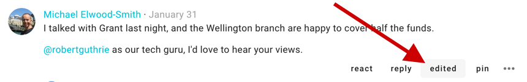

# Engaging with threads

## Comments and replies
The most common activity in a thread is commenting. Comments are shared with everyone in the thread – usually this is just the members of your group. First look for **Comment** and your user photo (or initials).

_Make sure that Comment is highlighted, not Proposal or Poll._

Write your comment and press **Post** to have your say.

Replies are like comments except in that the author of the original comment will be notified of your reply. Click **reply** on the comment you would like to associate your comment with, as it will be nested underneath theirs – by default – in the thread in which you replied.

You can reply to your _own_ comment in order to nest your reply underneath the comment. Click the three horizontal dots (**⋯**) to find **reply** in this case.

If Loomio has emailed you a comment and says you can reply to the email, you can reply directly from your email and your message will appear in the thread.

## Editing comments
If you've made a typo, or want to add a bit more information to your comment shortly after you've posted it, click **edit** on your comment. Editing does not take anyone else's attention with notifications nor unread signals.

Changes you've made will be visible _to others_ via the **edited** button, so you can see what people have changed in their comment.

If you have new information or are coming back after an extended period of time, just make a new comment, then people who have already read your comment will see that there is new information.

## Reactions

Click **react** on any thread context or comment to share how a comment made you feel, or acknowledge something someone has said, without writing a comment. They're a light-weight way to participate without interrupting the conversation, and they only send a notification within the app (not by email).

## Automatic translation
<iframe width="100%" height="380px" src="https://www.youtube-nocookie.com/embed/ZI_ZxJKoiy0?rel=0" frameborder="0" allowfullscreen></iframe>

Loomio can translate user content (eg, votes, comments…) from one language into another automatically (with the help of Google Translate). If the author of a comment uses a language other than yours, **Translate comment** will be available in the drop-down options of the comment in question, from the three horizontal dots (**⋯**).

## Email notifications
By default

- you will receive an email with everything you missed the day before as a daily digest
- you will receive immediately emails for all activity in threads in which you have participated

To change these defaults and more… [→ Notifications](/en/user_manual/users/email_settings)

### Setting email notifications for individual threads
You can adjust your email settings per thread, so that you can mute conversations that will never matter to you and get all activity immediately for those critical to you (and everything in between).

To do this, use the **subscribe** button at the bottom of the thread's context. If you want to see this or learn more about email settings… [→ Thread email settings & Subscribe](/en/user_manual/users/email_settings/#thread-email-settings-subscribe)
