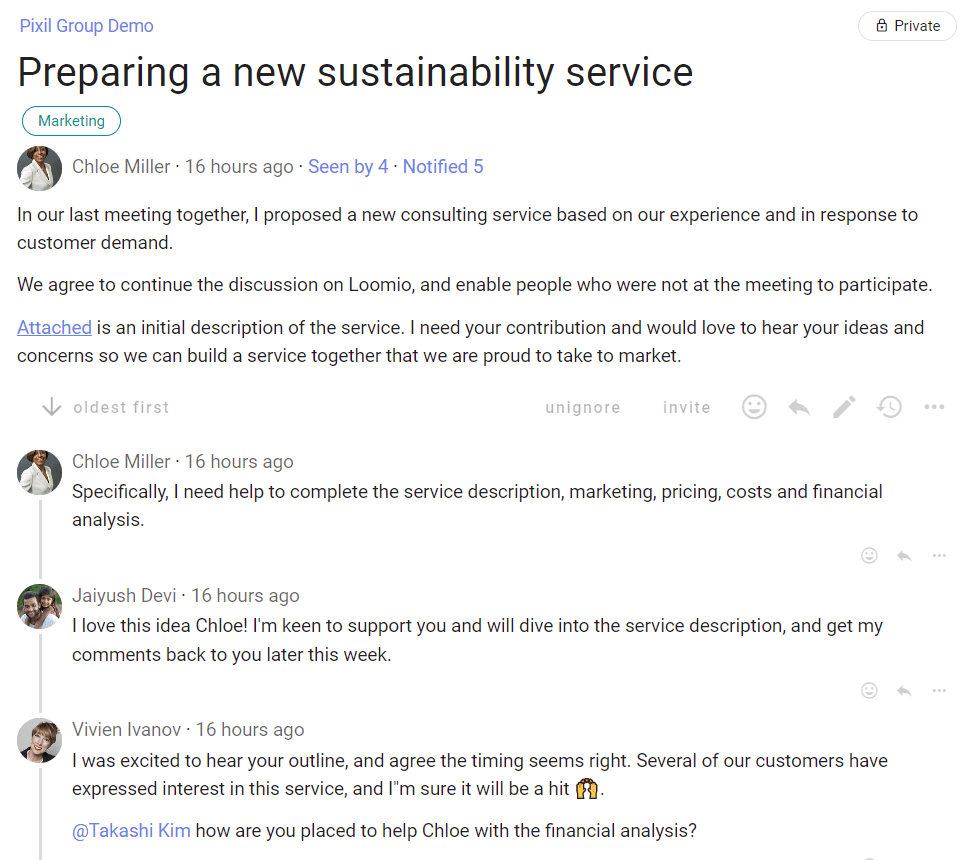

# Intro to Threads

Loomio threads are where you can share information, discuss topics, and make decisions with your group.  People participate by posting comments and replies.

- All info about a topic is in one easily accessible place.
- People can reply via email and their comments appear in the thread.
- You can see who has read the thread and who needs a nudge.
- There is a record of discussion you can easily find again.

Threads have a wide range of uses; from a general discussion forum to running specific work-flow and decision-making processes.

For example, you may facilitate an open discussion on a topic, inviting people to contribute their thoughts and opinions, and progress the discussion towards an agreed outcome.

Or you may invite people to participate in a particular decision, using a consent or advice decision-making process.

Threads can also contain polls and proposals to help progress a discussion to an outcome. As people comment in the thread and vote in polls, a thread timeline builds so you can easily find key milestones.

### Using threads

Here are some common uses of threads:

## Boards and Governance

**Prepare for a meeting** - Build an agenda, post board papers and organize administrative matters so everyone is up to date, in context and prepared. 

**Pass a resolution** - Post context and background information, respond to questions and raise a proposal to pass a resolution. 

**Discuss an agenda item on Loomio** - Start discussion about an agenda item prior to your meeting. Or, if you run out of time in the meeting, move the discussion on to Loomio.

**Approve minutes and track actions** - Post minutes and assign actions. Use a poll to approve minutes. 

## Member participation

**Share news (replace mailing list)** - Post information for members, invite comments.

**Organize an event** - Work with your organizing team on details. Keep all discussion and info within the thread. Then announce the event to wider membership.

**Develop a policy** - Post a policy draft, seek member feedback and input, finalize and ratify the policy.

**General Assembly** - Organize, prepare and run a formal meeting including all members, to deliberate and make decisions on strategic matters.

## Self-organizing working teams

**Share information** - Post information and reports of interest to your team, invite comment and discussion.

**Progress work** - Outline a work task and seek advice, input and feedback from team members through to completion.

**Meeting notes and actions** - Post meeting notes as a record of discussion, and follow up on tasks. 

**Explore ideas** - Share thoughts and invite discussion about a concern you notice, or an improvement that can be made.

**Advice, Consent and Generative decision making** - Prepare, propose, clarify, respond to reactions and objections, agree and implement - all within a Loomio thread.

## First thread examples

### Prepare for meeting

#### Step 1: Where should our focus be for the next meeting?  
We spend a lot of precious time in meetings and may not always talk about the things that really matter.  
Invite people to say what they think and co-create your agenda. 

#### Step 2: Meeting agenda
Announce your next meeting with a clear agenda. Include documents, links and any materials that will be discussed to help everyone prepare.  
Invite people to respond with an Opt-in poll to confirm they have read the agenda and are ready for the meeting.

#### Step 3: Minutes and actions
Following the meeting, record the minutes and actions.  Use a Proposal poll to confirm everyone has read the minutes and accepted their actions.  This provides a clear record of the meeting and a reference for the future for further discussion. 

