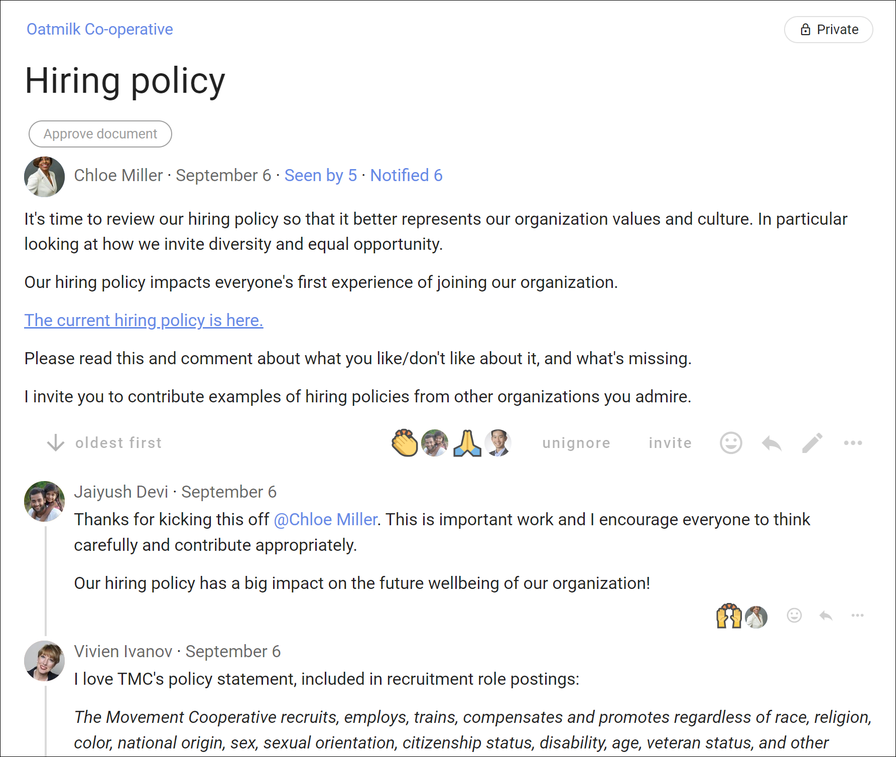

# Navigating threads

## Thread title

## Thread context

The thread **context** is always found at the top of the thread. Use the context to frame the discussion or decision.

At the bottom of the context panel is a formatting bar, where you can format text, attach files, images and embed a video. 

> **Tip:** As the thread progresses, refresh the context with latest information to help people see current status of the discussion.  

The context is like a whiteboard in your meeting room, where you can write the agenda, the outcomes intended and how you plan to get there. 

### Add attachments

Use the paper clip icon, just below the text form, to add attachments from your computer.

#### Remove attachments

While editing the context, click the **X** to the right of the file name to remove it.

## Formatting

Use the formatting tools underneath the space in which you write (any form). Hover the mouse/cursor over each item to know what it is. There's a number of format options listed below, and a few are explained in more detail further down.

- stylize (bold, italics, code block…)
- create lists (eg, checklists)
- turn text into hyperlinks - _links icon_
- add attachments (from your device) - _paper clip icon_
- embed video - _play button icon_
- create and modify tables - _icon with four squares_.

### Link to a Google doc

You can add a link to a Google doc in Loomio anywhere there is a text space; when starting a thread or poll, writing a comment, or updating your group description. The link icon is one of the formatting tools under the space you can write text in Loomio.

To use the link feature, 
1. Select the text you want to link to - say the name of a document
2. Click the link icon
3. Find the document link - go to your Google drive and ‘Get link’, or go to the Google doc and ‘Share link’.  Check the link permissions so members can open the link - usually ‘Anyone with the link’. Copy the link to your clipboard.
4. Now, go back to Loomio and paste the link.

A preview of the doc will appear under the text space. You can remove this if you want.

Now, anyone with access to your Loomio thread and permission to view the doc can open and read it.

<iframe width="100%" height="380px" src="https://www.youtube.com/embed/84FAbGJbTws" frameborder="0" allowfullscreen></iframe>

### Embed videos

You can embed a video from popular video platforms like Youtube and Vimeo into Loomio anywhere there is a text space; when starting a thread or poll, writing a comment, or updating your group description. The embed video icon is one of the formatting tools, under the space where you write text in Loomio.

To use the embed video feature, 
1. Click the embed video icon
2. Go to the video you want to embed, find and copy the shareable link 
3. Now, go back to Loomio and paste the link

A preview of the video will appear.

Now, anyone with access to your Loomio thread and permission to view the video can play it from within Loomio.

<iframe width="100%" height="380px" src="https://www.youtube.com/embed/gbWUCPzxTUQ" frameborder="0" allowfullscreen></iframe>

**Tip:** Make sure you set the visibility of the video in Youtube or Vimeo so that the people you want to can view it. In Youtube 'Unlisted' is a good option if you do not want to make the video public.

### Markdown

To revert to markdown editing, click **M↓**. _If you click this while there is text in the form, some formatting may be lost upon conversion._

#### WYSIWYG

Click **WYSIWYG** to return to the formatting tools. This will convert any text and markdown formatting to display how it will appear when posted. ***PREVIEW*** _also shows you how your text will appear, but without converting._

## Comments
The most common activity in a thread is commenting. Comments are shared with everyone in the thread – usually this is just the members of your group. First look for **Comment** and your user photo (or initials).

_Make sure that Comment is highlighted, not Start Poll._

Write your comment and press **Post** to have your say.

Replies are like comments except in that the author of the original comment will be notified of your reply. Click **reply** on the comment you would like to associate your comment with, as it will be nested underneath theirs – by default – in the thread in which you replied.

You can reply to your _own_ comment in order to nest your reply underneath the comment. Click the three horizontal dots (**⋯**) to find **reply** in this case.

If Loomio has emailed you a comment and says you can reply to the email, you can reply directly from your email and your message will appear in the thread.

## Editing comments
If you've made a typo, or want to add a bit more information to your comment shortly after you've posted it, click **edit** on your comment. Editing does not take anyone else's attention with notifications nor unread signals.

Changes you've made will be visible _to others_ via the **edited** button, so you can see what people have changed in their comment.

## Reactions

Click **react** on any thread context or comment to share how a comment made you feel, or acknowledge something someone has said, without writing a comment. They're a light-weight way to participate without interrupting the conversation, and they only send a notification within the app (not by email).

## Automatic translation
<iframe width="100%" height="380px" src="https://www.youtube-nocookie.com/embed/ZI_ZxJKoiy0?rel=0" frameborder="0" allowfullscreen></iframe>

Loomio can translate user content (eg, votes, comments…) from one language into another automatically (with the help of Google Translate). If the author of a comment uses a language other than yours, **Translate comment** will be available in the drop-down options of the comment in question, from the three horizontal dots (**⋯**).

## Timeline

The timeline helps you quickly access content in the thread such as comments, polls, decisions and outcomes. It is a visual, interactive history of key events, milestones and decision processes where you can see how a conversation evolved over time and the discussion that led to a decision.  

Comments formatted with a header, proposals and polls are automatically added to the timeline as links. Click the timeline text to go directly to the thread item.

You can pin or unpin any comment to the timeline, and edit the text displayed on the timeline.  See more at [Thread admin: Pin to Timeline](../thread_admin/#pin-to-timeline).

Jump to the top of the thread by clicking on "**Context**".

## Thread layout

By default comments in threads are listed one after the other as you scroll down the thread page - oldest comments first.  However you can change the thread order so that newest comments are listed at the top of the thread.  Seeing the latest comments first is useful for threads used for reporting or threads that have been active for some time.

The grey text just under the context will indicate in which order the activity is being listed, along with the number of replies.

To change this setting, click that grey text, choose your preference, and save. _This changes the layout for everyone, not just you._

### Options

## Unread comments 
When you open a thread, Loomio will first show you new comments. 

Unread comments are shown with a yellow line on the left side. 

