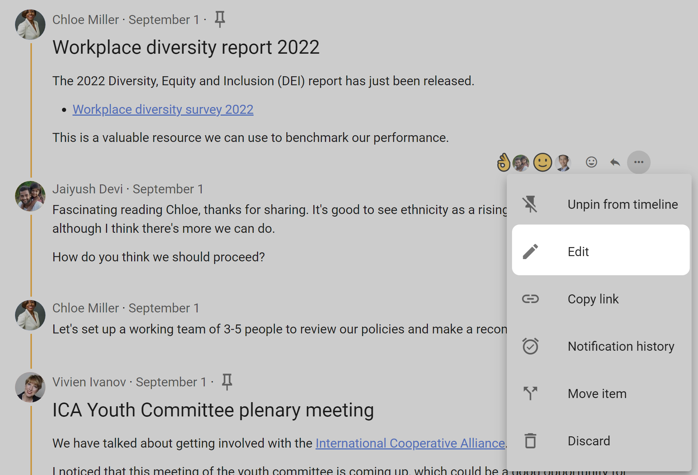
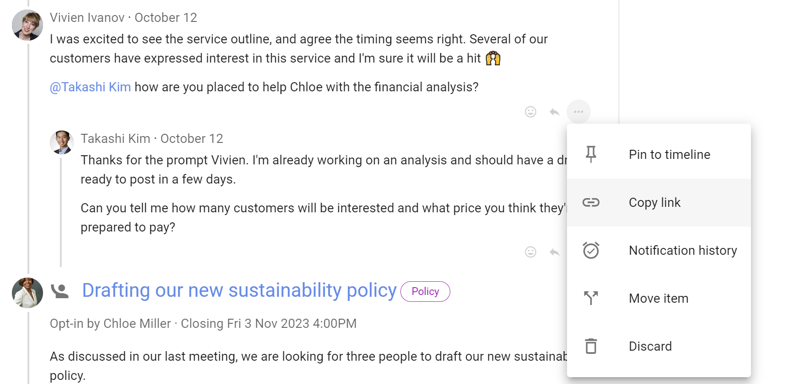
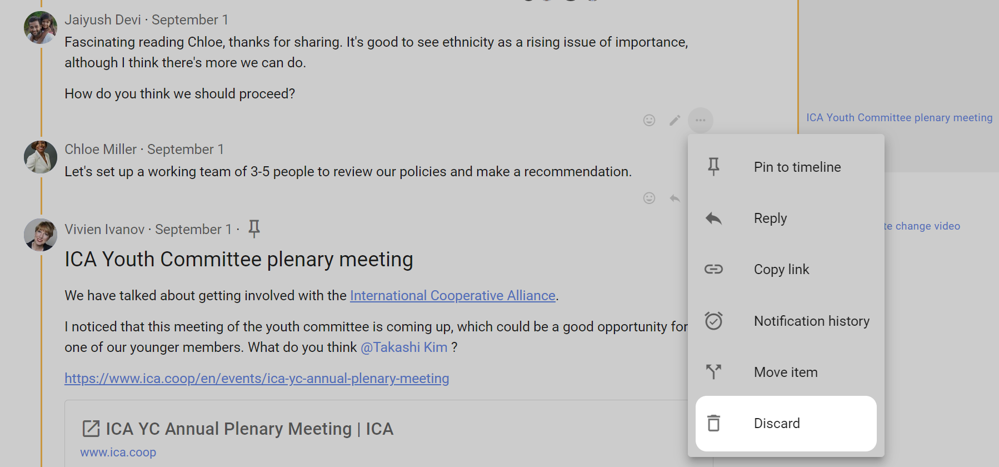
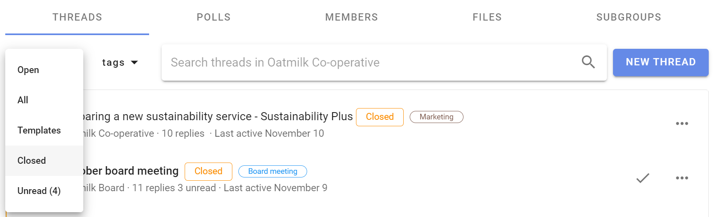
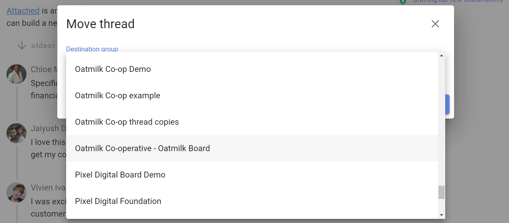

# Using threads

Loomio threads are versatile and you have many tools available to help you progress a discussion to an outcome.  Read on to see how to get the most from threads.

*On this page*
- [Thread navigation](#thread-navigation)
- [Thread context](#thread-context)
- [Thread timeline](#thread-timeline)
- [Comments](#comments)
- [Thread display](#thread-display)
- [Administering threads](#administering-threads)

## Thread navigation

A typical thread looks like this:

Description of thread features from the top.

**Group name** - At the top left of the thread page is the name of the group or subgroup that the thread belongs to.  Click on this name to go back to the group page.

**Thread privacy** - At the top right of the thread page is a tag showing that this thread is private - only members of the group, and anyone specifically invited to the thread, can see and participate in the thread.  

**Thread title** - The thread title is the largest type font on the page, so easy to spot.  

**Category tags** - The thread may have one or more category tags. Using simple tags helps people more easily find threads of a similar type.

**Thread author** - Under the thread title is see the photo/avatar and name of the person who started the thread.

**Date** - Hover over the date to see the full date and time of thread start.

**Seen by** - Shows who has read the thread, and when.

**Notified** - Shows who has been notified about the thread, and if read or email opened.

**Thread context** - Content to frame the thread.

**Thread interaction and administration tools** - Under thread context is a range of tools where you can watch, invite, react, reply and edit the thread context.  Click on the 3 dot menu (**...**) to see more tools.

**Comments** - Comments are displayed under the thread context. The default display is from oldest to newest. You can change the order of display if you wish, however this applies to everyone in the group.   The comment author, image and date comment added helps you see who has written the comment and when.   Interaction and administration tools are also available for each comment.

**Timeline** - As comments and polls are posted in the thread, a timeline builds marking important milestones in the discussion.  Polls are automatically pinned to the timeline.  Any comment may be pinned to the timeline.

## Thread context

The thread **context** is always found at the top of the thread. Use the context to frame the discussion or decision.

Think of your group as you write content in the thread context.  Your aim is to get a discussion going, so consider how you can motivate people to participate.  In general, keep the thread context simple and clear.

Write the thread context when starting or editing a thread. **Edit** a thread with the pencil icon.

As the thread progresses, update thread context.  Think of the context like a whiteboard in your meeting room, where you can write the agenda, the outcomes intended and how you plan to get there. 

At the bottom of the context panel is a formatting bar, where you can format text, attach files, images and embed a video. 

## Thread timeline

The thread timeline is on the right of the thread, and helps you quickly access comments and polls in a thread. It is a visual, interactive history automatically building as the thread progresses with important comments, polls and milestones.

Comments that include a header (H2 or H3), polls and proposals are automatically pinned to the timeline. 

Click on the item in the timeline to go directly to the comment or poll in the thread.

Jump to the top of the thread by clicking on "**Context**".

## Comments
The most common activity in a thread is commenting. Comments are visible to anyone who has permission to see the thread.  

### Reading comments 
When you open a thread, Loomio will first show you new comments. 

Unread comments are shown with a yellow line on the left side. 

### Writing a comment

You can write a comment in a thread, and people can reply, react or post their own comment to continue the discussion.

When you have written your text, use **Post Comment** to instantly publish the comment. Your comment will be visible to anyone who has permission to see the thread. 

The full range of formatting tools described in [Formatting](https://help.loomio.com/en/user_manual/threads/thread_admin/index.html) are available for use in comments.

Write your comment and press **Post Comment**.

### Reactions
Reacting to a comment is a great way to encourage and acknowledge a comment by letting the comment author know how you feel.  

It is a quick and easy way to participate that does not require any text, nor send an email.

### Replying to a comment

You can reply to someone's comment by clicking on the reply icon located at the bottom right of the comment.

Your reply is published in the thread and an email notification is sent to the author of the comment.

You can reply to your own comment so as to nest your reply underneath the comment. Click the three horizontal dots (**⋯**) to find the **reply** feature.

If Loomio has emailed you a comment and says you can reply to the email, you can reply directly from your email and your message will appear in the thread.

### Automatic translation

Loomio can translate user content - written in thread context, comment or polls -  into your language.

If the author uses a language other than yours, **Translate comment** will be available in the drop-down options of that comment.

Click **Translate comment** to see the comment in your language.

### Comment tools

The following tools can be used on any comment by clicking on the three dot menu (**⋯**) at the bottom-right of the comment.

### Pin to timeline

Use **Pin to timeline** to pin a comment to the timeline.

You an edit the comment label on the timeline. Unpin and then pin it again; this will give you the opportunity to reword the text that appears as a link in the timeline.

> **Tip:** Highlight the words that you would like to use as the text in the timeline

**Unpin**  removes the item from the timeline.

### Editing comment
If you want to change anything you can edit the comment by selecting **Edit** under the 3 dot menu.

### Show edits

When a comment has been edited, the **Show edits** icon appears.

Click on **Show edits** to see what changes have been made.  Red highlighted text has been deleted, and green highlighted text added.  

The person who edited the comment, and the date and time of edit, is recorded in Loomio.  

Click on the arrows to see previous edits.

You cannot edit other people's comments unless:
- You are the comment author
- You are a group admin and the group permission [Admins can edit members' comments](https://help.loomio.com/en/user_manual/groups/settings/index.html#permissions) is enabled. 

### Copy link

Use **Copy link** to copy the unique address (url) of the comment.  

The link will be copied to your computer or mobile device clipboard, where you can paste or add it as a link in another part of Loomio or any online document.

This is a great way to directly refer to youw own comment or a comment someone has posted.

### Notification history

See [Comment notification history](https://help.loomio.com/en/user_manual/threads/notifying_people/index.html#comment-notification-history).

### Move item
Sometimes a comment is useful, but off-topic for the thread; _it may be a short conversation took place that would have been better held in another thread or subgroup._ In this case you will want to move one or more related comment(s) and replies by selecting **move item** in the comment's options (**⋯**). This will allow you to select any number of thread items, _including_ polls or proposals. You can then add them to a pre-existing thread of your choice, or start a new thread.

### Discard comment

Discarding a comment removes it from the thread, but retains the comment in a trash bin.

You can discard your own comments at any time with **Discard** under the 3 dot (*...*) menu located at the bottom right of your comment.

#### Restore comment

You can restore your own comment with **Restore**.  The location of the comment will be labeled as **Item removed**.  Click on the 3 dot (*...*) menu located at the bottom right of your discarded comment and select **Restore**.

### Delete comment

Delete comment removes the comment permanently from the thread.  It cannot be restored.

If "Members can delete their own comments" is permitted in [Group Settings](https://help.loomio.com/en/user_manual/groups/settings/index.html#permissions), you can delete your comment.

The location of the comment will be labeled as **Item removed**.  Click on the 3 dot (*...*) menu located at the bottom right of your discarded comment and select **Delete**.

A warning message will appear and ask you to acknowledge that the comment will be permanently from the thread and cannot be restored.

Admins can delete any comment - their own comments and the comments of other people in the group.

## Thread display

By default comments in threads are listed one after the other as you scroll down the thread page - oldest comments first.  However you can change the thread order so that newest comments are listed at the top of the thread.  Seeing the latest comments first is useful for threads used for reporting or threads that have been active for some time.

The grey text just under the context will indicate in which order the activity is being listed, along with the number of replies.

To change this setting, click that grey text, choose your preference, and save. _This changes the layout for everyone, not just you._

### Thread display options

## Administering threads

There are a set of tools on the thread page to help you make a copy, print, move thread, close or delete thread.  

Find the tools under the 3 dot (**⋯**) menu, under the thread context on the right.

### Make a copy

Create a copy of a thread - title ("Copy of...") and the thread context, along with any tags and formatting used.   

Use **Make a copy** when you want to start a new thread based on an existing thread.  

Edit the thread title and context for your new thread.

> Note: **Make a copy** does not copy comments or polls from the source thread.  Although Loomio remembers the polls used in the source thread, so that when you start a poll in the thread, the poll types used in the source thread will show at the top of the list of polls.

### Show notifications

See [Notified: (Thread notification history)](https://help.loomio.com/en/user_manual/threads/notifying_people/index.html#notified-thread-notification-history).

### Print

In the thread menu click on the 3 dots menu (**⋯**) and choose **Print**. 

A page suitable for print is generated.

To save as a file, use your browser's ability to "save to pdf", or copy and paste it into a file or repository of your choosing.

### Pin thread
Admins can pin threads to the top of the group page to make them easier to find. 

Pinned threads will appear above your other threads on your group page and will be ordered by the most recently pinned item at the top. You can change position of the pinned thread by pinning and unpinning threads.

You can **pin** or **un-pin** from the thread preview options on the Group page.

### Close thread

To keep the list of discussions on your group page relevant, you can close threads which people don't need to see.

To view closed threads, go to your group page. Click the drop-down menu just under the **Threads** tab and change the thread filter from **Open** to **Closed**.

Closed threads are marked with a **Closed** tag.

#### Re-open thread

You can re-open a closed thread from the [group page](https://help.loomio.com/en/user_manual/groups/thread_management/index.html#close-thread) or from within the thread.

### Move to group

You can move a thread to another group or subgroup.  The thread will then be visible to any member of the destination group, and anyone who have been specifically invited to the thread.

Select **Move to group** from the 3 dot menu to the right of the thread.

Select the destination group or subgroup.

### Delete thread

You can delete any thread that you start. 

Group admins you can delete any thread in the group.

You will be asked to confirm you want to delete the thread.  Delete thread can not be undone.

