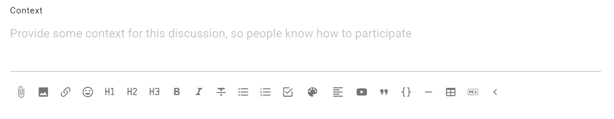
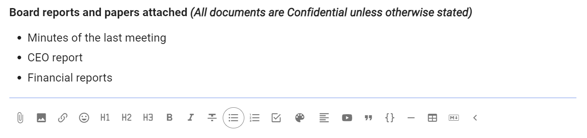
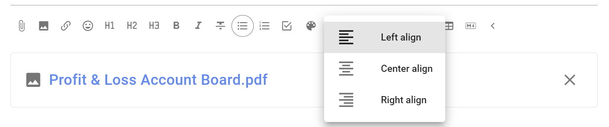
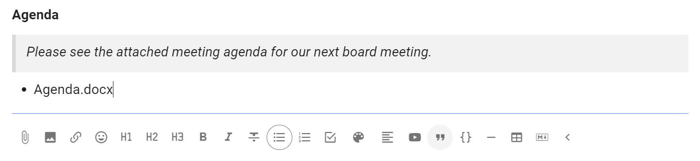

# Using threads

Loomio threads are versatile and you have many tools available to help you progress a discussion to an outcome.  Read on to see how to get the most from threads.

*On this page*
- [Thread navigation](#thread-navigation)
- [Thread context](#thread-context)
- [Thread formatting](#thread-formatting)

## Thread navigation

A typical thread might look like this:

Description of thread features from top to bottom.

**Group name** - At the top left of the thread page is the name of the group or subgroup that the thread belongs to.  Click on this name to go back to the group page.

**Thread privacy** - At the top right of the thread page is a tag showing that this thread is private - only members of the group, and anyone specifically invited to the thread, can see and participate in the thread.  

**Thread title** - The thread title is the largest type font on the page, so easy to spot.  

**Category tags** - The thread may have one or more category tags. Using simple tags helps people more easily find threads of a similar type.

**Thread author** - Under the thread title is see the photo/avatar and name of the person who started the thread.

**Date** - Hover over the date to see the full date and time of thread start.

**Seen by** - Shows who has read the thread, and when.

**Notified** - Shows who has been notified about the thread, and if read or email opened.

**Thread context** - Content to frame the thread.

**Thread interaction and administration tools** - Under thread context is a range of tools where you can watch, invite, react, reply and edit the thread context.  Click on the 3 dot menu (**...**) to see more tools.

**Comments** - Comments are displayed under the thread context. The default display is from oldest to newest. You can change the order of display if you wish, however this applies to everyone in the group.   The comment author, image and date comment added helps you see who has written the comment and when.   Interaction and administration tools are also available for each comment.

## Thread context

The thread **context** is always found at the top of the thread. Use the context to frame the discussion or decision.

Think of your group as you write content in the thread context.  Your aim is to get a discussion going. So consider what people in your group need to be motivated to participate.  In general, keep the thread context simple and clear.

At the bottom of the context panel is a formatting bar, where you can format text, attach files, images and embed a video. 

As the thread progresses, refresh the context with latest information to help people see current status of the discussion.  Think of the context like a whiteboard in your meeting room, where you can write the agenda, the outcomes intended and how you plan to get there. 

## Thread formatting

When starting a thread, poll or writing a comment, you will see the formatting bar under the text. Hover the mouse or cursor over each item for the name of each tool.

Use the formatting tools to add information, emphasis and structure to your thread; so as to communicate clearly and encourage people to participate in the thread.

### Attach file

Use the paper clip icon, just below the text form, to add file attachments from your computer.

#### Remove attachments

While editing the context, click the **X** to the right of the file name to remove it.

### Insert image

Use this tool to insert and display an image.

### Insert link

You can add a link to any shareable document or page on the internet.  

To add a link for a Google doc: 
1. Select the text you want to link to - say the name of a document.
2. Click the link icon.
3. Find the document link - go to your Google drive and ‘Get link’, or in your Google doc ‘Share link’.  Check the link permissions so members can open the link - usually ‘Anyone with the link’. Copy the link to your clipboard.
4. Now, go back to Loomio and paste the link.

A preview of the doc will appear under the text space. You can remove this if you want.

Now, anyone with access to your Loomio thread and permission to view the doc can open and read it.

<iframe width="100%" height="380px" src="https://www.youtube.com/embed/84FAbGJbTws" frameborder="0" allowfullscreen></iframe>

### Insert Emoji

Emojis are great way to lighten the mood and encourage people.  Select the emoji you like from the pop up screen.

### Headings

H1, H2, H3 headings can help you structure your thread or comment.

Select the text to mark as a heading and click on the heading format tool.

If a heading is used in a comment, the comment will automatically be pinned to the thread timeline.

### Bold, Italicize, Strikethrough

Select the text to format and click on the required format tool.

### List

Use to add a list of items formatted as bullet points.

### Numbered list

Use to add a numbered list of items.

### Task list

Use the task list to add check boxes for each task, and assign someone with a due date for completion.

See the page on [Tasks](https://help.loomio.com/en/user_manual/threads/thread_admin/tasks.html) for more information.

### Colors

Use colors to add a highlight color to text.

### Align

Select to align text to left, center or right.

### Embed videos

You can embed a video from popular video platforms like Youtube and Vimeo into Loomio anywhere there is a text space; when starting a thread or poll, writing a comment, or updating your group description. The embed video icon is one of the formatting tools, under the space where you write text in Loomio.

To use the embed video feature: 
1. Click the embed video icon.
2. Go to the video you want to embed, find and copy the shareable link.
3. Now, go back to Loomio and paste the link.

A preview of the video will appear.

Now anyone with access to your Loomio thread and permission to view the video can play it from within Loomio.

<iframe width="100%" height="380px" src="https://www.youtube.com/embed/gbWUCPzxTUQ" frameborder="0" allowfullscreen></iframe>

**Tip:** Make sure you set the visibility of the video in Youtube or Vimeo so that the people you want to can view it. In Youtube 'Unlisted' is a good option if you do not want to make the video public.

### Quote

Quote adds emphasis to your text, and can be useful to draw attention to an instruction.

### Code block

Typically used to show code in text, code block formatting is also available to help you distinguish text in your thread.

### Divider

Use the divider to draw a horizontal line to separate sections.

### Add table

Add a table to your thread. 

Additional tools are available to add/remove columns and rows.

### Markdown

To revert to markdown editing, click **M↓**. 

If you click this while there is text in the form, some formatting may be lost upon conversion.

#### WYSIWYG

Click **WYSIWYG** to return to the formatting tools. This will convert any text and markdown formatting to display how it will appear when posted. 

***PREVIEW*** shows how your text will appear, but without converting.

## Comments
The most common activity in a thread is commenting. Comments are shared with everyone in the thread – usually this is just the members of your group. 

Look for **Add Comment**.  You can write a comment alongside your profile image or initials.

The full range of formatting tools described in [Thread formatting](#thread-formatting) are available for use in comments.

Write your comment and press **Post Comment**.

Replies are comments where the author of the original comment is notified of the reply. Click **reply** on the comment you would like to associate your comment with, as it will be nested underneath theirs – by default – in the thread in which you replied.

You can reply to your _own_ comment in order to nest your reply underneath the comment. Click the three horizontal dots (**⋯**) to find **reply** in this case.

If Loomio has emailed you a comment and says you can reply to the email, you can reply directly from your email and your message will appear in the thread.

## Editing comments
If you've made a typo, or want to add a bit more information to your comment shortly after you've posted it, click **edit** on your comment. Editing does not take anyone else's attention with notifications nor unread signals.

Changes you've made will be visible _to others_ via the **edited** button, so you can see what people have changed in their comment.

## Reactions

Click **react** on any thread context or comment to share how a comment made you feel, or acknowledge something someone has said, without writing a comment. They're a light-weight way to participate without interrupting the conversation, and they only send a notification within the app (not by email).

## Automatic translation
<iframe width="100%" height="380px" src="https://www.youtube-nocookie.com/embed/ZI_ZxJKoiy0?rel=0" frameborder="0" allowfullscreen></iframe>

Loomio can translate user content (eg, votes, comments…) from one language into another automatically (with the help of Google Translate). If the author of a comment uses a language other than yours, **Translate comment** will be available in the drop-down options of the comment in question, from the three horizontal dots (**⋯**).

## Timeline

The timeline helps you quickly access content in the thread such as comments, polls, decisions and outcomes. It is a visual, interactive history of key events, milestones and decision processes where you can see how a conversation evolved over time and the discussion that led to a decision.  

Comments formatted with a header, proposals and polls are automatically added to the timeline as links. Click the timeline text to go directly to the thread item.

You can pin or unpin any comment to the timeline, and edit the text displayed on the timeline.  See more at [Thread admin: Pin to Timeline](../thread_admin/#pin-to-timeline).

Jump to the top of the thread by clicking on "**Context**".

## Thread layout

By default comments in threads are listed one after the other as you scroll down the thread page - oldest comments first.  However you can change the thread order so that newest comments are listed at the top of the thread.  Seeing the latest comments first is useful for threads used for reporting or threads that have been active for some time.

The grey text just under the context will indicate in which order the activity is being listed, along with the number of replies.

To change this setting, click that grey text, choose your preference, and save. _This changes the layout for everyone, not just you._

### Options

## Unread comments 
When you open a thread, Loomio will first show you new comments. 

Unread comments are shown with a yellow line on the left side. 

