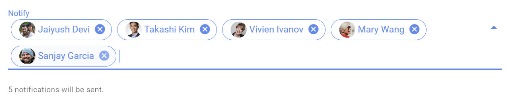
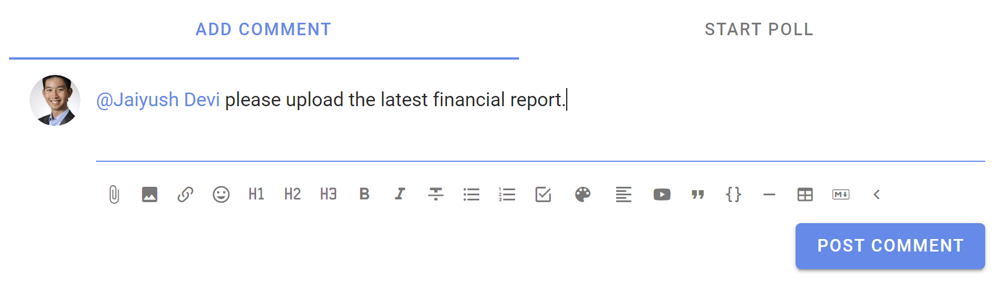

# Notifying people

Effective use of Loomio means knowing how and when to get attention from the group, group members, and even external people your group wants to engage in Loomio to keep everything in one place.

If you ask for attention when it's really important, and avoid it when it's not, people will keep paying attention.

## Notify people about the thread

When you start a thread, you can choose to notify all members of a group, or just some of them. Notify sends the thread to specific people via email. 

You can also invite guests to the thread.  Guests can see and participate in the thread, but cannot see other threads in your group that they have not been invited to.

Use the drop down menu to select a group of people, and click on the group to see individual people.  You can remove people from the notification list by clicking the x beside their name.  

You can type in the first few letters of the name of a member of your group, and their name in Loomio will appear. Click on this to add to the 'Notify' panel.

You can type or paste in a person's email address.  This is useful to invite a 'guest' to the thread.  Guests can see the thread and all comments and polls within the thread, however they cannot see any other threads of your group.  You can remove a guest from a thread. 

If the person is a member of your Loomio group they will receive the notification as usual.

**Do not notify anyone**

You can also choose not to notify anyone about your thread.  If the thread is started in a Loomio group, then all members of the group will be able to see and participate in the thread.  Members will be alerted that the thread has started through the daily **Catch up summary email** if enabled.

A Loomio thread offers a way for you to share information and work transparently - to "work out loud".  

By not notifying people you are saving a few emails from their in-box, and members of your group can stay informed of progress of the thread through the 'Catch up summary email' or by signing into Loomio. 

## Within a thread

### Mentioning people

If you want to get the attention of a specific person, type **@**, start typing their name, and then select the user name of the person you want to **mention**. You can mention people in comments, threads and polls. 

### Replies

When you reply to a comment, you will notify the user you replied to. Find the **reply** button on the bottom of the comment that you want to reply to.

*Note: You can also reply to your comment, but it does not send a notification.  Find the **reply** icon under the 3 dot menu.*

### Reactions

Reacting to a comment is a great way to encourage and acknowledge a comment by letting the comment author know how you feel.  It is a quick and light-weight way to participate that does not require any text, nor send an email.

On any comment or thread's context you can **react** and choose an emoji.

Reactions send a notification within Loomio, but do not send an email.

### Invite to thread 

You can invite people to the thread at any time after the thread has started.

Select the people you want to invite by group, subgroup or individually.  

To add people individually:
- Group members - type the first letters of their user name or type/paste their email address.
- Guests - type/paste their email address.

