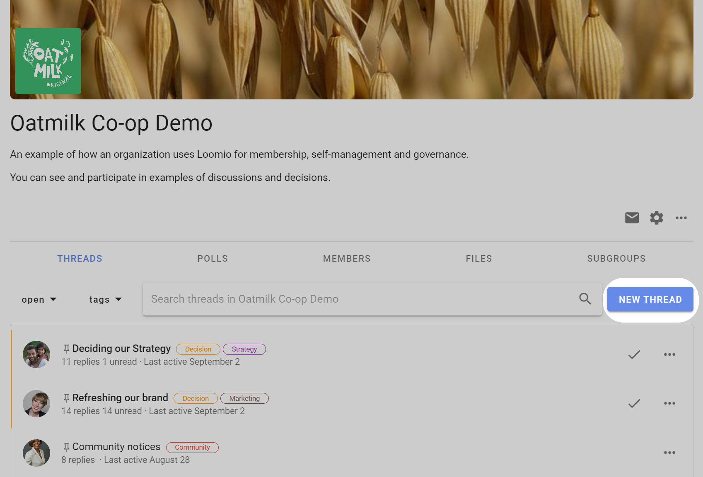
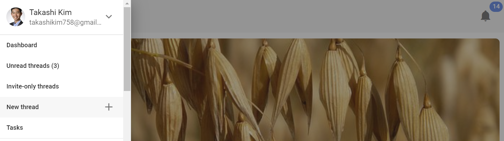
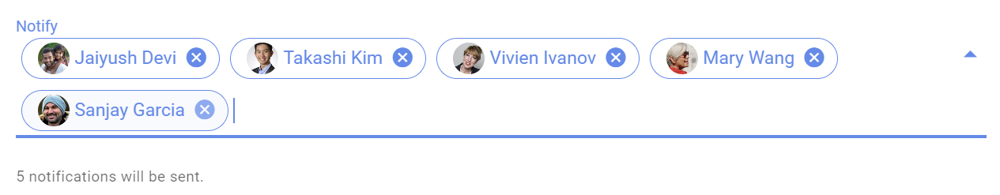
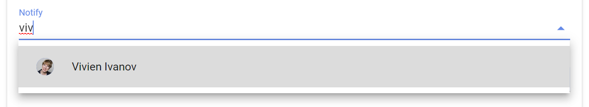
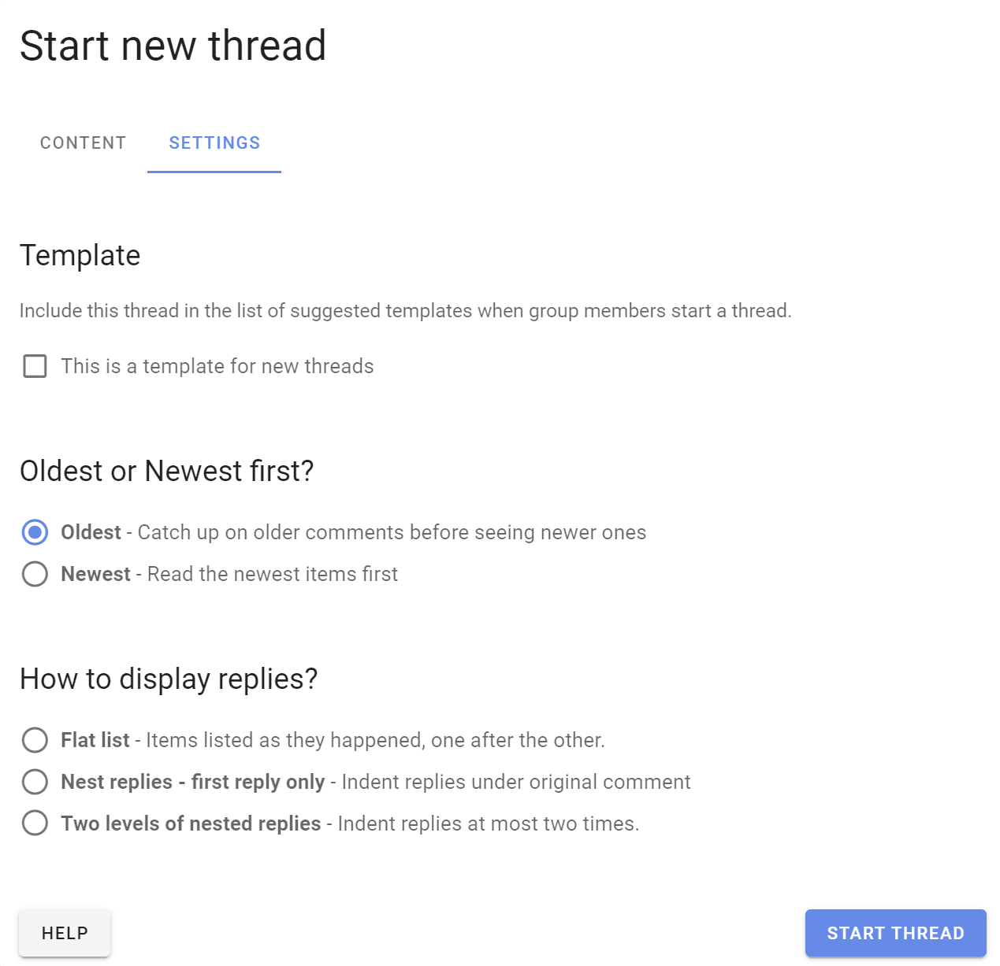
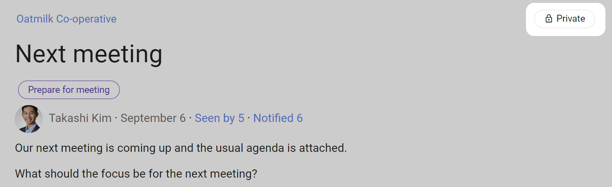
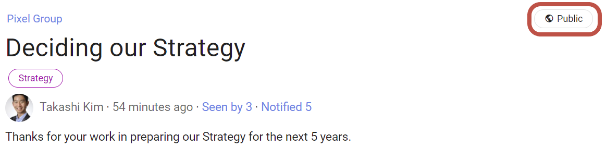

# Starting threads

Starting a Loomio thread is like writing an email. The subject line of an email is like the thread title, and the text you write in an email is like the context of a thread.   

As you would add people in the send list of your email, in Loomio you can invite people individually or as a group to the thread - they will receive an email notification with the content of your thread.
 
People can reply to your thread via email and their comments will appear in the thread.
 
As with an email, a thread may be a simple question, or a more detailed introduction to a topic with links or files attached for background information.

*On this page*
- [New thread](#new-thread)
- [Set up thread](#set-up-thread)
- [Thread privacy](#thread-privacy)
- [Invite-only thread](#invite-only-thread)
 
## New thread

Find the **New thread** button on your Loomio group page to start a new thread.

You can start a thread within your Loomio group or any subgroup.  

You can also start a thread from the sidebar menu.

## Set up thread

When you start a new thread, you will see two tabs:

- **Content** to write content for your thread.
- **Settings** to configure the thread display.

## Content tab

### Group
Check the name of the group or subgroup is correct for your thread.  Anyone in this group will be able to see the thread. You can also start the thread in another group or as an 'Invite-only' thread (no group).

*Tip: If you are not ready to make the thread visible in your group, start the thread as 'Invite-only'.  You can move the thread to your Loomio group when ready.*

### Tags
Add tag(s) to help people find your thread when searching by tag.  Admins can create new tags. 

### Notify
Use notify to send the thread to specific people via email. 

Use the drop down menu to select a group of people, and click on the group to see individual people.  You can remove people from the notification list by clicking the x beside their name.  

You can type in the first few letters of the name of a member of your group, and their name in Loomio will appear. Click on this to add to the 'Notify' panel.

You can also type or paste in a person's email address.  This is useful to invite a 'guest' to the thread.  Guests can see the thread and all comments and polls within the thread, however they cannot see any other threads of your group.  You can remove a guest from a thread. 

If the person is a member of your Loomio group they will receive the notification as usual.

### Title
Give your thread a relevant title.  A thread title is similar to an email subject line.

### Context
Use thread context to introduce the topic and frame the conversation or decision to make. Use the formatting tools to emphasize key points. Include background information, attach files, link to online documents and embed a video. 

The context will always stay at the top of the thread and you can update it at any time as the discussion progresses.  When the discussion ends, update the context with the outcome.

## Settings
The Settings tab contains some additional options.  These settings change the thread for everyone.

### Template
If a particular thread is often repeated, you can mark the thread as a template.  Template threads will be included in the list of suggested templates when members of your group start a new thread.

See [Thread templates](https://help.loomio.com/en/user_manual/threads/templates/index.html#thread-templates) for more information about setting up and using thread templates.

### Oldest or Newest first?
Change the order that comments are displayed in the thread.  By default the oldest comments are at the top of the thread, and people scroll down to the most recent comments.  

Changing to Newest displays the most recent comments at the top of the thread.  This is useful for threads used for reporting information or progress.  

For example at Loomio we have a long thread running for customer feedback.  As customer feedback is received, they are posted as comments in the thread, with the most recent at the top.  Everyone in the Loomio group can then see the feedback, ask questions by replying, and easily find feedback for follow up.

### How to display replies?
You can choose comments to be displayed as:

**Flat list** - Comments and all thread activity is displayed chronologically, one after the other.

**Nest replies - first reply only** - Replies to comments are indented under the original comment.

**Two levels of nested replies** - Replies to replies are indented at most two times.

## Thread privacy
If your group privacy is **Closed** or **Secret** then your threads will be **private**. Private means that only members of the group are able to view the threads started in this group (*except* when you **invite people** such as an expert or any guest not currently part of your group).

If your group is "Open" then all your threads will be public, meaning that anyone with the URL can view the thread.

See [Group privacy](https://help.loomio.com/en/user_manual/groups/settings/index.html#privacy) for more info.

## Invite-only thread
Use an ‘invite-only’ thread when you want to invite particular people to a private discussion.  They do not need to be a member of your Loomio group.

