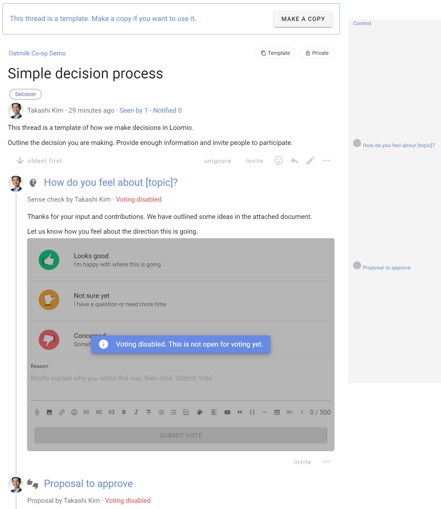

# Thread templates

If you frequently use a particular thread, workflow or decision making process, you can now save this as a thread template.  

Build and save your thread template with the content and polls appropriate to your process.

*On this page*
- [Set up a thread template](#set-up-a-thread-template)
- [Using thread templates](#using-thread-templates)

## Set up a thread template

To set up your own template, start a thread in your group as usual.  

Go to the **Settings** tab and check the **Template** box.

Back on the **Content** tab, add a category tag(s), title and provide some sample text to help people using the template.

Click **Start thread** and your new thread template is created.

The thread is clearly marked as a template.  Note the statement at the top of the thread page and the **Template** tag alongside the thread privacy tag.

There is value to easily copy and share a thread name, tags and context that is frequently used.  

However, the real benefit comes when you add the polls for a particular decision or workflow process, so they are readily available for people using the template.  Add the polls in the order of your process.

See this video as Michael walks through the creation of a thread template.

<iframe width="560" height="315" src="https://www.youtube.com/embed/_uDWQ0p2CXQ?start=327" title="YouTube video player" frameborder="0" allow="accelerometer; autoplay; clipboard-write; encrypted-media; gyroscope; picture-in-picture" allowfullscreen></iframe>

In the video example of the [Simple decision process](https://help.loomio.com/en/user_manual/polls/decisions/index.html), the first poll is a Sense check:

Note that **Voting open** is unticked - this is a template thread, so not used for actual voting.

**Save poll**. 

As voting is not open, you can invite people to provide feedback on the poll if you wish.

Repeat by adding further polls as needed.

The thread template will then contain the content and polls typically used in your decision or workflow process.

## Using thread templates

When a thread template has been created in your group, anyone in your group starting a new thread will see a new screen, asking if they want to start the thread as either:
- Blank - thread starts as usual with no pre-filled content
- Simple decision process - your new thread template
- New template - to start a new template

When a thread template is selected, a copy of the thread template content is created.

Edit thread title and context as usual.

The polls created in the template are now ready to use, in the order they were created.

You can see an example of this thread template in use in the [demo group](https://www.loomio.com/demo).  See the thread "Refreshing our brand".

### Close thread template

As a last step, **Close** the thread.  The thread template is accessible with **New thread** as above, but is removed from the open threads on your group page.

Select **closed** to view the template.

