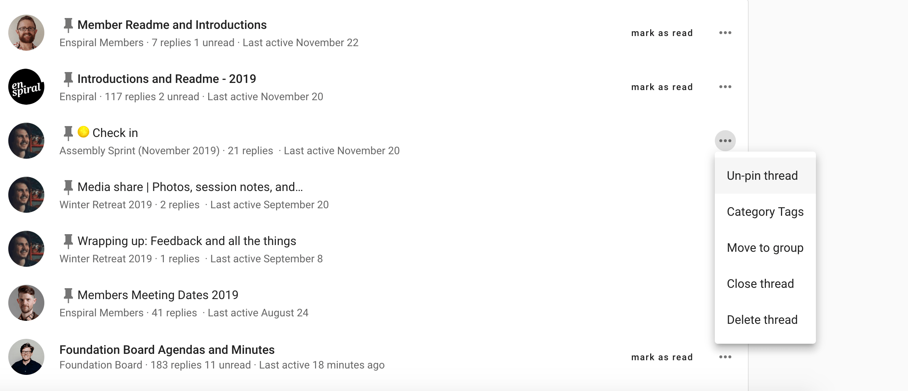
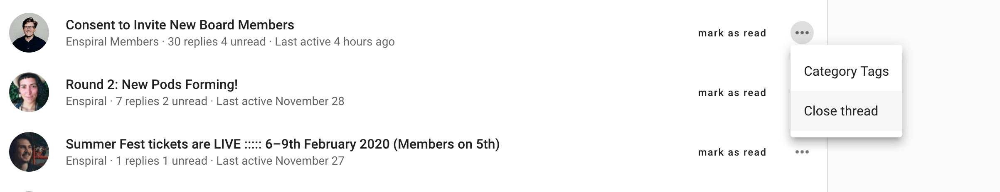
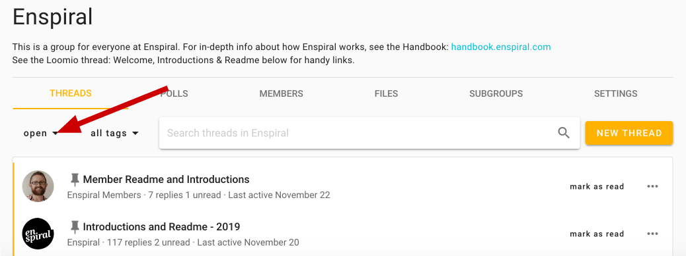
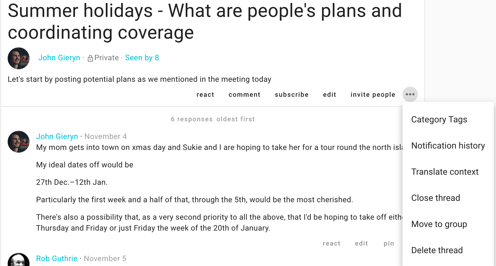
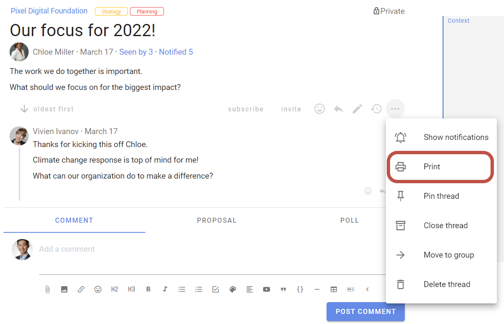

# Thread administration

### Pin thread
If you are a coordinator, you can pin comments to order them and make them easier to find. Pinned threads will appear above your other threads on your group page and will be ordered by the most recently pinned item at the top. You can change position of the pinned thread by pinning and unpinning threads.

You can easily  **pin** or **un-pin** from the thread preview options, but **only from the Group page**.

### Close thread

To keep the list of discussions on your group page relevant, you can close threads which people don't need to see.

To view closed threads, first navigate to the relevant **group page**. You will need to use the drop-down just under the Threads tab to change the thread filter from its default of **open**.

Choose "closed" to view all your closed threads in the thread filter.

#### Re-open thread

Re-opening a closed thread is done from within the thread's page – again, the three horizontal dots (**⋯**). See [organizing threads](#thread-options-and-organizing-threads) for a depiction.

# Options within threads

## Thread context

Threads are easily updated and edited by those with permission to by clicking **edit**.

> **Tip:** Double-clicking a thread context also opens the context editor.

Learn more about thread contexts [here](../engaging_with_threads/#thread-context).

## Thread Options and Organizing threads

The following administrative actions may be taken from within the thread, and in some cases from pages that list threads (thread preview options). To find these options, go to the page of the thread in question and use the **⋯** three horizontal dots to the right of the basic thread actions at the bottom of the context.

### Move thread

You may want to move threads between groups and subgroups to keep things organised. To do this, select **move to group** from the additional options

<iframe width="100%" height="380px" src="https://www.youtube-nocookie.com/embed/59T3xCK-jys?rel=0" frameborder="0" allowfullscreen></iframe>

### Delete thread

If you're the admin of a group you can delete any thread – or comments in any of the threads – in the group.

If you started a thread, you can delete that thread, but only your comments within it.

## Invite guests to thread

Consult an expert or external party while keeping relevant communications all in one place: Invite them to a specific thread by clicking **members**, at the bottom of the thread's context. They won't get access to any other threads in your group, just this one. They do not need to already have a Loomio account, and they can participate by email just like all Loomio users.  _If you_ do _want them to be in the group, then invite them to join from the group page._

You can remove them (or give them permissions) by clicking the dots to the right of their name, again from the context's **members** button.

## Administering comments and decisions

The following are achieved from any comment by first clicking on the three horizontal dots (**⋯**) at the bottom-right of the comment, proposal, or poll in question.

### Deleting comments
You can delete your own comments at any time.

Again, an admin can delete any comment.

Select **delete** from the comment's options (**⋯**).

<iframe width="100%" height="380px" src="https://www.youtube-nocookie.com/embed/cGc8_1zWrzE?rel=0" frameborder="0" allowfullscreen></iframe>

### Move items
Sometimes a comment is useful, but off-topic for the thread; _it may be a short conversation took place that would have been better held in another thread or subgroup._ In this case you will want to move one or more related comment(s) and replies by selecting **move item** in the comment's options (**⋯**). This will allow you to select any number of thread items, _including_ polls or proposals. You can then add them to a pre-existing thread of your choice, or start a new thread.

<iframe width="100%" height="380px" src="https://www.youtube-nocookie.com/embed/qaaQkA2myRc?rel=0" frameborder="0" allowfullscreen></iframe>

### Pin to timeline

The thread timeline helps you quickly access comments and decisions in a thread. It is a visual, interactive history building with important comments, decisions and thread milestones.

Comments that include a header (H2 or H3), polls and proposals are automatically pinned to the timeline. 

Click on the item in the timeline to go directly to the comment or poll in the thread.

#### Add, remove, or edit timeline items

To add, remove, or edit timeline items, either click the word **pin** or **unpin** at the bottom-right of any comment, proposal, or poll.

To edit the words used in the timeline: unpin and then pin it again; this will give you the opportunity to reword the text that appears as a link in the timeline.

> **Tip:** Highlight the words that you would like to use as the text in the timeline

<iframe width="100%" height="380px" src="https://www.youtube-nocookie.com/embed/Dy8Hi_QM-Gw?rel=0" frameborder="0" allowfullscreen></iframe>

## Archiving threads

In addition to [closing threads](#close-thread) or [moving threads](#move-thread), you can also archive the thread to your local device:

### Print thread

In the thread menu click on the 3 dots menu (**⋯**) and choose **Print**. Then use your browser's ability to "save to pdf", or copy and paste it into the file or repository of your choosing.

