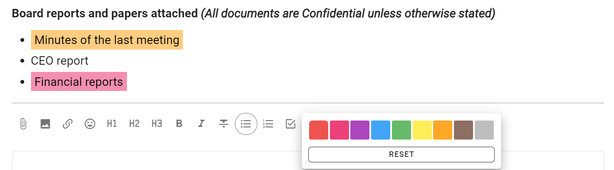

# Formatting

When starting a thread, poll or writing a comment, you will see the formatting bar under the text. 

Hover the mouse or cursor over each item for the name of each tool.

Use the formatting tools to add information, emphasis and structure to your thread; so as to communicate clearly and encourage people to participate in the thread.

## Attach file

Use the paper clip icon, just below the text form, to add file attachments from your computer.

### Remove attachments

While editing the context, click the **X** to the right of the file name to remove it.

## Insert image

Use this tool to insert and display an image.

Select the image file to insert from your computer.

The image is displayed within Loomio.

Tip:  You can also copy/paste an image directly into Loomio.

## Insert link

You can add a link to any shareable document or page on the internet.  

To add a link for a Google doc: 
1. Select the text you want to link to - say the name of a document.
2. Click the link icon.
3. Find the document link - go to your Google drive and ‘Get link’, or in your Google doc ‘Share link’.  Check the link permissions so members can open the link - usually ‘Anyone with the link’. Copy the link to your clipboard.
4. Now, go back to Loomio and paste the link.

A preview of the doc will appear under the text space. You can remove this if you want.

Now, anyone with access to your Loomio thread and permission to view the doc can open and read it.

<iframe width="100%" height="380px" src="https://www.youtube.com/embed/84FAbGJbTws" frameborder="0" allowfullscreen></iframe>

## Insert Emoji

Emojis are great way to lighten the mood and encourage people.  Select the emoji you like from the pop up screen.

## Headings

H1, H2, H3 headings can help you structure your thread or comment.

Select the text to mark as a heading and click on the heading format tool.

If a heading is used in a comment, the comment will automatically be pinned to the thread timeline.

## Bold, Italicize, Strikethrough

Select the text to format and click on the required format tool.

## List

Use to add a list of items formatted as bullet points.

## Numbered list

Use to add a numbered list of items.

## Task list

Use the task list to add check boxes for each task, and assign someone with a due date for completion.

See the page on [Tasks](https://help.loomio.com/en/user_manual/threads/thread_admin/tasks.html) for more information.

## Colors

Use colors to add a highlight color to text.

## Align

Select to align text to left, center or right.

## Embed videos

You can embed a video from popular video platforms like Youtube and Vimeo into Loomio anywhere there is a text space; when starting a thread or poll, writing a comment, or updating your group description. The embed video icon is one of the formatting tools, under the space where you write text in Loomio.

To use the embed video feature: 
1. Click the embed video icon.
2. Go to the video you want to embed, find and copy the shareable link.
3. Now, go back to Loomio and paste the link.

A preview of the video will appear.

Now anyone with access to your Loomio thread and permission to view the video can play it from within Loomio.

<iframe width="100%" height="380px" src="https://www.youtube.com/embed/gbWUCPzxTUQ" frameborder="0" allowfullscreen></iframe>

**Tip:** Make sure you set the visibility of the video in Youtube or Vimeo so that the people you want to can view it. In Youtube 'Unlisted' is a good option if you do not want to make the video public.

## Quote

Quote adds emphasis to your text, and can be useful to draw attention to an instruction.

## Code block

Typically used to show code in text, code block formatting is also available to help you distinguish text in your thread.

## Divider

Use the divider to draw a horizontal line to separate sections.

## Add table

Add a table to your thread. 

Additional tools are available to add/remove columns and rows.

## Markdown

To revert to markdown editing, click **M↓**. 

If you click this while there is text in the form, some formatting may be lost upon conversion.

### WYSIWYG

Click **WYSIWYG** to return to the formatting tools. This will convert any text and markdown formatting to display how it will appear when posted. 

***PREVIEW*** shows how your text will appear, but without converting.

## Close thread

To keep the list of discussions on your group page relevant, you can close threads which people don't need to see.

To view closed threads, first navigate to the relevant **group page**. You will need to use the drop-down just under the Threads tab to change the thread filter from its default of **open**.

Choose "closed" to view all your closed threads in the thread filter.

### Re-open thread

Re-opening a closed thread is done from within the thread's page – again, the three horizontal dots (**⋯**). See [organizing threads](#thread-options-and-organizing-threads) for a depiction.

