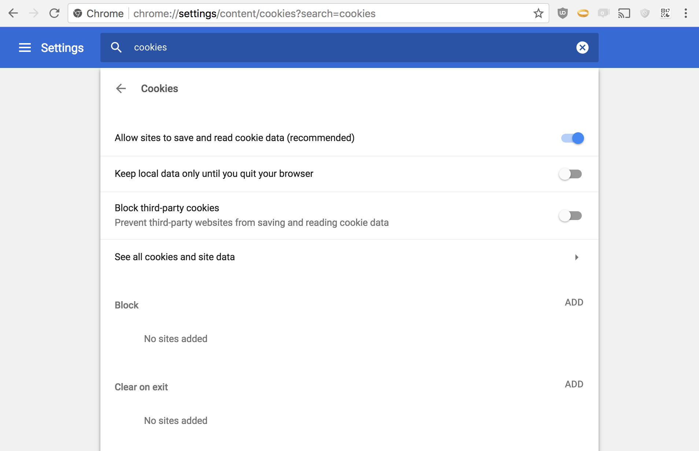
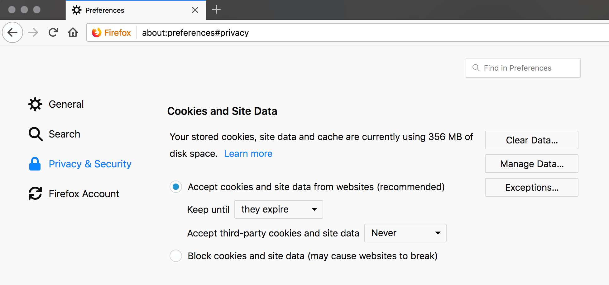
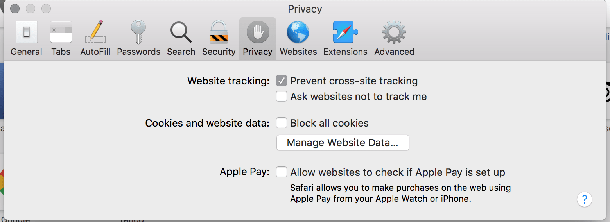

# Signing in to Loomio

*On this page*
- [Create new user account](#create-new-user-account)
- [Sign in on phone or tablet](#sign-in-on-phone-or-tablet)
- [Returning to Loomio](#returning-to-loomio)
- [Add Loomio to your phone home screen](#add-loomio-to-your-phone-home-screen)
- [Troubleshooting](#troubleshooting)

## Create new user account

The first time you visit Loomio you will go through a short process to set up a Loomio user account. 

You won’t need a password and your computer will remember you in future.

**Loomio user accounts are identified by email address** 

You will need to provide an email address to make sure your Loomio user account is yours.

> **Tip**: Use an email address that is uniquely yours, so other group members will easily recognize you and know that your comments are from you.  To avoid confusion, do not use shared and role based email addresses like info@... or ceo@... where more than one person can access the account.

If you have any problem signing in to Loomio, you can always regain access with the email address you used when you set up your Loomio account.

### Invitation via email

You may receive an invitation to join a Loomio group via your email inbox:

Click the **Accept invitation** button at the centre of the email.

The link will take you to the internet browser on your computer, tablet or phone and open a page where you are invited to create an account.

Type in your email address and click the **CONTINUE WITH EMAIL** button.

*Alternatively, you can sign in with your Google account.*

You will be taken to a page to create your Loomio user account.

Type in your name, so people in your group will recognise you.

Tick the check boxes to accept Loomio [Terms of Service](https://help.loomio.com/en/policy/terms/) and [Privacy Policy](https://help.loomio.com/en/policy/privacy/index.html). Click on the links to read these important documents which govern your use of Loomio.

Tick the second box if you would like to receive our newsletter.

When ready, click the **CREATE ACCOUNT** button at the bottom right hand corner of the screen.

Loomio will send an email to your email address with a 6 digit code.  This is required to confirm you own your email address.

Go to your email inbox and open the email from Loomio with subject 'Sign in to Loomio'.

Copy the code from that email, go back to your internet browser screen and enter the code.

Click **SIGN IN** to go to your new Loomio user account.

That's it! You should now have an active Loomio user account and able to participate in your Loomio group.  

When you return to Loomio, in most cases you browser will remember you and automatically sign you in.  
However if you have reset your computer or are accessing Loomio from another device, you will be need to sign in again.  The simplest way to do this is to sign in via email and follow the prompts.

## Sign in on phone or tablet

If you use your phone to access Loomio, the sign in process is very similar.

An invitation via email to participate in a Loomio group will look something like this:

The email subject line shows the name of the person inviting you and the group name on Loomio.

In the email body, you will see the group image and logo, and a message from the person who has sent the invitation.

Tap the **Accept invitation** button.

If you have not previously signed into Loomio on your phone browser, you will be asked to sign in.

Type in your email address and tap **CONTINUE WITH EMAIL**.

On the next page tap **SIGN IN VIA EMAIL**. 

Loomio will send an email to your email address with a 6 digit code.  

Go to your email inbox and open the email from Loomio with subject 'Sign in to Loomio'.

If the email does not arrive soon, check your spam folder.

Copy the code from that email, go back to your internet browser screen and enter the code.

Tap **SIGN IN**.

The next time you receive an email from Loomio, just tap on the thread or decision title.  Your phone browser should remember you and take you straight in to Loomio.

## Returning to Loomio

You can sign in with any notification email from Loomio, including; the **'Yesterday on Loomio'** daily summary email, a thread invitation, or an invitation to vote.

For example:

If you have previously signed in to Loomio you can:

- Tap on the thread title (the large colored text) to go to Loomio.

- Reply to the email as you would with any other email, and your comment will automatically go into the thread.

- Click on the link at the bottom of the email 'view it on Loomio'.

If you are not signed into Loomio, you will be asked to sign in. 

### Returning to Loomio after some time

If you are returning to Loomio after some time, or signing in to Loomio on a new device, you may need to sign in again.

You can sign in to Loomio from our website at [loomio.com](https://www.loomio.com/) with **Sign in** or by going directly to the Loomio service you are using; [loomio.com](https://www.loomio.com/dashboard), [loomio.eu](https://loomio.eu/dashboard) or [loomio.nz](https://loomio.nz/dashboard).

**Remember to enter the email address you used when you set up your Loomio account:**
- Type in your email address and tap **CONTINUE WITH EMAIL**.
- On the next page tap **SIGN IN VIA EMAIL**. Loomio will send an email to your email address with a 6 digit code.  
- Go to your email inbox and open the email from Loomio with subject 'Sign in to Loomio'.
- Copy the code from that email, go back to your internet browser screen and enter the code.
- Tap **SIGN IN**.

## Add Loomio to your phone home screen

Loomio is a mobile optimized web app and you can add the Loomio icon to your phone home screen.

Follow the instructions below to add a shortcut to Loomio on the home screen of your iPad, iPhone, or Android devices.

### iPhone or iPad
Launch “Safari” app.  (This does not work from the “Chrome” app.)

Go to [loomio.com/dashboard](https://www.loomio.com/dashboard).

Tap the 'Share' icon (it has an arrow coming out of a box) to open the share menu.

Find and tap “Add to Home Screen.” The Add to Home box will appear, with Loomio icon and name.

Tap “Add.” Safari will close and the Loomio icon will appear on your home screen.

### Android
Launch “Chrome” app.

Go to [loomio.com/dashboard](https://www.loomio.com/dashboard).

Tap the menu icon (3 dots in upper right-hand corner) and tap Add to homescreen.

The Loomio icon will appear on your home screen.

### Tap the Loomio icon on your homescreen to open Loomio

The first time you do this, you will need to sign in to Loomio.
- Enter your email address and tap 'CONTINUE WITH EMAIL'
- Tap 'SIGN IN VIA EMAIL'
- Check your email and type in the 6 digit code. Tap 'SIGN IN'

You will be taken directly to Loomio where you can read and participate with your group as usual.

Loomio will remember you, so you will be automatically signed in the next time you visit.

## Troubleshooting

### I can't access Loomio
Loomio is a web app, accessible via popular web browsers such as Chrome, MS Edge, Firefox or Safari.  
- Check your browser is updated to a current version for best security and performance.

Sometimes IT systems block untrusted website addresses.  Loomio is open source software and does not download any software to your computer or device.  
- Check your IT system is not blocking [loomio.com](https://www.loomio.com/) and [loomio.com](https://loomio.com/) domains.  
  - If you are on the European service: [loomio.eu](https://loomio.eu/)
  - If you are on the Aus/NZ service: [loomio.nz](https://loomio.nz/)
- IT may need to unblock access to Loomio, and add loomio.com to their ‘allow list’ or ‘white list’.

### I can't receive emails from Loomio
Loomio uses your email address for user authentication.  Notifications of new threads, decisions and other activity in Loomio are sent to your email address.
- Check your IT system is not blocking emails from @loomio.com 
- IT may need to unblock emails from Loomio and add @loomio.com to their ‘allow list’ or ‘white list’.
- If IT refuses to budge, can you use a personal email address?

### I can't see any of my groups!
To fix this: Sign out then sign in again with the email address you normally use Loomio with.

Why does this happen? This can happen because you participated in a poll when you were not signed in; Loomio creates a guest user, so you can participate without signing in. When you sign in later, we confirm the authenticity of your vote and connect it to your registered user.

### Every time I visit Loomio I have to sign in!

Ensure your browser is not deleting cookies. If you find that you're logged out of Loomio every time you visit, your browser may be configured to delete cookies when you close the browser window. Cookies are the way we recognize you when you use Loomio, so deleting them means you need to identify yourself (ie: sign in) every time you visit.

Here are screenshots of what correct cookie settings look like:

Chrome cookie settings

Firefox cookie settings

Safari cookie settings

